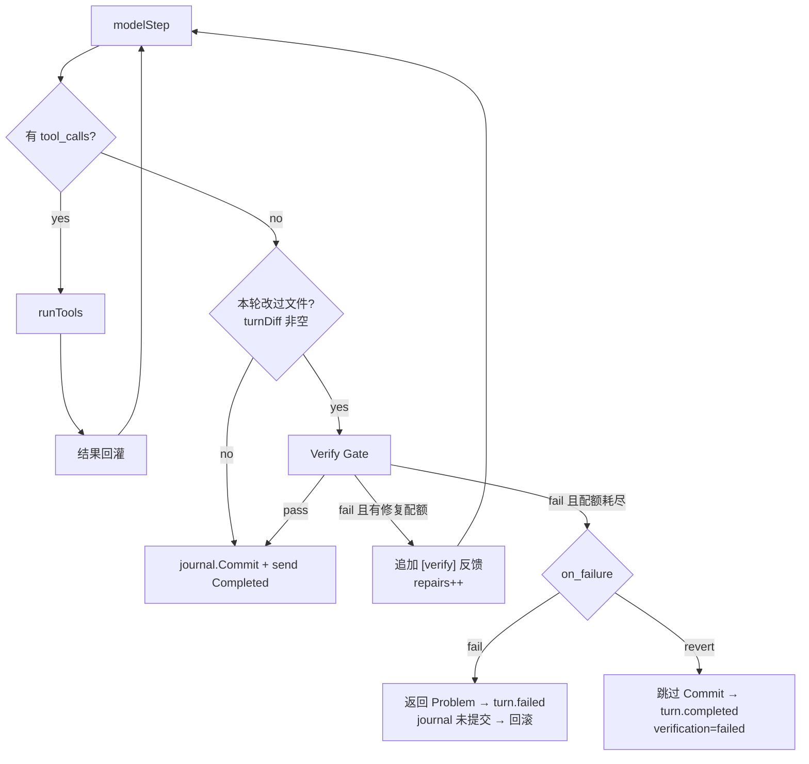

# RFC-002：Verify Gate

> 状态：Implemented（M1 第一条主线，T0 范围）
> 关联：[ROADMAP §5](../ROADMAP.zh-CN.md)、[ARCHITECTURE](../ARCHITECTURE.zh-CN.md)、[USAGE](../USAGE.zh-CN.md)
> 影响面：`internal/runtime/agent/engine`、`internal/observability/verify`、`internal/runtime/protocol`、`internal/config`、`internal/adapter/tool/quality`

本 RFC 决定 **一个改过文件的 turn 在完成前必须形成什么验证结论，以及结论失败时怎么处置**。它同时收掉一笔 M0 欠债：工具失败不回灌模型，模型没有自我纠正的机会。

---

## 1. 问题

M0 结束时验证能力的实际状态是：post-edit diagnostics 会跑，`quality_*` 工具存在，verifier role 存在，但**是否验证完全取决于模型愿不愿意调用**。收据里 `Verification.Tests` / `Verify` 永远是 `not_evaluated` 占位，所以"未验证的修改"在数据上根本看不出来。

更硬的一个缺口：`runTools` 里只有 `approval_denied` 一种错误被当作可恢复，其余错误（含 `read-before-edit`）直接走 `errorsByIndex` 终止整个 turn，且不发任何 `tool.result`。这让"验证失败 → 让模型修"这条路从一开始就不成立——模型收不到失败。

## 2. 可恢复失败的边界

分界线是 **"模型自己改一下就能对"** 还是 **"模型换个参数反复试探安全边界"**。前者回灌，后者终止。

实现在 `internal/runtime/agent/engine/toolfailure.go`，用 `errors.Is` 判定 sentinel 而不是匹配错误字符串（`tool.ErrUnknownTool` / `ErrToolUnavailable` / `ErrInvalidArguments` 是本次为此新增的）。

| 错误 | 处置 | 理由 |
| --- | --- | --- |
| `policy.DecisionError{Code: "approval_denied"}` | 回灌 | 既有行为 |
| `workspacejournal.ErrUnread` | 回灌 | 模型先 `file_read` 就能继续 |
| `workspacejournal.ErrStale` | 回灌 | 重读拿到新指纹即可 |
| `tool.ErrInvalidArguments` | 回灌 | 参数 schema 错误是模型可修的 |
| `tool.ErrUnknownTool` / `ErrToolUnavailable` | 回灌 | 让模型换一个存在的工具，而不是让 turn 死掉 |
| `permission_denied` / `mode_denied` / `constitution_deny` / `ErrSandboxDenied` | **终止 turn** | 见下 |

**策略与沙箱拒绝不回灌**：把"你没权限"告诉模型，它会换路径、换工具、换措辞反复试探权限边界，而当前没有"每 turn 拒绝次数预算"来给这种试探封顶。先有预算再谈回灌，本 RFC 不做。

benchmark 任务 `unread-edit-blocked` 因此从"锁定 turn 失败"翻成"锁定模型自我纠正成功"——这正是 M0 记录的"改动时须同步更新该任务"。

## 3. 挂载点

门禁插在 turn 提交之前。模型不再要求工具时（`len(calls) == 0`）才会走到这里：



`turnDiff` 为空时门禁 `skipped`：只读 turn 不该被验证成本拖慢，也不该因为仓库本来就有失败的测试而被判失败。

## 4. 配置语义

```toml
[execution.verify]
mode = "soft"             # off | soft | hard
scope = "diagnostics"     # diagnostics | repository
on_failure = "fail"       # fail | revert
max_repair_steps = 1
timeout = "2m"
command = ""              # 仅 scope = "repository" / "affected" 时有效
```

### 4.1 mode 默认 `soft`

生产默认现在是 `soft + diagnostics`：有文件改动就必须形成 `passed` / `failed` / `unavailable` 之一，失败会在修复配额内回灌模型，配额耗尽后记录 `reported`，但不会单独改变 turn 终态。需要阻断交付的 CI/自动化显式配置 `hard`；`off` 仍保留给不需要验证的受控测试或特殊 Host。

旧实现因 fixture stream 数量固定而默认 `off`，这让生产配置拥有完整门禁代码却从不触发。相关 fixture 已经能承受默认评估；没有诊断覆盖的改动明确记 `unavailable`，不伪报 `passed`，也不因环境缺能力阻断普通交互。

### 4.2 三种 scope

- `diagnostics`（默认）：复用本 turn 已收集的 post-edit diagnostics，不额外起进程。只有 error 级判失败，warning 只计数。**没有任何 receipt 覆盖改动文件时判 `unavailable` 而不是 `passed`**——缺失的诊断不能读成绿灯。
- `repository`：跑仓库自己的验证命令（`verify.Detect` 按 go.mod / Cargo.toml / package.json / pyproject.toml 探测，兜底 `make verify`），或跑显式配置的 `command`。
- `affected`：经 Repo Index 将 Go 改动映射为包级 `go test`、Python 改动映射为相关 pytest 文件；不能映射的语言明确返回 `unavailable`。显式 `command` 可使用 `{paths}` / `{packages}` 占位。

`unavailable` 不算失败。一个没有验证命令的工作区不应该让每个 turn 都过不去。

### 4.3 on_failure 只实现两个（对路线图的偏离）

一个必须先讲清的事实：**未提交的 turn 失败时，journal 的 `Rollback` 已经会恢复文件**。所以 `fail` 与 `revert` 的区别**不在文件**，而在终态语义：

| 值 | 终态 | 文件 | 适用 |
| --- | --- | --- | --- |
| `fail` | `turn.failed`（`CodeConflict` Problem） | 回滚 | CI：`exec` 退出码非零 |
| `revert` | `turn.completed`，收据 `verification = failed` | 回滚 | 交互：保留模型的说明，但明确告知改动已撤销 |

`ask` 需要接 `interact.Host` 并让所有 Host 渲染新的 input 请求，本次不做，配置加载时报错。

### 4.4 command 的存在理由

`command` 只在 `repository` scope 下有效（其他 scope 下配置它会在加载时报错，避免"我配了但没生效"）。它的第一动机是 hermeticity：benchmark 任务需要一个"改对了没有"的判据，而不能依赖机器上装了 `make` / `go` / `pytest`。同样的需求在单仓多语言项目里也成立。

## 5. 修复轮

主循环改为 `for step := 0; step < MaxSteps+gate.extraSteps(); step++`，`extraSteps()` 就是已消耗的修复轮数。**修复轮在正常步数配额之外获得额度**：一次门禁失败不该让模型少一步本来可以用来干活的预算。

时间由每次验证的 `context.WithTimeout(timeout)` 约束。

**已知缺口，不假装有**：token 仍由既有 turn budget 统一约束，修复轮没有独立 token 预算。修复轮会消耗与正常步数相同的 token 预算，预算耗尽时按既有 budget 逻辑处理。

### 5.1 回灌形式

`RoleUser` + `[verify]` 前缀（沿用 mailbox 已有的约定），正文是 `Receipt.Feedback(4KiB)`，超长截断并标记。

不伪造 `tool_call` / `tool_result` 配对：模型没发起过这次调用，伪造配对既污染历史，也可能被 provider 的配对校验拒绝。

### 5.2 修复轮必须先重读

一次成功写入会 `Invalidate` 该文件的读指纹（`guard.go`），所以修复轮里模型要改同一个文件必须先 `file_read`。这不是门禁引入的约束，是 read-before-edit 本身的行为，但门禁让它第一次成为常见路径——`verify-gate-repair` 任务显式覆盖这条路。

## 6. 事件与收据

新增 `turn.verification` 事件（`protocol.TurnVerificationData`）：

| 字段 | 含义 |
| --- | --- |
| `mode` / `scope` | 生效的配置 |
| `status` | `passed` / `failed` / `unavailable` / `not_evaluated` |
| `action` | `passed` / `repair` / `reported` / `failed` / `reverted` / `skipped` |
| `repair_steps` | 已消耗的修复轮数 |
| `checks[]` | 每个检查的名称、命令、状态、退出码 |
| `errors` / `warnings` | 诊断计数 |
| `paths[]` | 本 turn 改动的文件 |

`status` 与 `action` 是两件事，不能合并：soft 模式下 `status = failed` 而 `action = reported`，turn 照常完成——把两者压成一个字段就无法区分"验证失败但按配置不阻断"和"验证通过"。

Execution Receipt 的 `Verification` 用真实结论替换占位：`Verify` 总是记门禁结论，`Tests` 仅在 `scope = repository`（真的跑了命令）时记同一结论，否则保持 `not_evaluated`——诊断 scope 没有跑测试，不能声称跑了。门禁未启用或 turn 没改文件时记 `not_evaluated`；runner 不可用时记 `unavailable`（本次为此在 protocol 层新增 `ReceiptUnavailable`）。

## 7. runner 的位置

`internal/observability/verify` 与 `diagnostics` 同层同形：`Runner` 接口 + `CommandRunner`，engine 经 `Options.Verify.Runner` 注入，wire 装配。

`quality_verify` 原有的 `detectVerifierChecks`（go/cargo/node/python/make 探测）搬进该包，工具改为委托 `verify.Detect`，避免两份探测逻辑各自漂移；工具的输出 payload 保持不变。

`CommandRunner` 运行命令时会先 `sandbox.BindPolicy` 再用 policy 里的**规范化** workspace root 作为工作目录——policy 存的是解析过符号链接的路径，直接用调用方给的写法（macOS 的 `/var` 就是个符号链接）会被判定为"在工作区之外"。

## 8. benchmark 覆盖

| 任务 | 覆盖 |
| --- | --- |
| `verify-gate-pass` | 门禁跑仓库命令并通过，turn 正常提交 |
| `verify-gate-repair` | 模型谎报完成 → 门禁失败 → 回灌 → 重读 + 修复 → 门禁通过（`verify_repairs = 1`） |
| `verify-gate-hard-fail` | 无修复配额 + `on_failure = fail` → `turn.failed` + 文件回滚 |
| `verify-gate-revert` | 同上但 `on_failure = revert` → `turn.completed` + 文件回滚 |
| `unread-edit-blocked` | 可恢复失败回灌后模型自我纠正 |

后三个任务共用同一个失败命令，差别只在 `on_failure`，这样"两者区别在终态而不在文件"这条结论是被断言钉住的，不只是文档里的一句话。

## 9. 明确不做

- `on_failure = ask` 的交互路径；
- 策略/沙箱拒绝的回灌与"每 turn 拒绝预算"；
- 修复轮独立 token 预算；
- 门禁前的轻量 workspace checkpoint（ROADMAP §5.4 第 3 条，属 Edit Transaction 主线）；

## 10. 未决问题

1. 多个检查失败时的回灌优先级（当前按 `Detect` 顺序全量拼接后截断，可能挤掉后面更相关的失败）；
2. 修复轮的 token 预算是否需要独立配额，还是复用 budget reminder 机制；
3. `repository` scope 在大仓库上的耗时是否需要"只跑一次"的 turn 级缓存。

## 11. 验收

- 门禁在 `turnDiff` 非空时必然产生一个 `turn.verification` 事件，收据里不再出现占位；
- `fail` 与 `revert` 在文件效果上一致、终态上不同，且两者都有 benchmark 断言；
- 可恢复失败以 `tool.Result{IsError: true}` 回灌，策略/沙箱拒绝仍终止 turn，两侧都有单测；
- 未知 scope 与 `ask` 在配置加载期报错，不进入运行期。
