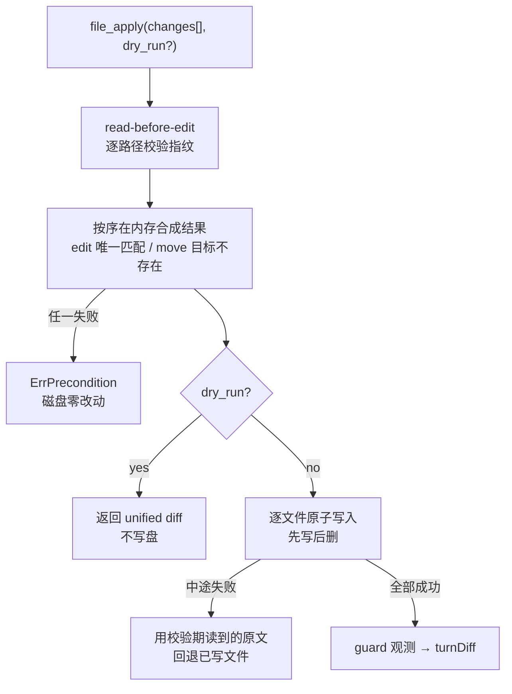

# RFC-005：Edit Transaction

> 状态：Implemented（M1 第二条主线）
> 关联：[ROADMAP §5.3 / §5.4](../ROADMAP.zh-CN.md)、[RFC-002 Verify Gate](RFC-002-verify-gate.zh-CN.md)、[ARCHITECTURE](../ARCHITECTURE.zh-CN.md)、[USAGE](../USAGE.zh-CN.md)
> 影响面：`internal/adapter/tool/file`、`internal/adapter/tool/guard`、`internal/adapter/tool`、`internal/persist/workspacejournal`、`internal/platform/textdiff`、`internal/security/sandbox`、`internal/runtime/agent/engine`、`internal/runtime/protocol`、`internal/runtime/app`、`internal/host/tui`

本 RFC 决定 **一次编辑操作的原子边界在哪里、跨文件改动怎么表达、以及"这个 turn 到底改了什么"以什么为准**。

---

## 1. 问题

M1 第一条主线（Verify Gate）落地后暴露出三个互相纠缠的缺口：

**1.1 "改了哪些文件"是猜的。** `turnDiff` 的路径来自解析工具参数里的 `path` 字段，并且只对 `file_write` / `file_edit` / `file_patch` 三个名字生效。而 `file_patch` 的 schema 里根本没有 `path`——路径藏在 diff 正文里。于是一个只用 patch 改文件的 turn：`turnDiff` 为空 → 门禁判 `skipped` → **改了文件却完全没验证**，收据也报"无改动"。这是一个真实的越过安全门禁的漏洞，不是排版问题。

**1.2 跨文件改动没有原子性。** 写入本身是逐文件原子的（temp + rename），但"改 3 个文件"是 3 次独立工具调用，第 2 次失败就留下半套改动。唯一的多文件入口 `file_patch` 依赖 `git apply` 与强沙箱，在没有 git 的工作区直接不可用。

**1.3 收据没有行级统计。** 仓库里**没有任何 unified diff 生成器**，只有 shell out `git diff`。`diff_line_stats` 因此长期挂在收据的 `not_collected` 列表里。

## 2. 事务的边界是"一次工具调用"

被否掉的方案是 **turn 级事务**：把 turn 内所有写入暂存到影子目录，turn 结束时才落地。

否掉的理由是它和 Verify Gate 直接冲突：门禁要在提交前跑**真实命令**（`go test`、`grep`），模型也要能 `file_read` 回自己刚写的内容。暂存意味着验证与回读看到的都是旧工作区，那验证就失去意义。

所以分层：

| 层 | 粒度 | 保证 | 实现 |
| --- | --- | --- | --- |
| 事务 | 一次 `file_apply` 调用 | 全部生效或全部不生效 | 本 RFC |
| 回滚 | 一个 turn | 失败/revert 时逆序恢复 before-image | 既有 `workspacejournal` |

## 3. 改动改为"观测"，不再解析参数

`guard.prepareFileWrites` 在执行前已经为每个声明了 write 资源的路径取了指纹；执行后重新 `Snapshot` 比对，就能得出每个路径**真实变没变**以及 `created` / `modified` / `deleted`，写进 `result.Metadata["changes"]`，由 engine 记入 `turnDiff`。

三个直接后果：

- `isFileMutatingTool` 白名单和 `pathFromToolArgs` 删掉了。任何声明了 write 资源的工具都自动被覆盖，"改了文件"这件事不再依赖工具参数长什么样。
- **内容相同不算改动**：用相同字节重写一个文件，identity（mtime/inode）变了但内容没变，`Record.Kind()` 返回空，不进 `turnDiff`，门禁不会为一次空写入跑一遍测试。
- 判定口径统一：`ChangeCreated` / `ChangeModified` / `ChangeDeleted` 定义在 `workspacejournal`，guard 与收据都用同一套词汇。

代价：`turnDiff` 的 `Summary` 从工具元数据（`bytes=` / `replacements=`）变成了 kind + 行级增删，TUI `/diff` 输出与相关测试随之更新。

## 4. `file_apply`

### 4.1 两阶段

**校验期只读**。它把每个路径读进内存，按序把 op 作用在这份虚拟视图上。因此一次事务内允许对同一文件多次 `edit`——后面的 op 看到前面 op 的结果。这顺带消掉一个既有摩擦：成功写入会作废读指纹，今天改同一文件两次必须中间重读（`verify-gate-repair` 基准就在演示这件事）。

**冲突不写特例表**。"先 delete 再 edit"在校验期自然表现为"文件不存在"；"move 到已存在的路径"表现为目标已存在。语义来自虚拟视图，不来自一张 op 兼容矩阵。

**apply 期先写后删**。写入全部完成才开始删除，这样进程在两阶段之间死掉，工作区留下的是**多一份数据**而不是少一份。中途失败时用校验期读到的原文回退已写文件；回退本身再失败，错误里明确写出"工作区处于部分修改状态"——沉默地丢掉这个事实比报错更危险。

### 4.2 op 语义

| op | 前置条件 | 效果 |
| --- | --- | --- |
| `write` | 无（可新建、可覆盖、`content` 省略即清空） | 内容替换为 `content`；已存在则保留权限位，新建用 `0644` |
| `edit` | 文件存在且非二进制，`old` 在当前视图中**恰好匹配一次** | 替换该唯一匹配 |
| `move` | 源存在，`to` 在当前视图中不存在，且不等于源 | 目标取源的内容与权限位，源变为不存在 |
| `delete` | 文件存在 | 变为不存在 |

`op` 不用的字段必须缺省：`write` 带着 `old` 会被拒绝，而不是静默忽略。静默忽略会把模型的困惑藏在一次"成功"里。

一次调用最多 64 个 change：校验期把内容留在内存里，需要一个上界。

### 4.3 rename/move/delete 是 op，不是独立工具（对路线图的偏离）

路线图 §5.3 的字面表述是"一等工具"。这里做成 `file_apply` 的 op，因为：少两个 descriptor 的 prompt 成本、一条代码路径、并且真正的痛点是"重命名之后紧跟着的一串编辑"要在同一次调用里完成。`{"op":"move","path":"a.go","to":"b.go"}` 足够表达。

### 4.4 `file_edit` / `file_write` / `file_patch` 都保留

单文件工具是模型的肌肉记忆，也是全部 fixture 的依赖。它们改为复用同一个 apply core（各自构造一个 change），对外的 `Content` / `Metadata` 不变，避免两套匹配与写入逻辑漂移。`file_patch` 保留（能吃任意 diff），`file_apply` 提供**不依赖 git 和强沙箱**的多文件路径。

### 4.5 校验失败是可恢复失败

新增 sentinel `tool.ErrPrecondition`：调用在**碰磁盘之前**被拒绝，因此改动为零。`recoverableToolFailure` 据此把它回灌给模型（附一句"the workspace was not changed"），而不是终止 turn。

这条豁免的**唯一依据是"零写入"这个保证**，所以只有校验期的错误能带上这个 sentinel；apply 期的失败（可能有回退失败的残留）不带，照旧终止 turn。RFC-002 里"策略与沙箱拒绝不回灌"的理由（防止模型反复试探安全边界）在这里不适用：这不是权限边界，模型换个参数是正当行为。

## 5. dry_run 与审批

`dry_run` 校验完成后返回 unified diff 并**零写入**，但**资源声明保持 write**。

让 dry_run 变成 read 资源就会出现"声明只读、却具备写能力"的工具——那正是 Guard 要防的洞。预览的目的是让审批有意义，不是绕开审批：一次 `dry_run` 调用同样要过审批、同样要满足 read-before-edit。

宿主侧真正的"审批前先看 diff"需要把工具接口拆成 plan / apply 两段（改 `tool.Executor`，牵动所有工具），留给 VS Code 扩展那条线。当前的替代品是 TUI 审批面板：它把 `changes` 渲染成每个 op 一行（`move a.go → b.go`、`write x.py 12 lines`），而不是把内嵌整份文件正文的 JSON 糊在审批框里。

## 6. Guard 装配：`ChangesField`

`ResourceResolver` 是数据驱动的（`Templates` + `PatchField`）。事务工具的路径在 `changes` 数组里，所以新增 `ChangesField`，枚举每个 change 的 `path` **和 `to`**。

这是安全边界，两条规则写死在实现里：

- **move 的源和目标都声明为 write**。漏掉任何一个，Claims（并发独占）与 journal（before-image）就只盖住一半。
- **读不懂的 `changes` 直接拒绝调用**。数组不是数组、元素不是对象、`path` 不是字符串——任何一种都返回错误，而不是"枚举出零个路径"然后放行。枚举失败等于把一次未受 Guard 中介的写入交给工具。

`file_apply` 也进 `mediatedFileWriter`：read-before-edit 覆盖事务里**每一个既存路径**，post-edit 诊断对每个改动路径都跑。

## 7. `internal/platform/textdiff`

需要一个 unified diff 生成器供三处复用：dry-run 预览、收据行级统计、以后宿主的原生 diff。约 150 行 LCS，自带测试，比继续 shell out `git diff` 诚实——后者在非 git 工作区直接不可用。

明确处理的边界情况：新建/删除渲染成 `/dev/null`、空文件、缺尾换行（`\ No newline at end of file`）、二进制拒绝（`ErrBinary`）。LCS 表在剪掉公共前后缀后仍超过 `maxCells` 时退化为"整体替换"，保证大文件不会把内存吃穿。

## 8. 收据的行级统计

`ReceiptChange` 增加 `kind` 与 `added` / `removed`，`diff_line_stats` 从 `not_collected` 移除。

统计口径是 **"相对本 turn 起点"**，不是"相对上一次调用"：guard 用 journal 持有的 before-image 与磁盘现状比对。一个文件在一个 turn 内被改三次，收据报的是累计增删，因为 `turnDiff` 按路径去重、后写覆盖前写。二进制内容与未配置 journal 的场景不报数字——缺一个数是诚实的，报 0 会被读成"没变"。

自动回滚留下的冲突现在进收据的 `UnresolvedIssues`（`workspace rollback could not restore <path>: <reason>`），不再只拼进错误字符串里的一个计数。冲突意味着工作区留着没人接受的改动，这是必须被人看到的残留。

## 9. journal 的两处收紧

- **`Rollback` 在有冲突时保留 before-image**，与 `Revert` 对齐（此前无论成败都 `release()`，导致冲突后无法重试）。只有完全无冲突的回滚才释放 handle。
- **before-image 存不下就拒绝写入**。内存 `contentstore` 报 `ErrCapacity` 时工具根本不执行——没有 before-image 就没有回滚能力，宁可写不成功也不能悄悄放弃这个保证。行为本来如此，本次补测试钉住。

另新增查询 API：`Manager.Changes()`（路径 + kind + before/after 指纹）与 `Manager.BeforeImage()`。

## 10. 沙箱新增 `Workspace.Remove`

`delete` 与 `move` 需要在沙箱内删文件。实现沿用既有写入路径的口径：在最终目录的描述符上 `unlinkat`（Windows 走描述符相对的 `FileDispositionInformation`），并对目标做与 `AtomicWrite` 相同的校验——符号链接、跨设备目标一律拒绝而不是跟随。

## 11. journal 落盘与跨进程恢复（原"明确不做"第一条，已落地）

原文这里写的是"事务原子性只在活进程内成立，进程被杀会留下半套改动"。这条缺口已经补上，机制如下。

**磁盘布局。** `workspacejournal.Open(root, dir)` 把 turn 账本写成 `dir/turns.jsonl`，before-image 写进 `dir/objects`（复用 `state/cas` 的引用计数 CAS，经 `contentstore.Durable` 适配成 `contentstore.Store`）。宿主用的 `dir` 是 `{workspace}/.codehelper/journal`：账本必须跟着工作区走，而不是跟着 `--data-dir`——没开状态库的宿主同样需要这个保证，worktree 里的子 Agent 也需要自己的一份。`Open` 拒绝相对路径，否则两个工作区会因为进程 `chdir` 到别处而共用一个账本。

**写序。** 每条记录在它描述的那次写入**之前**落盘并 `Sync`：`begin` → 每个路径的 `before`（含 before-image handle）→ 工具写入 → `after`（回滚要靠它比对磁盘现状）→ `commit` 或 `settled`。被杀在任何一步，下一个进程都能从账本读出"这个 turn 碰了哪些路径、原始内容在哪"。

**下一个进程做什么。** `Recover` 按 owner 与状态分流：

| 账本里的 turn | 处理 | 为什么 |
| --- | --- | --- |
| 未 commit，owner 进程已死 | 回滚，逐条报 `Receipt` | 这是没人接受过的半套改动，下一个 turn 不能在它上面继续 |
| 已 commit，owner 进程已死 | 保留改动，释放 before-image，记 `abandoned` | 它过了 verify gate，是成品；跨重启不提供 revert |
| owner 进程仍活着 | 跳过，记录保留 | 两个宿主共享一个工作区时，回滚对方正在写的文件比不回滚更糟 |
| 文件在崩溃后又被改过 | 报冲突，记录保留 | 那次改动可能是人做的，覆盖它不是恢复 |

进程存活用 `kill(pid, 0)` 判断；pid 被复用时会误判成"活着"从而跳过恢复，这是安全的方向（保持现状等人处理，而不是在活进程底下回滚）。Windows 没有可移植答案，一律当作"活着"。

**可见性。** `codehelper exec` 在恢复发生时向 stderr 报一行（回滚几个、保留几个、让给活进程几个）；`codehelper diagnostics` 的 `journal.interrupted_turns` 不开任何进程就能报出某个工作区是否压着没人接受的改动。

**开关。** `execution.journal.durable`（默认 true）与 `execution.journal.recover_on_start`（默认 true）。关掉退回到纯进程内语义。恢复失败直接拒绝启动：在没恢复的工作区上开 turn 正是这套机制要防的事。

## 11.1 明确不做

- 跨重启 revert 已 commit 的 turn。commit 意味着它过了门禁，保留它比提供一个"重启后还能撤"的承诺更诚实。
- 有限模糊 `edit`（空白容错的唯一匹配）：单独决策，不和原子性混在一起做。
- LSP rename / organize imports / format。
- 回滚时清理 turn 内新建的空目录。
- CRLF / 编码策略显式化（当前二进制拒绝、UTF-8 校验保留原样）。
- ~~宿主侧 preview-before-approval~~ 已由 RFC-013 T4 实现：可规划 file writer
  在 Guard ask 前无副作用生成 before/after/diff，批准后重算 identity 再进入既有
  journal/atomic commit；VS Code 用原生 diff 展示，不通过 `WorkspaceEdit` 写盘。
  任意 `file_patch` 的完整 composer 仍未实现，在 editor 强制计划模式下 fail-closed。

## 12. benchmark 覆盖

| 任务 | 锁定的性质 |
| --- | --- |
| `edit-transaction-multi-file` | 一次调用跨 4 个路径、3 种 op；收据报告的改动集合与真实效果一致（含 move 的源） |
| `edit-transaction-rollback` | 后一个 op 不可应用时，前一个 op 的目标文件与种子逐字节一致；拒绝以工具结果回灌模型 |
| `edit-transaction-move` | 不依赖 git 的重命名被观测为"源 deleted + 目标 created" |

`file_patch` 没有对应基准：它 shell out `git apply` 且要求强沙箱，macOS 沙箱会拦住 git 对 `/var/folders` 临时文件的写入，任务只会超时。"参数里没有 path 的工具也进门禁"这条性质因此由 engine 层单测（`TestVerifyGateCoversToolsWhoseArgumentsCarryNoPath`，用不依赖 git 的假工具）与上面三个 `file_apply` 任务共同证明。

## 13. 未决问题

- **事务与并发调用的相互等待**。`Claims.AcquireResources` 是全量获取（要么一次拿下全部资源、要么整体等待），所以不会死锁；但一次覆盖很多路径的事务会与多个并发调用互相排队，等待是否公平（会不会被小调用持续插队饿死）没有测量。
- **事务规模上界**。64 个 change 与"校验期全部内容留在内存"是一对；真要支持超大批量重构，需要流式校验或按文件分批提交，那会削弱原子性，需要单独决策。
- **每次写入两条 fsync 的代价没有测量**。`before` 与 `after` 各同步一次，量级上远小于工具自身的写入与 diff，但在慢盘上批量改几百个文件时值不值得改成组提交，没有数据。
- **恢复与 Engine 历史的关系**。恢复只回滚工作区文件，不动线程历史：重启后的新会话本来就不带旧历史。同一进程内 resume 一个被恢复过的线程时，历史里仍留着那次失败 turn 的工具结果，读起来像是改动还在——这条要等 M2 的 thread 恢复路径一起收。

## 14. 验收

- `go test ./...` 与 `go test -race -p 1 ./...` 全绿。
- benchmark 套件 10/10 通过。
- 关键断言：事务失败零残留、dry_run 后工作区逐字节不变、事务的每个 op 路径都进 resources、read-before-edit 覆盖事务全部既存路径、行级统计相对 turn 起点累计。
