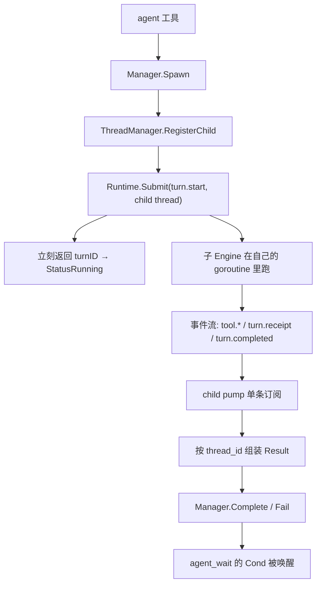

# RFC-006：ChildRuntime

> 状态：Implemented。D1–D10 已落地（真 turn、参数化 Engine 工厂、三种 workspace 策略、预算强约束、结果 schema、事件驱动收敛、写冲突两级、`agent_merge` 合回父工作区）。`subagent_child_turn` 不再出现在 maturity 不完整列表中。
> 关联：[ROADMAP §7.1](../ROADMAP.zh-CN.md)、[RFC-002 Verify Gate](./RFC-002-verify-gate.zh-CN.md)、[RFC-005 EditTransaction](./RFC-005-edit-transaction.zh-CN.md)、[RFC-007 ExecutionService](./RFC-007-execution-service.zh-CN.md)
> 影响面：`internal/orchestration/subagent`、`internal/adapter/tool/agent`、`internal/runtime/app`（`thread_manager.go`）、`internal/runtime/app/wire`、`internal/runtime/protocol`、`internal/config`

本 RFC 决定 **一个被 spawn 出来的子 Agent 到底怎么执行、在哪个工作区执行、受什么预算约束、以什么结构把结果交回父 Agent**。它不涉及后台任务队列与 workflow（那是 RFC-007）。

---

## 1. 问题

控制面已经是真的，执行面是假的。`agent` 工具走 `Spawn` → `buildChildPrompt` → `Takeover`，`Takeover` 最终落到：

```go
// internal/runtime/app/wire/session.go
func (childTurnRuntime) StartTurn(_ context.Context, agentID, prompt string) (string, error) {
	return fmt.Sprintf("child-turn:%s:%s", agentID, prompt), nil
}
```

由此产生四个连带事实，全部要在本 RFC 内收掉：

1. **子 Agent 永远不执行任何工作**，`prompt` 被拼成一个字符串就丢了。`wire/maturity.go` 诚实地把 `subagent_child_turn` 报成 `stub`。
2. **子 Agent 永远不终止**。`StatusRunning` 只能由 `Complete` / `Fail` / `Interrupt` / `Close` 迁出，而生产路径里没有任何代码调用前两个——所以 `agent_wait` 在真实会话里必然挂到超时（测试是靠手动调 `manager.Complete` 才绿的）。
3. **worktree 只是个目录**。`createWorktree` 是 `MkdirAll` 加一个 `.codehelper-worktree` marker，不碰 git，也没有被用作任何工具的执行根——子 Agent 的工具走的是父 Agent 那把 `guard`，工作区是父工作区。
4. **`Stance` 与 `Profile` 只进 prompt 文本**。`read_only` 不阻止写，`Budget.MaxTokens` / `MaxCostUSD` 是两个没有读者的字段。

## 2. 三条硬约束

这三条不是偏好，是当前代码的事实，本 RFC 的多数决策都是它们的直接后果。

### C1：workspace journal 一次只允许一个活跃 turn

```go
// internal/persist/workspacejournal/journal.go
func (m *Manager) Begin(turnID string) error {
	if m.active != nil {
		return errors.New("workspace journal already has an active turn")
	}
```

`agent` 工具是在**父 turn 执行期间**被调用的，此刻父 turn 已经持有 journal。所以子 turn 不可能复用父 journal——它必须要么自带一个（根不同），要么不带（只读）。

### C2：`interact.Host` 的 emitter 是单值

```go
// internal/adapter/tool/interact/host.go
func (h *Host) SetEmitter(emit func(context.Context, Request) error) {
	h.mu.Lock()
	h.emit = emit
	h.mu.Unlock()
}
```

整个会话共享一个 `inputHost`，Engine 在每个 turn 开始时覆盖它、结束时置 nil。父子 turn 并发时，后者会抢掉前者的 emitter，父 Agent 的用户输入会被路由到子 Agent 的 sink。

### C3：ThreadManager 的 Engine 工厂不带参数

```go
threadManager := app.NewThreadManager(func() (*app.EngineAdapter, error) {
	worker, err := agentengine.New(seedOptions)
	...
})
```

每个线程 Engine 都是同一份 `seedOptions` 的副本。子 Agent 需要不同的 workspace、journal、预算与步数，所以工厂必须能按线程给出不同的 options。

## 3. 决策

### D1：子 turn 是一等 runtime turn，不旁路 Runtime

子 turn 走与父 turn 完全相同的路径：构造 `protocol.StartTurnPayload` → `Runtime.Submit` → `dispatch` → `ThreadManager.StartTurn` → `Engine.RunForTurn`。

理由是事件出口。旁路 `Runtime` 直接调 `ThreadManager` 会得到一个不发事件的执行——没有 `turn.receipt`、没有 `tool.*`、eventlog 里没有痕迹，于是"所有执行经过 Guard 且可审计"这条退出条件就是假的。走 Submit 之后，子 Agent 的每个工具调用、审批请求、诊断与收据都是普通事件，只是 `thread_id` 不同，`session/replay`、SSE、eventlog 全部自动可用。

代价是 `Runtime` 允许不同线程并发跑 turn（同线程不允许），这条本来就成立（`activeThreads` 只按线程去重）。

### D2：Engine 工厂参数化，子线程带 options 覆盖

`NewThreadManager` 的工厂签名改为接受一个规格：

```go
type ThreadSpec struct {
	ThreadID protocol.ThreadID
	Child    *ChildSpec // nil 表示宿主线程，按 seedOptions 原样构造
}

type ChildSpec struct {
	AgentID   string
	Role      string
	Stance    string
	Workspace string        // 隔离根；空表示复用父工作区
	Journal   *workspacejournal.Manager // nil 表示只读子 Agent
	ReadOnly  bool
	MaxSteps  int
	Budget    agentengine.Budget
	Deadline  time.Duration
}
```

`ThreadManager` 新增 `RegisterChild(threadID, ChildSpec)`，在子 turn 提交**之前**登记；`forThread` 的懒创建照旧，只是把 spec 传给工厂。这样宿主线程一行不变，子线程拿到自己的 Engine。

不做的替代方案：`Engine.Fork()`。它复制历史与账本但**不复制 `guard` / `journal` / `turnIDs`**，fork 出来的 Engine 一旦跑工具就会对着 nil guard 崩。fork 的用途是历史交接，不是造一个可运行的子 Engine。子 Agent 继承父上下文继续用现有的 `buildChildPrompt` 文本前缀机制。

### D3：三种 workspace 策略全部实现

| 策略 | 触发 | 实现 |
| --- | --- | --- |
| `read_only_shared` | stance `read_only` / `review` / `explore` | workspace = 父工作区，`Journal: nil`，guard 策略降级为只读（写类 capability 直接 deny） |
| `worktree_isolated` | stance `write` / `minimal_write` / `test_focused` 且工作区是 git 仓库 | `git worktree add --detach {root}/worktrees/{agentID} HEAD`，workspace = 该路径，自带 `workspacejournal.New(worktreePath, sharedContentStore)` |
| `same_workspace_serialized` | 显式请求 | child 复用父 workspace、工具根和 journal；父/子 Engine 共享 session 级 whole-turn gate，任一时刻只有一个 turn 能采样和调用工具 |

`same_workspace_serialized` 的 gate 覆盖整个 turn，而不是只包单次写工具。`agent` 在父 turn 中 spawn/followup 后，子 turn 已被 Runtime 接受，但会在 Engine 入口等待父 turn释放 gate；等待可被 context cancel 和 child wall-time 中断。在当前父 turn 内调用 `agent_wait` 会立即返回 `deferred=true`，因为阻塞等待会形成“父等子、子等父 workspace”的死锁；父 turn 必须先结束，后续 turn 再读取 child 结果。serialized child 的写已直接进入父 workspace，因此不再调用 `agent_merge`；`Close` 只取消在飞/排队 turn并释放 Engine，绝不删除宿主目录。

**非 git 工作区**：`worktree_isolated` 无法实现（没有 `git worktree` 可用），此时按 stance 决定——写类 stance 返回 `unavailable` 并在错误里说明原因，不静默退化成"和父 Agent 共享工作区乱写"。拒绝点在 `Spawn`（provision 隔离根的时刻）而不是 `Takeover`：与其造出一个跑不了的 Agent，不如根本不造。`workspace = "worktree"` 显式配置时把这个检查提前到会话启动，`NewExec` 直接失败。

多个 `workspacejournal.Manager` 共存是安全的：包内没有可变全局状态，`Manager` 全部实例作用域，共享同一个 `contentstore` 也安全（内容寻址）。

**隔离根必须连工具一起换。** 这是实现里最容易漏的一条：`tool.Registry` 在构造时就把 workspace root 烧进每个工具（`filetool.NewWithBackend(root, backend)`、`shelltool` 的 cwd、`gittool` 的 `Dir`……），所以只改 `Engine.Options.Workspace` 得到的是"Engine 以为自己在 worktree 里，工具照旧写父工作区"。写类子 Agent 因此要一整套自己的工具面：

| 组件 | 为什么必须 per-child |
| --- | --- |
| `sandbox.Backend` | `BindPolicy` 认定一个 backend 只属于一个 workspace root，换根必须换 backend |
| `tool.Registry` | 每个工具的根在构造时固定 |
| `workspacejournal.Manager` | 回滚要针对子 worktree 的文件 |
| `process.SessionManager` | 后台任务 journal 按根落盘 |
| `diagnostics` / `verify` runner | 否则子 Agent 的诊断与测试跑在父工作区 |

共享的是 `contentstore`（内容寻址，跨根安全）与状态库。

**子 Agent 的符号索引本轮不建**：`repoindex` 按根分区，为每个子 worktree 建一次索引的代价与收益都需要实测。子 Agent 因此只有文本搜索，符号工具按现有的 availability 机制报 unavailable——是显式降级，不是静默缺失。

### D4：子 turn 不接 InputHost，审批 fail-closed

由 C2，子 Engine 的 `Options.InputHost` 恒为 nil。子 Agent 里任何工具调 `Host.Wait` 会拿到 `HostUnavailableError`，按现有分类这是不可恢复失败，子 turn 失败——这是对的：子 Agent 不该向用户提问，它的输入只有 prompt。

审批更微妙。每个 Engine 有自己的 `Guard`，审批请求会作为普通 `approval.required` 事件发在**子线程**上，机制上任何绑定了该线程的 Host 都能回答。但当前没有任何 Host 渲染子线程，所以本 RFC 的默认行为是：**子 Engine 装一个自动拒绝的审批处理器**，拒绝理由与 capability 原文一并写入子结果的 `unresolved`，父 Agent 因此知道"这件事需要人，而我没法在子 Agent 里问"。

等 TUI 的 agents 面板落地（M2 后续线程）再把子线程审批接到宿主，届时这个默认行为改为可配置。选择"自动拒绝"而不是"挂着等"的原因：挂着等意味着子 Agent 会一直烧到 wall-time 预算才死，对 hermetic fixture 测试也是不可确定的。

### D5：结果 schema 从子 turn 的收据派生，不新造采集

`turn.receipt`（`protocol.ExecutionReceiptData`）已经把五个分区都算好了，子结果不重新采集，只做投影：

| 子结果字段 | 来源 |
| --- | --- |
| `summary` | 子 turn 终态事件的 `TurnCompletedData.Text` |
| `evidence` | 收据的 `Evidence`（`ReceiptEvidence`：facts + risks + reminders） |
| `diff` | 收据的 `Changes`（`[]ReceiptChange`，带 `added` / `removed` 行数） |
| `verification` | 收据的 `Verification`（`ReceiptVerification`）+ 最后一个 `turn.verification` 的 `status`/`action` |
| `unresolved` | 收据的 `UnresolvedIssues` + 本 RFC 追加的审批拒绝项 |

新增类型放在 `subagent` 包（控制面的语言），协议层不新增事件：

```go
type Result struct {
	AgentID      string                        `json:"agent_id"`
	ThreadID     string                        `json:"thread_id"`
	TurnID       string                        `json:"turn_id"`
	Status       Status                        `json:"status"`
	Summary      string                        `json:"summary,omitempty"`
	Evidence     *protocol.ReceiptEvidence     `json:"evidence,omitempty"`
	Diff         []protocol.ReceiptChange      `json:"diff,omitempty"`
	Verification protocol.ReceiptVerification  `json:"verification"`
	Unresolved   []string                      `json:"unresolved,omitempty"`
	Usage        ResultUsage                   `json:"usage"`
}
```

`Usage` 从占位的 `{status:"unknown"}` 换成真值（收据里的 input/output/reasoning/cached token 与 `cost_microunits`、`cost_known`）。`agent` 工具的 `Receipt.Usage` / `Verification` 两个字段因此不再是硬编码的 `"unknown"` / `"self_report_only"`。

**持久化**：`Result` 的完整 JSON 落进 handle store（与既有 `transcript_handle` 同一机制），`Complete(agentID, message)` 的 `message` 里放紧凑摘要 + handle ref。这样重启后 `agent_spawn_edges.last_message` 仍能读到结论，而大 payload 不进 SQLite 的一列。

### D6：完成语义靠 child pump 翻译，不靠轮询

`Takeover` 必须保持"提交后立刻返回 turnID"的语义（否则父 turn 会被子 turn 阻塞，而 `agent_wait` 就没有存在意义了）。所以：



child pump 复用 ACP host 已经验证过的形状：一条进程级订阅 + `threadID → agentID` 映射，收到子线程的 `turn.receipt` 就暂存，收到终态事件就组装 `Result` 并迁移状态。订阅被丢弃时按 `lastSeq` 重订（同 ACP 的处理），因为漏掉终态事件会让子 Agent 永远 running。

`startTurn` 里 `runtime == nil` 时那条 `"takeover:" + agentID + ":" + prompt` 的兜底保留——单元测试依赖它，且它明确表达"没有 runtime 就没有执行"。

### D7：预算落到真实拦截点

| 预算 | 拦截点 | 超限行为 |
| --- | --- | --- |
| steps | 子 Engine `Options.MaxSteps` | `CodeResourceExhausted`，子 turn failed |
| tokens（单个子 Agent） | 子 Engine `Options.Budget.MaxTokens`（`checkBudget` 已实现） | 同上，turn 中途即停 |
| tokens（全体子 Agent） | child ledger：`StartTurn` 入口查账、settle 时按收据记账 | 池子花完后下一个子 turn 被拒，`CodeResourceExhausted` |
| USD | 同 tokens 两级 | 同上 |
| wall-time | `childRuntime.armDeadline` 持有的定时器 | 提交 `turn.cancel`，状态 `errored`，`unresolved` 记超时 |
| concurrency | `subagent.Budget.MaxParallel`（存活子 Agent）+ child ledger 的 turn 级 lease（在跑的子 turn） | `Spawn` 拒绝 / `StartTurn` 拒绝 |
| depth | `subagent.Budget.MaxDepth` + ledger `MaxDepth` | `Spawn` 拒绝 |

三点需要说清楚：

1. **子 Agent 有自己的 ledger，不与 RLM 共用**。`execution.subagent.max_tokens` 必须只表示子 Agent 的开销；如果沿用 rlm 那个 `Governor`，父 Agent 随手跑几个 rlm 子查询就会吃掉子 Agent 的额度。rlm 那个 governor 恢复空 limits（即原状）。
2. **真实用量只存在于收据里，所以记账必然发生在 settle**。这意味着池子可以被"最后一个子 turn"透支一次：被拒的是下一个子 Agent，`unresolved` 里写明透支。想要不透支就只能预扣估算值，那等于用估算数骗账本，比透支一次更糟。
3. **并发上限里真正先绑的是"存活子 Agent 数"**（`Spawn` 检查），因为在跑的子 turn 数永远 ≤ 存活数。turn 级 lease 的价值是让"在跑的子 turn"这件事可数——`agent_followup` 在存活子 Agent 上起新 turn 不经过 `Spawn`，只有这里知道实际在跑几个。

新增配置分区：

```toml
[execution.subagent]
max_depth = 5
max_parallel = 4
max_steps = 8              # 子 turn 独立步数配额，默认小于父 turn
max_tokens = 0             # 0 = 继承会话预算；非 0 同时是单个子 Agent 上限与全体池子
max_cost_usd = 0.0
wall_time = "5m"           # 单个子 turn 的墙钟上限
workspace = "auto"         # auto | read_only | worktree
```

`workspace = "auto"` 按 stance 选策略（D3 的表）；显式配 `worktree` 但工作区不是 git 仓库时，加载期报错而不是运行期才发现。

### D8：跨 Agent 写冲突两级检测

第一级是**声明期**：`Manager` 维护 `path → agentID` 的写claim 账本。子 Agent 的 `Result.Diff` 回来时登记其写路径；另一个存活子 Agent 的 diff 或 merge 触到同一路径时，返回显式冲突而不是让后写者赢。

第二级是**应用期指纹**：合并时对每个路径比较父工作区当前指纹与子 worktree 的基线指纹，不等就是冲突。这里直接复用 `workspacejournal.Fingerprint` 与它已有的比较语义（`journal.go` 里 rollback 冲突检测用的是同一套），不新写一套比较。

### D9：合并走父 turn 的正常写路径，因此自动落入 Verify Gate

新增 `agent_merge` 工具：把指定子 Agent 的 worktree 改动应用到父工作区。它**不自己实现事务**，而是走 `file_apply` 已有的 validate-then-apply 路径（RFC-005），于是：

- 改动进父 turn 的 `turnDiff`；
- 父 turn 结束前 Verify Gate 必然看到这些改动（`turnDiff` 非空即触发），§7.1 第 8 条"父 Agent 合并前必须通过 Verify Gate"因此不需要任何新门禁代码；
- 冲突、read-before-edit、回滚全部沿用既有语义。

`agent_merge` 默认 `dry_run` 可用，先给父模型看 diff 再决定。

`agent_turn` 后台 executor 没有父模型来做这一步，因此采用同一合并实现但在
task terminal 前自动 `dry_run=false`：持有宿主 whole-turn gate，经过同样的
path claim、spawn-time `BaseRev` 指纹检查、ToolGuard、`file_apply` 与 parent
journal。任一冲突或 apply 失败都使 task failed / `merged=false`，不会先把任务
标 completed 再销毁唯一含改动的 worktree。`same_workspace_serialized` 已直接
写宿主根，只标记 `merged=true` 而不重复应用。

### D10：takeover / followup / interrupt 的真实语义

三者在有真 Engine 之后才第一次有区别：

| 操作 | 线程与 Engine | 历史 |
| --- | --- | --- |
| `takeover`（spawn 内隐含） | 新建子线程 + 新 Engine | 空历史 + `buildChildPrompt` 前缀 |
| `agent_followup` | 复用同一子线程与 Engine | **保留**上一轮历史，这是复用 Engine 的全部价值 |
| `agent_interrupt` | 提交 `turn.cancel` 到子线程 | Engine 与历史存活，`agent_followup` 可续 |

`Close` 才销毁：清 worktree、释放并发位、Engine 随线程一起丢弃。

## 4. 要改的既有断言

| 位置 | 现状 | 改为 |
| --- | --- | --- |
| `internal/host/cli/diagnostics_maturity_test.go` | 断言 `subagent_child_turn == "stub"` | 合并路径落地后该键从 maturity map 省略 |
| `internal/adapter/tool/agent/agent_test.go` | `dualRuntime` mock 返回 `child-turn:...` | mock 保留（它是 mock），补真实 runtime 的集成测试 |
| `internal/orchestration/subagent/control_test.go` | Wait 测试手动调 `manager.Complete` | 保留（单元层不该起 Engine），另加 pump 的单测 |
| `wire/runtime.go` | `Budget: subagent.Budget{}`、共用一个空 limits 的 `Governor` | `subagent.Budget` 从 `[execution.subagent]` 注入；子 Agent 用独立 ledger，rlm 那个保持空 limits |
| `adapter/tool/agent/agent.go` | spawn 成功后 `Charge(1, 0)` | 删掉：那 1 个 token 是编的。真实用量在 settle 时按收据记账 |

`Spawn` 里那句 `_ = prompt` 一并收掉：prompt 现在有真实去处。

## 5. benchmark 覆盖

| 任务 | 覆盖 |
| --- | --- |
| `subagent-real-turn` | 子 Agent 真的调工具、真的产生收据，父 Agent 从 `agent_wait` 读到结构化结果 |
| `subagent-readonly-blocked` | `read_only` stance 的子 Agent 尝试写 → 被 guard 拒 → `unresolved` 记录，父 Agent 收到失败而非静默成功 |
| `subagent-budget-exhausted` | 子 turn 撞 `max_steps` → `errored` + 父 Agent 拿到部分结果 |
| `subagent-merge-conflict` | 两个写 Agent 触同一路径 → 第二次 merge 显式冲突 |

hermetic 前提：fixture provider 的 stream 数量必须把子 turn 的请求算进去。这个风险已经踩到并证实——fixture server 按**全局请求序号**发 stream，父 turn 与并发子 turn 的到达顺序不确定，父子同流的 fixture 必然 flaky。

`wire` 层的集成测试因此不走父模型 spawn，而是直接 `manager.Takeover` 起子 turn：唯一的 provider 请求就是子 Agent 的那一个，请求序列确定。要在 bench 里覆盖"父 Agent 通过 `agent` 工具 spawn"这条路径，得先让 fixture server 按 thread 分流，属 contract tests 那条线程（RFC-003 T1）。

## 6. 明确不做

- 子 Agent 的审批接到宿主 UI（等 TUI agents 面板）；
- 子 Agent 独立的 provider route 选择（§8.2 模型路由，M3）——本轮子 Agent 继承父 route 的冻结快照；
- 子 Agent 的 WorkingSet / EvidenceSet 持久化（父 Agent 的也不持久化，同一个缺口）；
- 子 Agent 递归 spawn 的深度大于 `MaxDepth` 时的排队（直接拒绝）；
- 非 git 工作区的写类子 Agent（显式 unavailable）。

## 7. 未决问题

1. 子 turn 的事件是否需要在协议上打"这是子 Agent"的标记。当前只能靠 `thread_id` 反查 `agent_spawn_edges`，Host 要渲染就得先建映射；加一个 `agent_id` 字段到事件 meta 是更直接的，但那是协议面扩张，需要双 Host contract fixture（§11.3）。
2. `Result` 的 handle 在会话结束后失效（`contentstore.NewMemory`），而 `agent_spawn_edges.last_message` 里的摘要活着。跨重启读完整子结果需要 durable CAS——属 §5.4，与 RFC-007 的持久 checkpoint 同批。
3. wall-time 超时后子 worktree 的处置：立刻清理会丢掉可能有用的部分改动，保留则要有回收策略。当前倾向保留到 `Close`。
4. 并发子 Agent 共享 `httpclient` 的 `MaxConcurrent: 8`，真实并行度可能低于 `max_parallel`。需要一次实测再决定是否给子 Agent 独立的连接预算。（`Governor` 已拆开：子 Agent 有自己的 ledger。）
5. 子 worktree 落在 `{workspace}/.codehelper/agents/worktrees/` 里，即宿主工作树内部。git 允许嵌套工作树，且未跟踪文件不会进父 Agent 的 `git ls-files` 索引，所以当前没有可观察的问题；但"工作区里有另一个 checkout"这件事对 `file_list`、glob 类工具是可见的。放到工作区外能消除这点，代价是宿主 sandbox 策略需要额外的写根。等 agents 面板暴露 worktree 路径时一并决定。
6. 写冲突两级均已落地：声明期 claim 账本（D8 L1）与 `agent_merge` 应用期指纹比对（D8 L2，相对 spawn-time `BaseRev`）。

## 8. 验收

- `agent` 工具 spawn 出的子 Agent 会真的调用工具并产生自己的 `turn.receipt`，eventlog 里能按 `thread_id` 取到完整子 turn；
- `agent_wait` 在子 turn 终止后返回，返回值里 `summary` / `evidence` / `diff` / `verification` / `unresolved` 五个分区都有真实来源，没有 `"unknown"` / `"self_report_only"` 占位；
- `read_only` 子 Agent 的写被拒且父 Agent 看得见；写类子 Agent 的改动只出现在自己的 worktree，不污染父工作区；
- 撞 steps / tokens / USD / wall-time 任一预算的子 Agent 终止于 `errored`，且父 Agent 拿到部分结果而不是超时；
- 两个写 Agent 触同一路径产生显式冲突，两级检测各有单测；
- `agent_merge` 的改动进父 turn 的 `turnDiff`，因此被父 turn 的 Verify Gate 覆盖；
- `same_workspace_serialized` 下父/子 turn 不重叠，排队可取消，child 关闭不删除宿主 workspace，当前 turn 的 `agent_wait` 不死锁；
- `subagent_child_turn` 不再报 stub / `no_merge`（合并路径已落地，maturity 列表省略完整驱动）。
