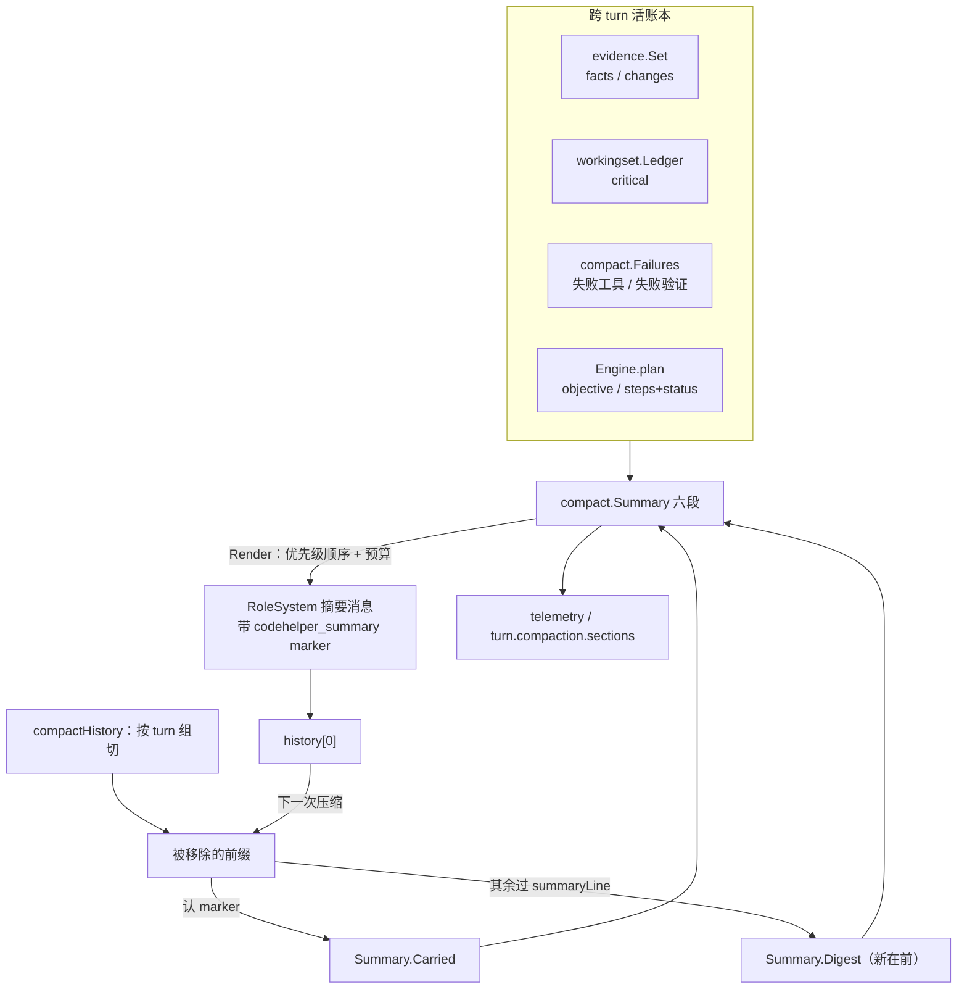

# RFC-009：ContextLifecycle（结构化 compact）

> 状态：Implemented（M1 第六条主线）
> 关联：[ROADMAP §8.1 / §8.3](../ROADMAP.zh-CN.md)、[RFC-001 RepoContext](RFC-001-repo-context.zh-CN.md)、[RFC-008 ExecutionReceipt](../ROADMAP.zh-CN.md)、[ARCHITECTURE](../ARCHITECTURE.zh-CN.md)、[USAGE](../USAGE.zh-CN.md)
> 影响面：`internal/runtime/agent/compact`（新增）、`internal/runtime/agent/engine`、`internal/runtime/agent/evidence`、`internal/adapter/tool/interact`、`internal/config`、`internal/runtime/app`、`internal/runtime/protocol`、`internal/observability/telemetry`、`internal/host/tui`、`internal/host/bench`

本 RFC 决定 **一次 compact 保留什么、这些内容从哪里来、以及一条摘要如何活过下一次 compact**。

engine 决定**何时压、在哪里切**；本 RFC 决定**保留什么、怎么读**。这条切分线值得单独立一份文档，因为两个答案的变化原因不同：切点关心字节预算与 provider 窗口，内容关心模型接着干活需要什么。

---

## 1. 问题：三个具体缺陷，不是"摘要不够好"

改造前的 `summarizeMessages` 把每条消息压成 `"{role}: {text}"` 再拼起来，于是：

**1.1 截断方向是反的。** 它按到达顺序填预算，预算用尽就停。**保下来的是最旧的行**，刚被移除的那几个 turn 反而丢掉——而它们才是下一次采样要接着往下做的。

**1.2 递归压缩会摧毁上一次的摘要。** 第一次 compact 产出一条 `RoleSystem` 摘要放在 history 头部。第二次 compact 时它只是一条普通消息，被同一个"每条消息 512 字节"的口径截断，于是上一次花掉整份预算保下来的结构一次性蒸发。长会话压第二次就等于失忆。

**1.3 阈值没有配置入口。** `MaxContextBytes` 只在 engine 里有一个 `256 KiB` 的默认值，`wire` 从来没从 `snapshot.Config` 填过它。生产环境改不了，`/context` 也就无从展示"离下一次 compact 还有多远"。

## 2. 关键结构性发现：只有一段需要结转

| 段 | 来源 | 跨 turn 累积？ |
| --- | --- | --- |
| 事实 | `evidence.Set` 的 facts | 是，账本自己累积 |
| 改动 | `evidence.Set` 的 changes（带 read / verified / diagnostics 三标记） | 是 |
| 关键路径 | `workingset` 的 critical | 是 |
| 目标 / 待办 | `Engine.plan` 背后的 `interact.Plan` | 是，直到下一次 `update_plan` |
| 失败 | 改造前**不存在**（见 §5） | 本次新建 |
| 流水摘要 | 被移除的那批消息 | **不累积，必须结转** |

前五段来自**活账本**，每次 compact 重新生成得到的就是全会话累积值。所以重新生成**不是**对上一次摘要的近似——它是同一个答案的当前版本，因此**不需要合并上一次的摘要**。

真正需要跨 compact 结转的只有第六样：逐条流水摘要（digest）。这把"递归 compact"从一个摘要合并算法降级成一件小事：**认出上一次的摘要块，原样接过来**，而不是把它喂给逐条压行的那套逻辑。

## 3. 三个取舍

### 3.1 不调模型

六段全部从观测账本派生，compact 期间**不发生任何模型调用**。

理由与 EvidenceSet 同源：一个会写摘要的模型同样会写"我已经验证过了"，而收据与账本的既有纪律是**只记观测**。摘要是下一次采样的输入，让模型给自己的输入里塞进未经验证的断言，是把幻觉写成事实的最短路径。

附带好处是 compact 依然免费、确定、可在 hermetic 基准里断言请求数——`compact-structured-sections` 这类任务之所以能存在，前提就是压缩不产生额外请求。

模型叙事摘要不做，理由记在 §9。

### 3.2 结构在内存，文本给模型，marker 做桥

摘要消息用 `<codehelper_summary>` … `</codehelper_summary>` 包裹（仿 `promptcontext` 的既有 marker 手法，但**不复用** `StripContextualFragments`——那会把摘要删掉而不是结转）。compact 时在被移除的前缀里认出这个 marker，把 body 整块接过来当 digest 的"更早部分"。

这样**跨 `--resume` 也部分成立**：账本重建为空，但叙事随 `replacement_history` 里的消息文本活下来。代价明说：resume 后结构化五段从空账本重建，是与"账本不持久化"同一个已知缺口，本次**不新增协议字段**去补。

### 3.3 优先级顺序 = 截断顺序

预算截断保前缀，所以渲染顺序按"丢了最贵"排，而不是按路线图的书写顺序：

```
目标 → 待办 → 失败 → 改动（含未验证） → 关键路径 → 事实 → 流水摘要（新在前）
```

事实排在倒数第二，因为它是**唯一能靠一次工具调用重新取回**的；目标排第一，因为丢了它模型不知道自己在干什么。流水摘要垫底且**新在前**，顺手修掉 §1.1。

段是**整段丢**而不是切一半：半份改动清单读起来和完整的一样，一个相信自己拿到了全部未验证路径的模型会停止追查其余部分。流水摘要是唯一例外——它是一串互相独立的行，丢掉最旧的几行不会被误读。

## 4. 新包 `internal/runtime/agent/compact`

仿 `evidence` 的形状：纯内存、nil 可用、无 I/O。

- `Summary{Window, Goal, Todos, DoneTodos, Failures, Changes, CriticalPaths, Facts, OmittedFacts, Digest, Carried}`；
- `Render(budget) (text string, truncated bool, sections []string)`：按 §3.3 的顺序渲染，**先扣掉** marker、抬头与截断说明的长度再分配剩余预算；
- `Failures` 跨 turn 账本：按 `(kind, name, reason)` 去重并计数、有条数上限、`Clone()` 供 `Fork`。放在本包而不是单开一个包，因为它唯一的消费方就是摘要；
- `Carry(text)`：从一条消息里取出上一次的摘要 body。

两处刻意的行为：

**预算不够时仍然输出外壳。** marker、抬头（"这段摘要替换了 N 条消息"）与截断说明总是写出来。一次静默产出空字符串的 compact 会让 thread 完全看不出历史被丢过——那比一句"这里被截断了"糟糕得多。

**空段不算截断。** 一个没有失败记录的会话不应该因为"失败段没渲染"而被报成 `truncated`。`blocks()` 先过滤掉无内容的段，再进预算循环。

## 5. 补两个缺口

### 5.1 跨 turn 失败账本

改造前失败只活一个 turn：`receiptRecorder` 的失败集合每 turn 重建，`verifyGate` 的结论只进当次事件，诊断集合每 turn 重置。于是"这条路我已经走不通了"这个信息在 compact 时无从获取。

接线点用现成的两处，不新增拦截层：`runTools` 里已经在判 `result.IsError`；`verify.go` 的 `evaluate` 已经有失败分支（就在 `observeVerifiedEvidence` 旁边）。

### 5.2 待办的状态

`interact.Plan.Steps` 原本是 `[]string`，没有 status，所以"待办"只能整段照搬。改成：

```go
type PlanStep struct {
    Title  string `json:"title"`
    Status string `json:"status,omitempty"` // pending | in_progress | done
}
```

兼容手法是**宽容反序列化 + 收紧 schema**：`UnmarshalJSON` 仍然接受裸字符串（按 `{title: s, status: "pending"}` 收下），所以既有 history 与 fixture 不会因为契约变化而失败；而 `update_plan` 的 JSON schema 只**广告**对象形式（`additionalProperties: false` + status 枚举），让模型往新形状上走。摘要的"待办"只列**未 done** 的步骤，外加一句"已完成 N 项"——否则一份逐步缩短的清单会被读成一个逐步缩小的任务。

Engine 原先只留渲染后的 `planText`，现在同时留 `plan interact.Plan` 的结构；`Fork` 一并带上（此前 `Fork` 漏了 plan，顺手补）。

## 6. engine 接线

`compactHistory` 的切割逻辑（turn 组原子、不切开 tool 调用与结果的配对）**完全不动**，只把"逐条压行 + 拼上下文摘要"这两步换成建 `compact.Summary` 再 `Render`：



配套的两个小改动：

- `evidence.Set` 加 `Changes()` 访问器。此前只有 `UnverifiedPaths()`，拿不到 read / verified / diagnostics 三个标记，而摘要要说的正是"改了什么、改动处于什么状态"。
- `evidence.Fact` 加 `Describe()`。事实的措辞此前长在 `promptcontext` 里，摘要要用同一套措辞；同一个事实两种拼法比一种糟。

**唯一的行为回退：`PromptContextReceipts` 的字节/digest 明细移出摘要正文。** 它是给审计看的，已经在 `turn.receipt.context_sections` 里；塞进每次采样的 prompt 是为同一份数据付两次钱。明细仍留在宿主侧的 `CompactionReceipt` 上。既有测试随之更新。

## 7. 配置、遥测与 `/context`

新增 `[context.compact]`（常量 / 结构体 / TOML 影子结构体三处 + `CODEHELPER_COMPACT_*` 环境变量），在 `wire` 里与 `WorkingSetLimit` / `EvidenceLimit` 并列填进 `Options`：

| 字段 | 默认 | 含义 |
| --- | --- | --- |
| `max_history_bytes` | `262144` | 触发 compact 的 history 字节阈值（此前根本没接配置） |
| `summary_max_bytes` | `8192` | 一次摘要的渲染预算 |
| `max_digest_entries` | `120` | 流水摘要的行数上限 |

阈值的**下限刻意放到 256 字节**：基准任务靠把它压到几百字节来触发 compact，一个禁止这么做的下限会把这个行为放到测试之外。

其余出口：

- `telemetry` 新增 `Compactions` 与 `CompactionSavedBytes`（关掉 ROADMAP §8.3 挂着的"compact 节省未做"）；
- `turn.compaction` 事件加 `sections`（这次摘要实际带出了哪几段）与 `summary_truncated`；
- `turn.receipt` 加 `context_budget{history_bytes, max_history_bytes, compactions}`；
- TUI 的 `/context` 多打一行"history X/Y 字节，已压缩 N 次"。

`ContextBudget()` 与 `Compactions()` 与其他收据访问器一样**不加锁**：收据在 turn 内组装，那条 goroutine 已经持有 engine 锁，在这里再取一次会直接死锁（实现过程中真的撞上了，`TestSessionHostStreamsFixtureTurn` 挂死十分钟）。

## 8. benchmark：一个 turn 压不出 compact

原计划设想"单 turn + 压低阈值 + 多发几次工具调用"就能触发 mid-turn 门禁。**这条路走不通**：切割按 turn 组原子进行，同一个 turn 里所有消息的 `Turn` 相同，于是整段 history 是一个不可切分的组，`compactHistory` 只能返回"无可压缩"。**一次 compact 在结构上至少需要两个 turn。**

所以基准 harness 加了 `followups`：同一个 thread 上依次发多个 prompt，每个 prompt 一个 turn，全部 turn 折叠进同一份观测。没有 `followups` 的任务行为与此前逐字节一致。同时 `TaskContext` 加 `compact` 段，`Expectation` 加 `compactions` / `compaction_sections` / `compaction_sections_exclude` / `compaction_truncated`。

| 任务 | 锁定的性质 |
| --- | --- |
| `compact-structured-sections` | 第二个 turn 的请求里出现七个段头与目标行，且 `turn.compaction.sections` 报出七段（goals / todos / failures / changes / critical_paths / facts / digest） |
| `compact-recursive-carryover` | 三个 turn 触发三次 compact（第三次来自第二个 turn 内的 mid-turn 门禁），最后一次的请求里第一个 turn 的助手回答**仍然逐字存在**——它只可能来自被整块结转的 `Earlier summary:` 块 |
| `compact-priority-truncation` | 预算压到 320 字节时目标段仍在、事实与流水摘要被丢、摘要自报被截断，且 turn 照常完成 |

摘要**正文**的断言放在 fixture 的 `expected_request_fragments` 上（对着模型真正收到的请求断言，而不是对着 runtime 自己的事件），段的取舍放在 `Expectation` 上。一个坑值得记下来：Go 的 `encoding/json` 默认转义 `<` 与 `>`，所以请求体里是 `\u003ccodehelper_summary\u003e`，fixture 的片段不能带尖括号。

## 9. 明确不做

- **模型写的叙事摘要。** 需先有独立 route（不能用主模型的预算与延迟去换一段摘要）与独立预算，属 ROADMAP §8.2 / §8.3。
- **账本持久化与 resume 还原。** `--resume` 后五段从空账本重建，与"账本不持久化"是同一个缺口。
- **in-flight checkpoint**（属 ROADMAP §5.4）。
- **按信息类型的递归分层压缩。** 本次是一次性六段 + digest 结转，不做多级摘要树。
- **plan 步骤状态的自动推断。** status 由模型自报，runtime 不猜——猜错的状态就是一句未经观测的断言。
- **compact 的独立预算与独立 route。**

## 10. 未决问题

- **摘要预算与 history 阈值的关系。** 未显式配置 `summary_max_bytes` 时按阈值的四分之一推导（上限 8 KiB），这个比例没有测量依据，只是"摘要不该比它替换的历史还大"。
- **digest 的行数上限与预算上限重叠。** 两者都能截断流水摘要，先撞上哪个取决于消息长度分布；只保留一个会更好理解，但需要先知道真实分布。
- **carried 块的深度。** 一条摘要可以携带上一条摘要携带的摘要，链条长度目前只受预算约束。链很长时最早那层会被挤成一行缩进文本，其信息密度没有测量。

## 11. 验收

- `go test ./...` 与 `go test -race -p 1 ./...` 全绿；
- benchmark 套件 23/23 通过（新增三个 `compact-*`）；
- 关键断言：新在前的截断方向、第二次 compact 后上一次摘要逐字存在、预算不足时仍产出外壳并自报截断、空段不误报截断、裸字符串形式的 plan step 仍被接受。
