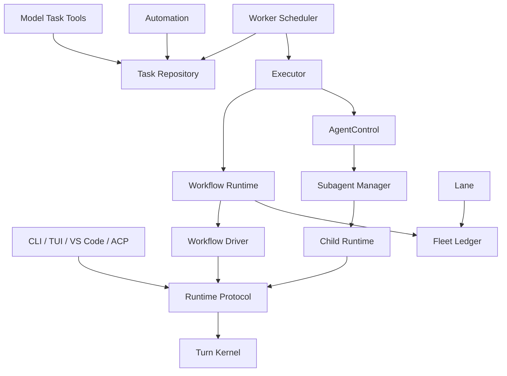
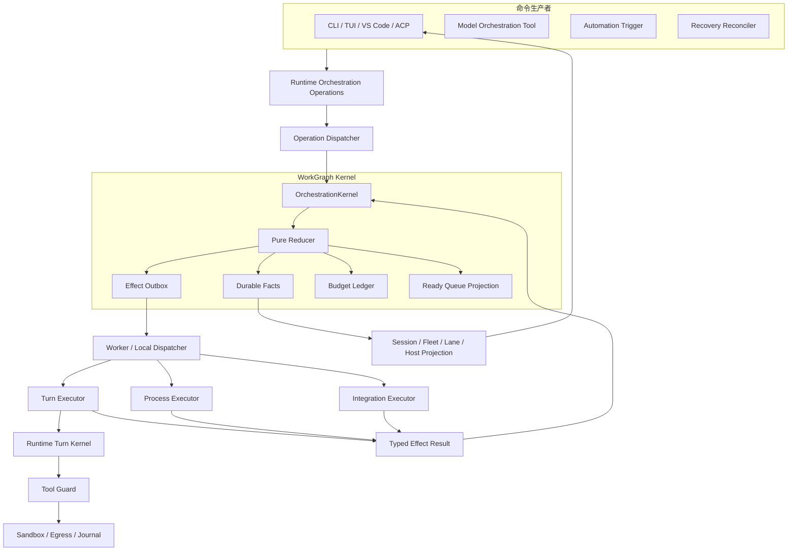

# Task Orchestration 架构升级方案

> 状态：OR0、OR1、OR2、OR3、OR4、OR5、OR6、OR7 `accepted`。
>
> OR0 基线：
> [`task-orchestration-or0-baseline.json`](task-orchestration-or0-baseline.json)。
> OR1 证据：
> [`task-orchestration-or1-evidence.json`](task-orchestration-or1-evidence.json)。
> OR2 证据：
> [`task-orchestration-or2-evidence.json`](task-orchestration-or2-evidence.json)。
> OR3 证据：
> [`task-orchestration-or3-evidence.json`](task-orchestration-or3-evidence.json)。
> OR4 证据：
> [`task-orchestration-or4-evidence.json`](task-orchestration-or4-evidence.json)。
> OR5 证据：
> [`task-orchestration-or5-evidence.json`](task-orchestration-or5-evidence.json)。
> OR6 证据：
> [`task-orchestration-or6-evidence.json`](task-orchestration-or6-evidence.json)。
>
> CodeHelper 基线：`refactor/security-governance` 分支，Commit
> `ca3c4ba` 加当前未提交 SG1-SG7 工作区。
>
> Codex 参考基线：`main` 分支，Commit
> `3bbf1fe75701c97fb190e0867002ba2d9dbda5db`。
>
> 范围：Task、Attempt、Worker、Automation、Workflow、Lane、Fleet、
> Subagent、Runtime Turn 之间的编排协议、状态所有权、持久化、恢复、取消、
> 预算、调度、上下文、集成和可观测性。

## 1. 执行摘要

CodeHelper 已经具备完整的任务编排组件：

- Task Repository 提供持久队列、Attempt、Lease、Heartbeat、Retry 与 Reclaim；
- Worker Scheduler 按 Executor、Workspace 和 Session Claim 可执行任务；
- Automation 按稳定 Schedule Slot 创建后台任务；
- Workflow 提供受限 DAG IR、依赖、并行 Wave、Retry、Timeout 与 Checkpoint；
- Subagent 提供 Role、Delegation Policy、Agent Tree、Mailbox、Tree Budget、
  Worktree、Result 与 Integration；
- Runtime Turn Kernel 提供 Durable Effect、Approval、Tool、Verification、
  Journal、Terminal Commit 与 Restart Recovery；
- Lane 提供本地进程 Placement，Fleet Ledger 提供运行审计视图。

这些组件分别解决了局部问题，但它们没有共享一个权威编排状态机。目前至少存在
五个生命周期所有者：

```text
Task Repository
Worker Scheduler
Workflow Runtime
Subagent Manager / Graph
Runtime Turn Kernel
```

其直接后果是：

1. Task、Workflow Node、Agent 与 Turn 使用不同状态和终止语义；
2. Retry、Cancel、Budget、Recovery 与 Result Binding 分散在多个层次；
3. Workflow 自己调度 Goroutine，Worker 自己调度 Lease，Subagent 自己管理并发；
4. Host Runtime Protocol 只能直接操作 Turn，无法直接操作 Run、Node 或 Agent；
5. 跨层故障需要通过 Task ID、Agent ID、Thread ID、Turn ID 人工拼接；
6. 部分声明存在但没有进入生产执行门禁，例如 Workflow Token 与 Cost Budget；
7. Child Runtime 和 Workflow Driver 需要额外 Event Pump、订阅和轮询来观察 Turn。

本方案引入唯一的 `OrchestrationKernel`，将所有可执行工作投影为统一
`WorkGraph`：

```text
Orchestration Command
        |
        v
WorkGraph Reducer
        |
        v
Durable Facts + Effect Outbox
        |
        v
Effect Dispatcher
   |         |          |
 Turn     Process    Integration
```

升级不删除 Task、Workflow、Subagent、Lane 或 Fleet 的领域概念，而是重新定义其
职责：

- Workflow 负责把 Spec 编译为 WorkGraph，不再拥有第二套调度状态机；
- Worker 负责 Claim 和执行 Effect，不再决定业务生命周期；
- Subagent 保留 Role、Context、Worktree 与 Integration，但 Agent Node 生命周期
  由 WorkGraph Kernel 统一驱动；
- Lane 只负责执行资源 Placement；
- Fleet 只负责 Projection 和审计；
- Runtime Turn 继续拥有单个 Turn 内的模型、工具和验证循环；
- OrchestrationKernel 拥有跨 Turn、跨 Agent、跨 Node 的运行生命周期。

最终目标是：

> 让长时间、多步骤、多 Agent 的工作具备单一事实源、严格预算、事件驱动调度、
> 可证明的取消、崩溃恢复和端到端审计，同时保留 CodeHelper 已有的 Guard、
> Sandbox、Journal、Receipt、Worktree 与 Integration 优势。

## 2. 背景与问题定义

### 2.1 当前组件关系



图中每条路径本身都能工作，但控制权发生重复：

- Worker 根据 Task State 决定是否执行；
- Workflow 根据 Node Status 决定是否进入下一 Wave；
- Subagent 根据 Agent Status 决定是否允许 Follow-up、Wait 或 Integration；
- Runtime 根据 Turn Kernel State 决定 Tool、Verification 与 Terminal；
- Fleet 再次记录 Run/Task 状态，但不参与权威决策。

### 2.2 当前身份层次

| 身份 | 当前含义 | 当前所有者 |
| --- | --- | --- |
| Task ID | 持久后台任务 | Task Repository |
| Attempt | 一次 Lease 执行机会 | Task Repository / Worker |
| Workflow Run ID | 一次 DAG 运行 | Workflow Checkpoint |
| Workflow Node ID | DAG 节点 | Workflow Runtime |
| Agent ID / Path | Child Agent 身份与拓扑 | Subagent Graph |
| Thread ID | 对话与 Engine 容器 | Runtime ThreadManager |
| Turn ID | 一次 Agent 执行 | Runtime |
| Effect ID | Provider、Tool、Journal 等持久副作用 | Turn Kernel |
| Lane ID | 本地执行 Placement | Lane Registry |
| Fleet Run ID | 审计视图中的 Run | Fleet Ledger |

这些身份没有一个共同的上层 Correlation Contract。后台 Workflow Node 创建新 Turn
时，Task、Run、Node、Thread 与 Turn 的绑定不是统一的原子事实。

### 2.3 当前状态机分裂

Task：

```text
queued -> running -> completed
                  -> failed
                  -> waiting
                  -> queued
queued -> canceled
```

Workflow Node：

```text
pending -> running -> completed
                   -> failed
pending -> skipped
```

Subagent：

```text
requested -> starting -> running -> waiting
                              \-> completed / failed / interrupted
completed -> integrating -> integrated / integration_failed
terminal -> starting
terminal -> closed
```

Turn：

```text
accepted -> running -> waiting for approval/input
                    -> verifying / repairing
                    -> completed / failed / canceled
```

这些状态不能简单合并成一个枚举，但必须由一个上层 Aggregate 明确它们之间的
映射、所有权与因果关系。

## 3. 当前实现中应保留的能力

本次升级是控制面收敛，不是重写所有编排组件。以下能力必须保留。

### 3.1 Task 与 Worker

- Workspace-scoped Claim；
- Lease Owner 与 Heartbeat Fencing；
- Attempt 独立记录；
- Retry、Drain、Interrupted、Lease Expired 原因区分；
- 非可执行 Work Board Task 不被 Worker Claim；
- Executor 注册集合在构造期固定；
- 不确定副作用默认禁止盲目 Retry。

### 3.2 Workflow

- Spec 唯一 Node ID、Dependency 与 Cycle 校验；
- 条件 Node、Compensation 与 Failed Dependency Skip；
- Node 级 Retry、Backoff、Timeout；
- Spec Fingerprint 与 Resume 拒绝；
- Structured Output Schema；
- Content Handle 保存大结果；
- Deterministic JS Host 的受限能力。

### 3.3 Multi Agent

- Delegation Disabled、Explicit、Adaptive 模式；
- Canonical Agent Path；
- Role、Stance、Depth 与 Nested Delegation；
- Task Capsule、Last N Turns、Full Context Fork；
- Durable Agent Tree、Mailbox、Completion Envelope；
- Token、Cost、Parallel、Resident、Total Budget；
- Read-only、Serialized、Worktree 三种 Workspace 策略；
- Owned Paths、Write Claims 与 Conflict Report；
- Preview Digest 绑定的 Integration；
- Parent Workspace Journaled Apply 与 Verification。

### 3.4 Runtime 与安全

- Host 只提交 Operation，不执行 Provider、Tool 或 Sandbox；
- Turn Kernel 是单 Turn 的唯一 Reducer Authority；
- Durable Effect 在副作用之前持久化；
- Tool 必须经过 Registry、Guard、Permission、Approval、Constitution、
  Claims、Journal、Sandbox 与 Egress；
- Terminal State、Session Delta、Receipt、Event 与 Outbox 原子提交；
- Pending Turn 与 Pending Terminal 可恢复；
- SG7 Attempt 必须绑定 Effective Permission Profile Digest。

### 3.5 Context Engineering 与 Tool Execution

- ContextLedger、World State Patch、WindowLedger；
- Tool Result Token-native Admission 与 Content Handle；
- Stable Prefix Digest 与 Incremental Eligibility Receipt；
- Typed Execution、Head/Tail Capture、Fair Resource Claims；
- Cancellation Terminal Owner 与 Teardown Receipt。

## 4. Codex 实现研究

### 4.1 统一 AgentControl

Codex 每棵 Root Thread Tree 只有一个共享 `AgentControl`。Root 与所有 Child
共享以下对象：

- Agent Registry；
- ThreadManager Weak Reference；
- Execution Limiter；
- V2 Residency；
- Rollout Budget。

Child 不进入第二套 Agent Runtime，而是由同一个 ThreadManager 创建普通 Thread。
Agent Identity、Thread Identity、Session Source 与 Parent Thread 因此天然绑定。

该设计的主要价值不是类型更少，而是：

1. Spawn、Follow-up、Interrupt、Wait 与 Resume 都操作同一种 Thread；
2. Child Status 从普通 Runtime Event 派生；
3. Thread Start 边界直接执行并发 Admission；
4. Restart 可以从 Thread Store 与 Agent Graph 恢复；
5. Host 与 Model Tool 看到的是同一组 Thread 事实。

### 4.2 原子 Spawn Reservation

Codex 在创建 Child 前预留：

- Agent 总量 Slot；
- Canonical Agent Path；
- Agent Nickname；
- V2 Resident Slot。

Reservation 未 Commit 时通过析构自动回滚，避免部分 Spawn 留下占用。CodeHelper
已有预算预留与 Worktree Allocation，但这些预留分散在 Manager、Graph、
childRuntime 与 Worktree Provider 中，应收敛为统一 Admission Receipt。

### 4.3 Execution Limiter

Codex 将并发限制放在“新的 Child Turn 是否真正启动”边界，而不是只限制 Child
对象数量。Execution Guard 随 Turn 生命周期自动释放。

这解决了 Resident Agent 与 Running Agent 的语义差异：

- Resident Agent 可以完成后继续保留上下文；
- Follow-up 会重新进入 Execution Admission；
- 只有真正运行的 Child 占用并发执行 Slot。

CodeHelper 已经分别实现 Resident 上限、Active Agent 上限和 child Governor Lease，
但它们不属于统一 WorkGraph Admission。

### 4.4 Event-driven Wait

Codex `wait_agent` 订阅 Session InputQueue Activity。Child Completion 被投递到
Mailbox 后唤醒 Parent；Steer 也能中断等待。等待不轮询 Agent 状态。

CodeHelper 的 `subagent.Manager.Wait` 已使用 Condition Variable，但 child release
仍通过固定间隔轮询 Turn Start 与 Terminal；Workflow Driver 也为每个 Node 创建
Event Subscription。目标设计应将所有等待统一为 Runtime-owned Subscription。

### 4.5 Residency

Codex 对已完成、失败或中断且没有 Active Turn、没有 Pending Mailbox 的 Child
执行 LRU Unload：

1. 先确保 Rollout 已持久化；
2. Shutdown Child Thread；
3. 从 ThreadManager 移除 Runtime Object；
4. 保留 Agent Metadata 与 Thread Store；
5. Follow-up 时按需 Reload。

CodeHelper 当前达到 `MaxResident` 后拒绝 Spawn，需要 Parent 主动 Close 释放。
引入 LRU 后，Agent 总量、Resident Runtime 数量和 Running 数量可以独立治理。

### 4.6 Context Fork

Codex 支持不 Fork、Full History 和 Last N Turns，并对 Fork 内容执行明确过滤：

- 保留 System、Developer、User；
- 仅保留 Assistant Final Answer；
- 删除 Reasoning、Tool Call、Tool Output、Search 与 Inter-Agent Communication；
- Full Fork 可保留 Reference World State；
- Truncated Fork 必须重建 World State Baseline。

CodeHelper 的 Task Capsule 更适合默认场景，应保留；Codex 的优势在于 Fork
Projection 与 Prompt Cache 语义更精确。目标设计应统一两者。

### 4.7 Rollout Budget

Codex 在 Root Session Tree 共享加权 Token Budget，并按 Thread 与 Window ID
投递剩余预算提醒。该机制直接在模型 Usage 结算路径执行。

CodeHelper 的 Tree Budget 更丰富，支持 Token、Cost 与 Reservation；但 Workflow
生产 Driver 返回空 Budget Snapshot，Workflow 的 MaxTokens、MaxCostUSD、
MaxAgents、MaxDepth 没有形成完整生产门禁。

### 4.8 不应照搬的部分

Codex 的 Multi Agent 控制面不是完整 Workflow Engine，不能替代 CodeHelper 的：

- Durable Task Lease 与跨进程 Claim；
- DAG、Compensation 和 Structured Output；
- Worktree Isolation；
- Owned Path 与 Write Claim；
- Preview-bound Integration；
- Cost Budget 与预算预留；
- Guard、Journal 与 Verification Receipt。

Codex Agent Graph 主要保存 Thread Spawn Edge，生命周期与 Integration 表达能力
弱于 CodeHelper Durable Agent Graph。因此应借鉴其统一 Thread、Residency、
Context Fork 与 Event-driven Wait，而不是降低 CodeHelper 的持久化和安全语义。

## 5. 核心问题与根因

### 5.1 编排不是 Runtime 一等协议

Runtime Protocol 当前只有：

- Turn Start、Cancel、Steer；
- Approval Decision；
- Input Reply；
- Thread Compact、Fork；
- Turn Revert。

Task、Workflow、Agent Lifecycle 主要通过 Tool 或 Repository API 操作。结果是：

- Host 无法通过统一 Operation 控制 Run；
- VS Code 与 ACP 必须额外查询 Projection；
- Operation Receipt 无法覆盖整个 WorkRun；
- Workflow Cancel 与 Turn Cancel 只能在内部手工桥接；
- Host Retry、Agent Follow-up 与 Worker Retry 缺少统一命令语义。

### 5.2 多个 Scheduler 同时拥有运行决策

- Worker Scheduler 决定何时 Claim Task；
- Workflow Runtime 决定 Ready Wave；
- Subagent Manager 决定 Agent Slot；
- childRuntime Governor 决定 Child Turn Admission；
- Turn Engine ToolScheduler 决定 Tool Effect Admission。

这些层次分别合理，但缺少统一 Resource Hierarchy 和公平策略。一个 Workflow
可以在 Worker 的一个 Slot 内启动多个 Node；每个 Node 又启动 Child Turn；每个
Turn 再并发执行 Tool。顶层无法准确预测实际并发和预算。

### 5.3 Workflow Budget 未闭环

Workflow Spec 声明：

```text
MaxTokens
MaxCostUSD
MaxSteps
MaxAgents
MaxDepth
MaxParallel
```

当前 Runtime 仅在 `charge` 中执行 `MaxSteps`，在 `runWave` 中执行
`MaxParallel`。生产 `backgroundWorkflowDriver.Budget()` 返回空 Snapshot。

因此 Token、Cost、Agent 与 Depth 限制更接近声明性元数据，而不是实际执行门禁。
这是 P0 正确性问题，不能只通过文档澄清。

### 5.4 跨层恢复没有共同 Commit Point

当前恢复层次包括：

```text
Task Lease Recovery
Workflow Checkpoint Recovery
Agent Graph Recovery
Turn Effect Recovery
Workspace Journal Recovery
Terminal Outbox Recovery
```

每一层都能恢复自身状态，但缺少一个原子事实说明：

```text
Attempt A
  执行 Node N
  已绑定 Thread T / Turn U
  使用 Authority Digest D
  当前 Durable Effect 为 E
```

如果进程在绑定边界崩溃，系统可能知道 Task 正在运行，却不知道应采用哪个 Turn；
或者知道 Turn 已完成，却尚未把 Node Settled。

### 5.5 生命周期等待与清理路径分散

当前同时存在：

- Worker Ticker；
- Automation Ticker；
- Subagent Condition Variable；
- Workflow WaitGroup；
- Workflow Event Subscription；
- childRuntime Event Pump；
- childRuntime Start/Terminal Polling；
- Lane Process Wait。

重复机制增加了 Shutdown 顺序、事件丢失窗口和后台 Goroutine 残留风险。

### 5.6 Fleet 与 Lane 定位不清

Fleet Ledger 当前记录 Workflow 与 Lane 事实，但不参与调度决策。它容易被误解为
第二个控制面。Lane 既包含进程生命周期，也被用于表达 Worker Placement。

目标设计必须明确：

- WorkGraph Store 是业务状态权威；
- Lease Store 是执行所有权权威；
- Lane 是 Placement；
- Fleet 是 Projection；
- 二者都不能决定 Node 业务状态。

## 6. 目标与非目标

### 6.1 目标

1. 所有可执行工作拥有统一 `RunID -> NodeID -> AttemptID -> EffectID` 链路。
2. Task、Workflow、Subagent 与 Automation 进入同一个 WorkGraph Kernel。
3. 一个 Reducer 决定 Node Ready、Attempt 创建、Retry、Cancel 与 Terminal。
4. 所有外部副作用在执行前形成 Durable Effect Fact。
5. 所有 Host 通过 Runtime Protocol 提交和观察编排命令。
6. Token、Cost、Steps、Agents、Depth、Parallel、Resident Budget 真实执行。
7. 等待、取消、恢复和清理使用事件驱动机制。
8. Child 继续使用普通 Runtime Turn，并保留 Worktree 与 Integration。
9. Worker 支持跨进程 Lease，但不拥有业务状态机。
10. Fleet、Lane 与 UI 成为权威事实的 Projection。
11. 保持 CE7 Token 与 Prompt Cache 指标不回退。
12. 保持 Architecture Ratchet、Security Ratchet 和 Tool Execution Gate。

### 6.2 非目标

- 不把单 Turn 内的 ReAct Loop 移出 `internal/runtime/agent`；
- 不让 Host 直接调用 Provider、Tool、Subagent Manager 或 Worker Executor；
- 不引入远端云编排控制面；
- 不要求所有工作都使用 Agent；
- 不把 Work Board Todo 自动转换为可执行 Task；
- 不取消 Workflow 的确定性 IR；
- 不删除 Automation 的 RRULE 与 Slot 去重；
- 不删除 Task Lease；
- 不弱化 Guard、Approval、Journal、Sandbox 或 Egress；
- 不使用一个巨大通用状态枚举替代领域状态；
- 不增加未发布格式的长期兼容迁移；
- 不以减少代码行数代替正确性。

## 7. 设计原则

1. **单一业务权威**：WorkGraph Kernel 是跨 Turn 编排的唯一状态机。
2. **分层状态而非状态混合**：Run、Node、Attempt、Execution 各自有明确状态。
3. **事实先于副作用**：Effect 必须先持久化，再交给 Executor。
4. **身份先于投影**：所有 Event、Receipt、Trace 必须携带稳定 Correlation。
5. **至少一次调度，幂等副作用**：Lease 可以重复取得，Effect 不能重复生效。
6. **权限单调收紧**：Node Authority 不得超过 Run 与 Parent Authority。
7. **预算预留与真实结算分离**：Admission 使用 Reservation，Terminal 使用 Usage。
8. **取消是状态转移**：Cancel 不是丢弃 Context，也不是只发送进程信号。
9. **恢复是主路径**：每个 Commit Window 都必须有显式恢复规则。
10. **Projection 不反向写权威状态**：Fleet、Lane、UI 只能提交 Command。
11. **模型输出有界**：Node Result 使用摘要加 Handle，不复制完整 Transcript。
12. **迁移期双读不双写**：同一业务事实始终只有一个写 Owner。

## 8. 目标总体架构



### 8.1 所有权边界

| Package | 目标职责 |
| --- | --- |
| `internal/orchestration/model` | WorkRun、Node、Attempt、Effect、Budget 类型 |
| `internal/orchestration/kernel` | Reducer、Command、Fact、Invariant、Recovery |
| `internal/orchestration/store` | Aggregate、Outbox、Lease、Projection 持久化 |
| `internal/orchestration/dispatcher` | Ready Effect Claim、Executor 调用与 Result 回传 |
| `internal/orchestration/workflow` | Spec 校验与 WorkGraph 编译 |
| `internal/orchestration/automation` | Schedule Slot 到 SubmitRun Command |
| `internal/orchestration/subagent` | Role、Context、Mailbox、Worktree、Integration Policy |
| `internal/orchestration/lane` | 本地执行 Placement |
| `internal/orchestration/fleet` | 只读 Projection 与审计 |
| `internal/runtime/agent` | 单 Turn Kernel，不承担跨 Node 调度 |
| `internal/runtime/app` | Orchestration Operation Handler、Event 与 Host Query |
| `internal/runtime/app/wire` | 只负责构造 Store、Kernel、Dispatcher、Executor |
| `internal/adapter/tool/task` | Model Tool 到 Orchestration Command 的适配 |
| `internal/adapter/tool/agent` | Model Tool 到 Agent Node Command 的适配 |
| `internal/persist` | SQLite、Event、CAS、Outbox 的实现 |

## 9. 核心领域模型

### 9.1 WorkRun

```go
type WorkRun struct {
    ID              RunID
    Kind            RunKind
    SessionID       protocol.SessionID
    Workspace       protocol.WorkspaceIdentity
    RootThreadID    protocol.ThreadID
    State           RunState
    Revision        uint64
    AuthorityDigest string
    Budget          BudgetAccount
    CreatedAt       time.Time
    UpdatedAt       time.Time
}
```

`RunKind` 初始支持：

```text
agent_task
workflow
automation
background_command
verification
```

### 9.2 WorkNode

```go
type WorkNode struct {
    ID               NodeID
    RunID            RunID
    Kind             NodeKind
    ParentNodeID     NodeID
    Dependencies     []NodeID
    Condition        Condition
    State            NodeState
    Revision         uint64
    Executor         ExecutorRef
    RetryPolicy      RetryPolicy
    TimeoutPolicy    TimeoutPolicy
    AuthorityDigest  string
    BudgetReservation BudgetReservation
    ResultRef        ContentRef
}
```

`NodeKind` 初始支持：

```text
agent_turn
workflow_phase
process
verification
integration
approval_gate
input_gate
join
```

`workflow_phase` 与 `join` 是纯控制节点，不产生外部副作用。

### 9.3 Attempt

```go
type Attempt struct {
    ID              AttemptID
    RunID           RunID
    NodeID          NodeID
    Number          int
    State           AttemptState
    LeaseOwner      string
    LeaseEpoch      uint64
    LeaseExpiresAt  time.Time
    AuthorityDigest string
    Execution       ExecutionRef
    StartedAt       time.Time
    EndedAt         *time.Time
}
```

Attempt 是一次可重试执行机会。Node 是业务工作，Attempt 是执行历史。Node Retry
必须创建新 Attempt，不能覆盖旧 Attempt。

### 9.4 ExecutionRef

```go
type ExecutionRef struct {
    Kind      ExecutionKind
    EffectID  EffectID
    ThreadID  protocol.ThreadID
    TurnID    protocol.TurnID
    SessionID protocol.SessionID
    ProcessID string
    LaneID    string
}
```

不同 Executor 只填充适用字段，但 `EffectID` 必须始终存在。

### 9.5 WorkGraph

WorkGraph 是 Run、Node 与 Dependency 的持久 Aggregate。它不保存大 Transcript
或 Tool Output，只保存：

- 稳定 Identity；
- 状态和 Revision；
- Dependency；
- Authority Digest；
- Budget Reservation 与 Usage；
- ExecutionRef；
- Content、Receipt、Verification、Integration Handle。

## 10. 状态机

### 10.1 RunState

```text
submitted
active
waiting
canceling
completed
failed
canceled
blocked
```

`blocked` 表示需要外部状态变化，例如权限、输入、环境或人工处置；它不同于
`failed`。

### 10.2 NodeState

```text
pending
ready
leased
running
waiting
succeeded
failed
skipped
canceled
blocked
```

合法主链：

```text
pending -> ready -> leased -> running
running -> waiting -> running
running -> succeeded / failed / blocked / canceled
pending -> skipped / canceled
ready -> canceled
leased -> ready
failed -> ready
```

`leased -> ready` 仅由 Lease Expiry、Drain 或可证明未开始的 Attempt 触发。

### 10.3 AttemptState

```text
created
leased
effect_started
waiting
succeeded
failed
canceled
interrupted
lease_lost
indeterminate
```

`indeterminate` 是重要终态：外部副作用可能已发生，但缺少可验证结果。该状态默认
禁止自动 Retry。

### 10.4 Execution State

Execution 不复制 Turn Kernel 的细节，只记录：

```text
prepared
started
settled
teardown_complete
```

Turn 内部的 Approval、Tool、Verification、Journal 仍由 Turn Kernel 管理。

## 11. Command、Fact 与 Effect

### 11.1 Command

初始 Command：

```text
SubmitRun
CancelRun
ResumeRun
RetryNode
SkipNode
ClaimReadyNode
RenewAttemptLease
ReleaseAttemptLease
BindExecution
ExecutionStarted
ExecutionWaiting
ExecutionSettled
ResolveApproval
ProvideInput
SendAgentMessage
IntegrateAgentResult
CloseAgentNode
ReconcileRun
```

Command 包含：

- Command ID；
- Expected Aggregate Revision；
- Actor；
- Authority Digest；
- Correlation；
- 幂等键；
- 时间。

### 11.2 Durable Fact

初始 Fact：

```text
RunSubmitted
RunActivated
RunCancelRequested
RunSettled
NodeDeclared
NodeReady
NodeSkipped
AttemptCreated
AttemptLeased
AttemptLeaseRenewed
ExecutionBound
EffectStarted
ExecutionWaiting
ExecutionResultReceived
AttemptSettled
NodeSettled
BudgetReserved
BudgetCharged
BudgetReleased
AgentMessageQueued
IntegrationRequested
IntegrationSettled
```

Reducer 只接受 Command、读取 Aggregate State、产生 Fact 与 Effect，不直接调用
Provider、Runtime、Process、Git 或 Store 外部能力。

### 11.3 Effect

```go
type Effect struct {
    ID              EffectID
    RunID           RunID
    NodeID          NodeID
    AttemptID       AttemptID
    Kind            EffectKind
    PayloadRef      ContentRef
    AuthorityDigest string
    IdempotencyKey  string
}
```

初始 `EffectKind`：

```text
start_turn
cancel_turn
run_process
cancel_process
verify
integrate
publish_notification
cleanup_execution
```

## 12. Runtime Protocol 升级

### 12.1 新增 Operation

```text
run.submit
run.cancel
run.resume
node.retry
node.skip
agent.message
agent.interrupt
agent.close
agent.integrate
```

Model Tool 不直接调用 Manager 或 Repository，而是构造同一种 Operation。Host 和
Model Tool 的差异只在 Actor、Policy 与 Approval，不在执行路径。

### 12.2 新增 Event

```text
run.started
run.status
run.completed
run.failed
run.canceled
node.status
attempt.status
execution.bound
budget.updated
agent.message
agent.integration
```

现有 `agent.spawned`、`agent.status`、`agent.message`、`agent.integration` 可在迁移
期继续投影，但来源改为 WorkGraph Fact。

### 12.3 Correlation

所有相关 Event、Receipt、Trace、Usage 必须携带：

```go
type OrchestrationCorrelation struct {
    RunID     RunID
    NodeID    NodeID
    AttemptID AttemptID
    EffectID  EffectID
}
```

Turn Event 额外携带 ThreadID 与 TurnID。Process Event 额外携带 Session/PID。

### 12.4 Operation Commit

`SubmitRun` 必须原子提交：

1. Run；
2. 初始 Node；
3. Dependency；
4. Budget Reservation；
5. Run Started Event；
6. Operation Receipt；
7. Outbox。

不能先返回 Accepted 再异步创建 WorkGraph。

## 13. Workflow 编译与执行

### 13.1 Workflow 只负责编译

Workflow Spec 校验后编译为：

```text
Spec Node -> WorkNode
Needs -> Dependency Edge
When -> Condition
Retry -> RetryPolicy
Timeout -> TimeoutPolicy
Permissions -> Authority Constraint
Budget -> Hierarchical Budget Limit
Schema -> Result Contract
```

原 `Runtime.walk/runWave` 不再是生产调度权威。Ready Node 由 Reducer 根据 Durable
Dependency Fact 推导。

### 13.2 Ready 推导

Node Ready 条件：

1. Node 为 Pending；
2. 所有 Dependency 已 Terminal；
3. Condition 满足；
4. Run 未 Canceling 或 Terminal；
5. Budget 可预留；
6. Authority 仍有效；
7. Executor 可用。

不满足 Condition 的 Node 产生 `NodeSkipped` Fact，而不是仅修改内存 Map。

### 13.3 并行

并行不再由 Wave 创建 Goroutine 表达。所有满足条件的 Node 都进入 Durable Ready
Projection，Dispatcher 根据：

- Run Fairness；
- Workspace Claims；
- Executor Capacity；
- Budget；
- Lane Availability；
- Priority 与 Created Order；

选择 Node。

### 13.4 Structured Output

Node Result 顺序：

```text
Execution Result
 -> Output Admission
 -> Schema Validation
 -> Content Store
 -> Result Handle
 -> NodeSettled Fact
```

Schema Validation 失败属于 Attempt Failure。完整输出不得直接写入 WorkGraph。

## 14. Worker、Lease 与 Dispatcher

### 14.1 Worker 新职责

Worker 只负责：

1. Claim Ready Attempt；
2. 续租；
3. 调用指定 Executor；
4. 回传 Typed Result；
5. 执行 Teardown；
6. 报告 Lease Lost 或 Indeterminate。

Worker 不再直接把 Task 从 Running 改为 Completed，也不决定 Retry。

### 14.2 Lease Fencing

每次 Claim 生成递增 `LeaseEpoch`。Executor 回传结果必须携带：

```text
AttemptID
LeaseOwner
LeaseEpoch
EffectID
```

过期 Owner 的结果不能覆盖新 Attempt，但可以作为 Late Evidence 保存用于诊断。

### 14.3 幂等性

Executor 分三类：

| 类别 | Retry 规则 |
| --- | --- |
| Pure | 可自动 Retry |
| Idempotent | 使用稳定 Idempotency Key 自动 Retry |
| Consequential | 仅在 Receipt 证明未生效时 Retry |

无法确定外部副作用是否发生时，Attempt 进入 `indeterminate`，Run 进入 `blocked`
或按显式 Compensation Policy 处理。

### 14.4 公平性

Dispatcher 使用分层公平队列：

```text
Workspace
 -> Session
   -> Run
     -> Node Priority / Created Order
```

一个大型 Workflow 不能长期占满所有执行 Slot。建议初始使用 Deficit Round Robin，
成本权重由 Node Executor 类型和预算 Reservation 推导。

## 15. Subagent 收敛

### 15.1 Agent 是 WorkNode

Spawn Agent 创建：

1. Agent Metadata；
2. Agent WorkNode；
3. Context Fork Receipt；
4. Worktree Allocation；
5. Budget Reservation；
6. Start Turn Effect。

这些事实必须由同一个 Submit/Spawn Transaction 原子绑定，或使用可恢复的
Prepared Reservation。

### 15.2 保留 Agent 领域状态

Agent Role、Path、Mailbox、Worktree、Integration 不塞入通用 Node 字段，而通过
`AgentNodeData` 扩展：

```go
type AgentNodeData struct {
    AgentPath      string
    ParentNodeID   NodeID
    Role           Role
    Stance         Stance
    ContextReceipt ContextReceipt
    Worktree       WorktreeRef
    OwnedPaths     []string
}
```

NodeState 是执行状态；IntegrationState 是结果集成状态。二者不混成一个状态机。

### 15.3 Follow-up

Follow-up 不创建新 Agent Node，而是在同一 Agent Node 下创建新的 Attempt 或 Child
Execution Node。这样保留 Agent Identity，同时每个 Turn 有独立 Attempt 与预算。

### 15.4 Event-driven Wait

`wait_agent` 订阅 WorkGraph Subscription：

```text
Agent Node Terminal
Agent Mailbox Activity
Parent Steer
Run Cancel
Timeout
```

任何一个事件都可唤醒等待。禁止固定间隔查询 childRuntime Map。

### 15.5 Residency

引入三个独立限制：

```text
MaxTotalAgentNodes
MaxResidentAgentRuntimes
MaxRunningAgentTurns
```

可卸载条件：

- Agent 当前无 Running Attempt；
- 无 Pending Approval/Input；
- Mailbox 无 TriggerTurn 消息；
- Worktree 状态已持久化；
- Turn History 与 Context Ledger 已落盘；
- Integration 未处于 Applying；
- 不在 Protected Set。

LRU Unload 只释放 Engine、Toolset、Watcher 与内存 History，不 Close Agent Node，
不删除 Worktree。Follow-up 时按需 Restore。

## 16. Context Fork 与 Token 效率

### 16.1 统一 ContextForkSpec

```go
type ContextForkSpec struct {
    Mode          ContextMode
    LastTurns     int
    IncludeWorld  bool
    IncludeFiles  []string
    MaxTokens     uint64
    SourceWindow  string
}
```

模式：

| 模式 | 语义 |
| --- | --- |
| `fresh` | 仅 System、Developer、Role 与 Objective |
| `task_capsule` | 默认；Entity Truth、Evidence、Working Set 与 Objective |
| `last_n_turns` | Capsule 加最近 N 个闭合 Turn |
| `full` | 显式授权的完整可投影历史 |

### 16.2 Projection 规则

除非模式明确要求，否则 Child Context 不复制：

- Raw Reasoning；
- Tool Call 与完整 Tool Output；
- Approval Transcript；
- Inter-Agent Transport Message；
- 已被 Content Handle 替代的大结果；
- Secret 或 Credential Material。

Full Fork 仅在保持 Stable Prefix 与 World State Reference 时沿用 Baseline；
Truncated Fork 必须生成新 World State Full Snapshot。

### 16.3 Context Receipt

```go
type ContextForkReceipt struct {
    Mode             ContextMode
    LogicalDigest    string
    StablePrefix     string
    SourceWindowID   string
    TokenEstimate    uint64
    IncludedTurns    []protocol.TurnID
    IncludedEntities []string
    OmittedKinds     []string
}
```

Context Receipt 绑定 Agent Node 与首个 Attempt，后续 Follow-up 使用独立增量 Receipt。

## 17. 统一预算模型

### 17.1 层级

```text
Workspace Budget
 -> Session Budget
   -> Run Budget
     -> Node Budget
       -> Attempt Reservation
         -> Turn / Tool Actual Usage
```

### 17.2 维度

```go
type BudgetLimit struct {
    MaxInputTokens  uint64
    MaxOutputTokens uint64
    MaxCostMicros   uint64
    MaxSteps        uint64
    MaxAgents       uint64
    MaxDepth        uint64
    MaxParallel     uint64
    MaxResident     uint64
    MaxWallTime     time.Duration
}
```

### 17.3 Reservation

Attempt 启动前预留：

- Execution Slot；
- 预计 Token；
- 最高 Cost；
- Agent Slot；
- Workspace Claim；
- Wall Time Deadline。

启动失败必须释放 Reservation。Terminal 使用真实 Receipt Charge，差额 Refund。

### 17.4 Usage Authority

Usage 来源优先级：

```text
Provider-observed Usage
 > Runtime exact serialized estimate
 > Conservative local estimate
```

模型自报 Token 或 Cost 不作为预算事实。

### 17.5 Budget Exhaustion

- 不允许启动新 Attempt；
- 正在执行的 Attempt 根据 Hard/Soft Policy 决定 Cancel 或完成；
- Parent 与 Child 都接收剩余预算 World State Patch；
- Run 终态区分 `budget_exhausted` 与普通 `failed`；
- 所有 Reservation 必须释放。

## 18. Authority 与安全

### 18.1 Authority Derivation

Node Effective Authority：

```text
Run Authority
 ∩ Parent Node Authority
 ∩ Role Policy
 ∩ Workflow Permission
 ∩ Workspace Policy
 ∩ Current Managed/User/Repository Permission
```

Attempt 创建时绑定：

```text
Authority Revision
Effective Permission Profile Digest
Policy Digest
Tool Catalog Digest
Workspace Identity
```

### 18.2 Authority Drift

Ready Node 在 Claim 前重新检查 Authority Revision：

- 未变化：继续；
- 权限收紧：重新编译并更新 Attempt Digest；
- 权限扩大：不得静默继承，必须重新 Admission；
- 历史 Approval Digest 不匹配：失效；
- Managed Policy 撤销：Cancel 或 Block。

### 18.3 Guard

OrchestrationKernel 不执行文件、进程、网络或 Git 写入。所有 Consequential Effect
仍通过现有 Guard 和 SG 架构。

### 18.4 Control Plane Protection

WorkGraph、Lease、Budget、Agent Graph 与 Integration Record 位于 Runtime-owned
Control Plane。模型不能通过普通 File 或 Process Tool 修改。

## 19. 取消、关闭与 Teardown

### 19.1 Cancel Tree

```text
Cancel Run
 -> Mark Run Canceling
 -> Prevent New Attempt
 -> Cancel Active Child Nodes
 -> Cancel Turn / Process Effects
 -> Await Terminal Owner
 -> Teardown Resources
 -> Release Budget and Claims
 -> Settle Run Canceled
```

### 19.2 Terminal Owner

每个 Effect 只有一个 Terminal Owner：

| Effect | Terminal Owner |
| --- | --- |
| Turn | Runtime Turn Kernel |
| Process | Process Manager |
| Verification | Verification Executor |
| Integration | Integration Service |
| Notification | Outbox Publisher |

OrchestrationKernel 接受 Terminal Result，但不伪造 Executor Terminal。

### 19.3 Close Agent

Close Agent：

1. 禁止 Follow-up；
2. Cancel Active Attempt；
3. 等待 Turn Terminal；
4. 处理未集成 Worktree；
5. 释放 Resident Runtime；
6. 释放 Claims 与 Reservation；
7. 写 Agent Closed Fact。

默认不能静默删除存在未集成修改的 Worktree，应要求 Integrate 或 Discard。

### 19.4 Teardown Receipt

```go
type OrchestrationTeardownReceipt struct {
    RunID             RunID
    NodeID            NodeID
    AttemptID         AttemptID
    RuntimeReleased   bool
    ProcessReleased   bool
    LeaseReleased     bool
    ClaimsReleased    bool
    BudgetReleased    bool
    WorktreeDisposition string
}
```

## 20. 持久化与事务

### 20.1 建议表

```text
work_runs
work_nodes
work_dependencies
work_attempts
work_effects
work_budget_accounts
work_budget_entries
work_results
work_events
work_outbox
work_leases
agent_node_metadata
agent_messages
agent_integrations
```

大 Payload、Result、Diff、Transcript 与 Evidence 保存到 Content Store。

### 20.2 Aggregate Revision

Run 与 Node 都使用 Revision：

- Command 携带 Expected Revision；
- Reducer 产生连续 Fact；
- Store 使用 Compare-and-Swap；
- 重复 Command ID 返回原 Receipt；
- Stale Command 返回 Typed Conflict。

### 20.3 Outbox

以下内容与 Aggregate Fact 同事务提交：

- Host Event；
- Ready Queue Entry；
- Effect Dispatch Entry；
- Completion Notification；
- Operation Receipt。

Publisher 使用稳定 Event ID，重启后允许重复 Publish Attempt，但 Host Projection
按 Event ID 去重。

### 20.4 不双写

迁移期不能同时让：

- Task Repository 写 Task State；
- WorkGraph 写同一 Task State。

每个阶段必须指定唯一写 Owner。旧表可以作为 Projection 双读，但不能作为第二权威。

## 21. Crash Recovery

### 21.1 启动顺序

```text
Open Stores
 -> Reconcile Incomplete Transactions
 -> Restore WorkGraph Aggregates
 -> Rebuild Ready Projection
 -> Reconcile Leases
 -> Reconcile Bound Runtime Turns
 -> Reconcile Process Sessions
 -> Reconcile Integration Attempts
 -> Publish Pending Outbox
 -> Start Dispatcher
 -> Start Automation Tick
```

恢复完成前禁止 Worker Claim 新 Effect。

### 21.2 Commit Window 决策表

| 崩溃位置 | 恢复行为 |
| --- | --- |
| Node Ready 前 | Reducer 重算 Dependency |
| Attempt Created、未 Lease | 重新进入 Ready |
| Lease、未 EffectStarted | Lease Expire 后安全重取 |
| EffectStarted、未 ExecutionBound | 按 Idempotency Key 查询 Executor |
| ExecutionBound、Turn Running | 绑定现有 Pending Turn |
| Turn Terminal、Node 未 Settled | 从 Terminal Receipt 补写 Node Result |
| Result Stored、Node 未 Settled | 复用 Handle 补写 NodeSettled |
| Node Settled、Event 未发布 | Outbox 重发 |
| Integration Applying、无 Receipt | Journal 与 Preview Digest Reconcile |
| Canceling、Teardown 未完成 | 继续 Teardown，不创建新 Attempt |

### 21.3 Orphan Reconciliation

必须识别：

- 无 Attempt 的 Runtime Child Turn；
- 无 WorkNode 的 Worktree；
- 无 Lease 的 Running Attempt；
- 无 Effect 的 Process Session；
- 已终止但仍占用 Budget 的 Attempt；
- 已 Apply 但未 Settled 的 Integration；
- 已 Settled 但未投递的 Completion。

不能自动删除无法证明归属的 Worktree，应进入 Quarantine。

## 22. Integration

### 22.1 保留 Preview-bound Apply

Agent 写入仍遵循：

```text
Child Result
 -> Changed Path Scan
 -> Owned Path Check
 -> Write Claim Check
 -> Parent Baseline Check
 -> Preview Digest
 -> Approval
 -> Journaled Apply
 -> Verification
 -> Integration Receipt
```

### 22.2 Integration 作为 Node

Integration 可由显式 `integration` Node 表达，并依赖 Agent Node Succeeded。
Integration Node 的 Attempt、Authority、Approval、Effect 与 Result 都进入统一
WorkGraph。

### 22.3 Compensation

Workflow 可以声明 Integration Failure Compensation，但 Compensation 不能绕过
Journal。Rollback 结果必须形成独立 Receipt。

## 23. Automation、Lane 与 Fleet

### 23.1 Automation

Automation 保留 Schedule Definition 与 Slot Deduplication。Tick 只提交：

```text
SubmitRun{
    Source: AutomationSlot,
    IdempotencyKey: automation_id + scheduled_at,
}
```

Automation 不直接创建可执行 Task Row。

### 23.2 Lane

Lane 只表达：

- Executor Process Identity；
- Backend；
- Capacity；
- Health；
- Attach/Log；
- Placement Label。

Lane Status 不改变 Node State。Lane 失败由 Dispatcher 转换为 Attempt Result Command。

### 23.3 Fleet

Fleet 由 WorkGraph Event 投影：

- Run 列表；
- Node Tree；
- Attempt Timeline；
- Worker/Lane Placement；
- Budget；
- Verification；
- Integration；
- Failure Summary。

删除任何从 Fleet Ledger 反向驱动执行的可能。

## 24. Host 与产品体验

### 24.1 统一 Run View

CLI、TUI、VS Code、ACP 使用同一 Projection：

```text
Run
├── Node A  completed
│   └── Attempt 1 / Turn ...
├── Node B  running
│   └── Agent /root/explore
├── Node C  waiting_for_approval
└── Node D  pending on B,C
```

### 24.2 Host 操作

Host 支持：

- Cancel Run；
- Retry Failed Node；
- Resume Blocked Run；
- Resolve Child Approval；
- Inspect Attempt；
- Open Result Handle；
- Preview/Apply Integration；
- Inspect Budget；
- Inspect Authority Digest。

Host 只提交 Operation，不直接更新 Store。

### 24.3 Model Tool Surface

模型可见能力建议收敛为：

```text
task_create
task_status
task_control
spawn_agent
agent_control
wait_agent
```

是否进一步减少 Tool 数量由 Token Baseline 决定，不能牺牲清晰 Schema。

## 25. 可观测性

### 25.1 Trace

```text
Run Span
 -> Node Span
   -> Attempt Span
     -> Effect Span
       -> Turn / Tool / Process Span
```

### 25.2 指标

必须记录：

- Run Completion、Failure、Cancel、Blocked Rate；
- Queue Delay、Lease Wait、Execution Time；
- Node Retry 与 Indeterminate Rate；
- Cancel Propagation 与 Teardown Latency；
- Ready Queue Fairness；
- Budget Reserved、Charged、Refunded；
- Resident、Running、Total Agent 数；
- Context Fork Token；
- Workflow Critical Path；
- Recovery Adoption 与 Duplicate Prevention；
- Orphan、Late Result、Stale Lease 数；
- Integration Conflict 与 Verification Failure。

### 25.3 诊断

`doctor` 和 Runtime Monitor 应能输出：

```text
为什么 Run 未结束
哪个 Node 阻塞 Critical Path
哪个 Worker 持有 Lease
哪个 Effect 正在执行
剩余预算
是否存在 Pending Approval/Input
是否存在未发布 Outbox
是否存在资源残留
```

## 26. 性能目标

### 26.1 正确性

| 指标 | 目标 |
| --- | --- |
| 重启后重复 Consequential Effect | 0 |
| 重复 Terminal Publication | 0 |
| Lost Completion | 0 |
| Stale Lease 覆盖新结果 | 0 |
| 预算泄漏 | 0 |
| Cancel 后 Session/PID/Lease/Claim 残留 | 0 |

### 26.2 时延

| 指标 | 目标 |
| --- | --- |
| Ready 到 Claim P95 | 小于 100ms，本地常驻 Worker |
| Agent Completion 到 Parent Wake P95 | 小于 50ms |
| Cancel Propagation P95 | 小于 100ms |
| Teardown P95 | 小于 2s，不含不可控外部进程 |
| Restart Reconcile 1000 Node P95 | 小于 2s |

### 26.3 资源

| 指标 | 目标 |
| --- | --- |
| 生命周期生产轮询 | 0 |
| Agent Runtime 常驻数 | 不超过 MaxResident |
| Running Child Turn | 不超过 MaxParallel |
| 1000 Node Projection 内存 | 有界并可分页 |
| Tool Schema Token | 不高于当前基线 |
| CE7 Input Token P50 | 零回退 |
| Prompt Cache Hit Rate | 不低于当前验收基线 |

## 27. 分阶段实施

### OR0：基线与架构冻结

目标：

- 建立可重复的正确性、性能、Token 与恢复基线；
- 冻结所有状态所有者和重复写路径；
- 不改变生产行为。

工作：

1. 输出 Task、Workflow、Agent、Turn Identity Mapping；
2. 记录所有 Scheduler、Ticker、Event Pump、Polling 与 Goroutine；
3. 建立 100/1000 Node DAG Benchmark；
4. 建立 8/32 Agent Resident Memory Benchmark；
5. 建立 Cancel、Restart、Lease Expiry Fault Injection；
6. 记录 Tool Schema Bytes 与 CE7 Token 指标；
7. 增加 Architecture Ratchet：禁止新建独立 Scheduler。

验收：

- 基线 Artifact 可重复；
- 所有生产状态写 Owner 有清单；
- 所有 Crash Window 有测试编号；
- 当前行为零变化。

### OR1：统一 Identity 与 Runtime Protocol

目标：

- 引入 Run、Node、Attempt、Effect Correlation；
- Host 能通过现有 `turn.start` 提交带完整 Correlation 的最小可执行工作；
- 旧执行路径暂不迁移。

工作：

1. 增加协议 ID、Correlation、Event、Receipt；
2. 扩展 Event Traits 与 Schema Generator；
3. TurnSpec 与 Execution Receipt 携带 Correlation；
4. VS Code、TUI、CLI、ACP 完成兼容 Projection；
5. 添加 Operation Idempotency Test。

OR1 不广告独立 `run.*` 或 `node.*` 写 Operation。没有 OR2 WorkGraph Kernel 时注册
这些 Operation 会让 ACP 宣称支持一个生产中只能失败的能力。OR1 以
`turn.start + OrchestrationCorrelation` 形成真实可执行入口；OR2 建立 Durable
Aggregate 后再注册独立 Run/Node Command。

验收：

- 任意后台 Turn 可追溯到 Run/Node/Attempt/Effect；
- Host 不解析 Event Data 猜测 Correlation；
- Protocol、VS Code、ACP Contract 全通过；
- 旧 Host 行为不回退。

### OR2：WorkGraph Kernel 与 Durable Store

目标：

- 建立唯一 Reducer、Fact、Effect Outbox；
- 支持 Submit、Ready、Attempt、Settle、Cancel 的最小闭环。

工作：

1. 实现 `orchestration/model` 与 `orchestration/kernel`；
2. 实现 SQLite Aggregate、Fact、Outbox；
3. 实现 Revision、Command Deduplication；
4. 实现纯 Reducer 与 Fuzz Invariant；
5. 实现 Recovery Rebuild；
6. 建立 Terminal Atomic Commit。

验收：

- Reducer 无外部副作用；
- 任何 Command 重放结果稳定；
- 任何 Fact 序列违反 Invariant 时 Fail Closed；
- Outbox Fault Injection 无丢失、无重复 Projection；
- Race 与 Fuzz 通过。

实现说明：

- `internal/orchestration/model` 定义 Run、Node、Attempt、Effect 与 Graph 不变量；
- `internal/orchestration/kernel` 提供无 I/O 的 Command -> Fact/Effect Reducer；
- `internal/orchestration/store` 在同一 SQLite 事务中提交 Aggregate、Fact、
  Command Receipt 与 Effect Outbox；
- Runtime 已注册 `run.submit/cancel/resume` 与 `node.retry/skip`；
- Durable Runtime 重启会重新派发 Accepted WorkGraph Operation，Store Command
  Digest 保证幂等；
- WorkGraph Host Event 使用由 Operation ID 与事件序号派生的稳定 Event ID，部分发布
  后崩溃也不会重复追加或重复 Fanout；
- Run、Node、Attempt Event 使用分层引用，只有真实 Execution 使用完整四级
  Correlation；
- Task、Worker、Workflow 尚未迁移到 WorkGraph 写权威，该工作从 OR3 开始。

### OR3：Task、Worker 与 Automation 迁移

目标：

- Task 生命周期由 WorkGraph Kernel 拥有；
- Worker 降为 Dispatcher；
- Automation 只提交 Run。

工作：

1. Task Create 转换为 SubmitRun；
2. Task Attempt 映射为 Work Attempt；
3. Lease 加入 Epoch Fencing；
4. Worker Result 通过 Command 回传；
5. Automation Slot 使用稳定 Idempotency Key；
6. 旧 Task 表变为 Projection；
7. 删除旧 Task State 双写。

验收：

- 多 Worker Claim 只有一个 Winner；
- Stale Worker Result 被拒绝；
- Restart 不重复 Automation Slot；
- Drain、Retry、Lease Expiry 语义保持；
- Work Board Task 永不执行。

实现说明：

- 每个可执行 Task 编译为一个单节点 WorkGraph，Task ID、Executor、Payload、
  MaxAttempts 与原始 Thread/Turn 作为不可变 Node ExecutionSpec；
- `tasks`、`task_lifecycle`、`task_attempts` 与 `automation_runs` 仅作为兼容
  Projection，并与 WorkGraph Command 在同一 SQLite 事务中更新；
- Worker 只调用 Epoch-fenced Claim、Bind、Heartbeat、Release 与 Settle
  Command，旧 `Heartbeat/Settle/Requeue` API 对可执行 Task 一律拒绝；
- Claim 的 Lease Epoch 使用 Aggregate Revision 单调生成，即使 Worker Owner
  字符串复用，旧 Result 也无法覆盖新 Attempt；
- Bind Execution 会原子确认 `dispatch_execution` Outbox，Lease Expiry 产生
  Cancel Effect；正常完成、Retry 与 Drain 不遗留虚假 Cancel；
- Automation 的可执行 Slot 使用稳定 Command ID，并原子创建 Automation Run、
  WorkGraph Run 与 Task Projection；
- 无 Executor 的 Work Board 和提醒 Task 不创建 WorkGraph，永远不会被 Worker
  Claim；
- Workflow 在 OR3 中仍是单节点 Executor Adapter，其内部 DAG 编译和
  `walk/runWave` 删除属于 OR4。

### OR4：Workflow 编译与调度收敛

目标：

- Workflow 只编译 WorkGraph；
- 删除生产 `walk/runWave` 调度权威；
- Node Budget、Retry、Timeout、Condition 全部 Durable。

工作：

1. 实现 Spec Compiler；
2. Dependency 与 Condition 进入 Store；
3. Ready Queue 由 Reducer 推导；
4. Structured Output 进入 Result Admission；
5. Checkpoint 数据迁移为 WorkGraph Projection；
6. 删除生产 Workflow Goroutine Wave；
7. JS Host 改为提交 Node Command。

验收：

- Parallel、Join、Skip、Compensation 语义等价；
- 1000 Node DAG 恢复只执行未完成 Node；
- Failed Node Retry 创建新 Attempt；
- Spec Fingerprint Drift Fail Closed；
- 无 Workflow 第二 Scheduler。

实施结果（2026-08-16，`accepted`）：

- Workflow Spec 已编译为 Durable WorkGraph，Dependency、Condition、
  Execution Payload、Max Attempts 与 Spec Fingerprint 均进入 Aggregate；
- Workflow Runtime 只保留正在执行的 Future，Ready、Skip、Join、Retry 与 Run
  Terminal 均由 Kernel Reducer 推导，生产 `walk/runWave` 已删除；
- 生产 Workflow 使用共享 SQLite WorkGraph Store；OR7 已删除旧 Workflow
  Checkpoint 包、Schema、导入与回写路径，WorkGraph 是唯一恢复权威；
- 1000 Node Chain 在第 901 个 Node 失败后恢复只执行剩余 100 个 Node，并将前
  900 个 Node 标记为 Resumed；
- `ReduceOwned` 与隔离版 `Reduce` 已通过 317,180 次 Fuzz 等价性验证；
- 调度面保持 11 个 Goroutine、5 个 Timer、0 个 Subscription，Architecture
  Ratchet 扩展并通过 74 个目标；
- Apple M5 Pro 上 1000 Node 实测为约 237.9ms、47.9MB、115,675 allocs。

### OR5：Subagent、Runtime 与 Residency 收敛

目标：

- Agent Node 使用统一 WorkGraph；
- Child 是普通 Runtime Thread；
- Wait、Completion、Release 全部事件驱动；
- 支持 LRU Unload/Reload。

工作：

1. Spawn Agent 形成 Agent Node；
2. childRuntime 降为 Turn Executor Adapter；
3. 删除 per-child Event Pump 与 Polling；
4. Mailbox Activity 接入 Subscription；
5. 实现 MaxTotal、MaxResident、MaxRunning；
6. 实现 LRU Unload 与 On-demand Restore；
7. Follow-up 创建新 Attempt；
8. 保留 Worktree、Claim 与 Integration。

验收：

- Parent Completion Wake P95 达标；
- Resident 超限时安全卸载；
- Reload 后 Context、Authority、Mailbox 一致；
- 无 Engine、Watcher、Toolset 泄漏；
- Nested Agent、Approval、Integration E2E 通过。

实施结果（2026-08-16，`accepted`）：

- Agent Spawn 幂等声明单节点 Durable WorkGraph；每个 Child Turn 执行
  Claim/Bind/Settle，Follow-up 对同一 Node 发起显式 Retry 并创建新 Attempt；
- Child 保持普通 Runtime Thread，`childRuntime` 降为 Turn Executor Adapter；
  Runtime Event Hub 在 Durable Append 和 Runtime Projection 后直接通知进程内
  Observer，不再创建 Child Event Subscriber；
- 删除 Child Event Pump、`Runtime.Events` 重连循环以及 Release 的
  `waitForStart/waitForTerminal` 轮询；
- `MaxTotal` 约束 Durable Agent 数，`MaxResident` 约束已加载 Thread，
  `MaxParallel` 只约束 Starting/Running/Waiting Turn，Requested Agent 不再误占
  Running Slot；
- Resident 超限时仅卸载终态 LRU Agent 的 Engine、Toolset 与 Thread
  Bookkeeping；Worktree、Context Receipt、Authority 与 Mailbox 保留，并在
  Follow-up 时按需恢复；
- Parent Completion Wake 连续 5 轮、每轮 64 次采样，最慢 P95 为
  32.375µs，低于 50ms 门槛；
- 调度面从 OR4 的 11 个 Goroutine、5 个 Timer 降至 9 个 Goroutine、3 个
  Timer，Subscription 保持 0；Architecture Ratchet 扩展并通过 76 个目标。

### OR6：统一 Budget、Authority 与 Fair Scheduling

目标：

- 所有预算声明真实执行；
- Attempt 绑定 SG7 Permission Digest；
- 多 Run 公平调度。

工作：

1. 实现 Hierarchical Budget Ledger；
2. Reservation、Charge、Refund 原子化；
3. Provider Usage 接入 Work Budget；
4. MaxAgents、MaxDepth、MaxParallel、MaxResident 强制执行；
5. Authority Drift Revalidation；
6. 实现 Workspace/Session/Run Fair Queue；
7. 接入 Tool Resource Claims。

验收：

- Workflow MaxTokens 与 MaxCostUSD 生产门禁覆盖率 100%；
- 无超卖 Slot 或负预算；
- Permission Digest 不匹配时拒绝执行；
- 大 Workflow 不饿死小 Run；
- Budget Exhausted 无新 Attempt。

实施结果（2026-08-16，`accepted`）：

- 新增 Workspace → Session → Run/Agent → Attempt 的 Hierarchical Budget
  Ledger，Token、CostMicros 与 Slot 的 Reservation、Charge、Refund 在同一锁域
  原子传播到所有父级；
- Workflow Node Claim 前创建预算 Reservation，失败/取消时 Refund，Terminal
  Receipt 按真实 Provider Usage Charge；Resume 在任何 Retry 前从 WorkGraph
  Node Result 重建已花预算；
- 生产 Background Workflow 与 Orchestrate Runtime Driver 均投影真实
  Input/Output Token 和 CostMicrounits；实测 `MaxTokens=1` 的 Turn 消耗 17
  Token 后失败，重启不再创建新 Attempt；
- Runtime Turn Receipt 收集 Guard 实际使用的 SG7
  `EffectivePermissionProfile.Digest`；Workflow、Agent 与 Task WorkGraph
  Attempt 在 Settlement 时持久化去重后的 Permission Digest；
- Run/Node 使用不可变执行权限摘要，Claim 必须携带重新计算的
  `ExpectedAuthorityDigest`，Role、Workspace、OwnedPaths、Workflow Permission
  或 Task Executor/Payload 漂移会在 Attempt 创建前被拒绝；
- Task 候选使用 Workspace/Session/Run 分层 Round-Robin，Worker 保持唯一
  Claim Authority；同一 Run 内保持 FIFO，大 Session 不再阻塞小 Run；
- Tool Guard 继续在 EffectivePermissionProfile 编译后获取 Typed Resource
  Claims，并与执行 Admission 一起释放；
- 调度面保持 9 个 Goroutine、3 个 Timer、0 个 Subscription；Architecture
  Ratchet 扩展并通过 78 个目标。

### OR7：Projection、清理与最终验收

目标：

- Fleet/Lane/Host 完全投影统一事实；
- 删除所有旧写入口与重复控制面；
- 完成真实 VS Code 与 DeepSeek 验收。

工作：

1. Fleet 改为 WorkGraph Projection；
2. Lane 仅保留 Placement；
3. 删除 Legacy Workflow Scheduler、child polling、Task 双写；
4. 完成 CLI/TUI/VS Code/ACP Run View；
5. 加入 Runtime Monitor 对比；
6. 执行 Crash Matrix、Race、Security、Token、Live Model 验收；
7. 更新中英文产品文档和书籍章节。

验收：

- Architecture Ratchet 不低于当前值；
- Security Ratchet 不回退；
- CE7 Token P50 与 Cache Hit 不回退；
- 所有生产生命周期轮询为 0；
- Cancel 后资源残留为 0；
- 端到端 Correlation 覆盖率 100%；
- 旧控制面代码和配置已删除。

实施结果（2026-08-16，`accepted`）：

- Fleet 已从 JSONL 写入控制面改为只读 WorkGraph Projection；`List/Inspect/Logs`
  分别读取 Aggregate 与 Ordered Facts，`Audit` 在同一 SQLite Read Transaction
  比较 Snapshot/Replay Digest；
- `RepairSnapshot` 在单个事务内只重建 Snapshot Cache，并通过 Revision Fence
  防止覆盖并发提交；Facts、Command Receipts 与 Effect Outbox 数量保持不变；
- Lane 在 Workflow 路径只执行 Durable Placement，不再启动 Dummy Process；相同
  Run/Placement 幂等恢复，冲突 Placement Fail Closed；
- 删除 Workflow Checkpoint 包、`workflow_runs/workflow_nodes` Schema、
  `CommandAdoptNode`、Legacy Task `Heartbeat/RecordAttemptTurn/Settle/Requeue`
  兼容壳，以及 Fleet Bridge Writer；
- Workflow Node Settlement 持久化稳定 `workgraph://.../nodes/...` ResultRef；
  CLI/TUI 读取统一 Run/Node/Attempt/Effect Projection，VS Code/ACP 继续通过同一
  Orchestration Event 与 Correlation Contract 构建 Host View；
- Crash Matrix 覆盖 Terminal+Outbox 原子回滚、Command Digest 去重、Revision
  CAS、Stale Lease/Epoch、Budget Oversell、Authority Drift、Snapshot Drift 与
  Repair；
- Architecture Ratchet 从 78 扩展到 81 个目标，新增 Projection、Fleet、Lane；
  调度面保持 9 个 Goroutine、3 个 Timer、0 个 Subscription；
- 1000 Node Workflow 实测约 243.5ms、49.3MB、136,113 allocs；Reducer Fuzz
  146,405 次，OR7 聚焦测试与 Race、SG7 15/15、Protocol、VS Code、Docs、Book
  全部通过；
- DeepSeek Live CE7 实测 Cached Input 7,936 / Input 8,013，Cache Share
  99.03%，P0 Live Control 同时通过。

## 28. 测试策略

### 28.1 Reducer

- Table Test 覆盖所有合法和非法转移；
- Property Test 验证 Terminal 不可逆；
- Fuzz 验证 Revision 单调、Budget 不为负、一个 Node 最多一个 Active Attempt；
- Replay Test 验证 Fact 序列确定性。

### 28.2 Store

- Transaction Fault Injection；
- Command Deduplication；
- CAS Conflict；
- Outbox Republish；
- SQLite Reopen；
- Corrupt Payload Fail Closed；
- Content Handle Missing。

### 28.3 Dispatcher

- Multi-worker Claim；
- Lease Expiry；
- Stale Epoch；
- Heartbeat Failure；
- Drain；
- Late Result；
- Indeterminate Effect；
- Fairness；
- Capacity Release。

### 28.4 Workflow

- DAG、Join、Condition、Skip、Compensation；
- Retry 与 Timeout；
- Schema Failure；
- Fingerprint Drift；
- Restart Mid-wave；
- 1000 Node Scale；
- Critical Path。

### 28.5 Multi Agent

- Concurrent Explore；
- Nested Delegation；
- Follow-up；
- Wait 被 Completion/Steer/Cancel 唤醒；
- Approval；
- Resident Eviction；
- Reload；
- Worktree Conflict；
- Integration Preview/Apply/Retry/Discard；
- Parent Crash 后恢复。

### 28.6 Security

- Authority Digest Drift；
- Managed Policy Revocation；
- Control Plane Write Attack；
- Worktree Escape；
- Network Egress；
- Sandbox Denial 与 Restricted Escalation；
- Stale Approval；
- Integration TOCTOU。

### 28.7 Live 验收

使用 VS Code + DeepSeek 完成：

1. 一个 Parent；
2. 两个并行 Explore Agent；
3. 一个写型 Implementer Worktree；
4. 一个 Approval；
5. 一个 Workflow Join；
6. 一次 Cancel；
7. 一次进程重启恢复；
8. 一次 Integration；
9. Runtime Monitor 采集 Token、Cache、Lifecycle、Residency 和残留。

## 29. 发布与迁移策略

### 29.1 Feature Gate

```text
execution.orchestration_kernel = off | shadow | on
```

- `off`：旧路径；
- `shadow`：旧路径执行，Kernel 只计算并对比，不写生产状态；
- `on`：Kernel 为唯一写 Owner。

### 29.2 Shadow Gate

Shadow 比较：

- Ready Node；
- Attempt 创建；
- Retry Decision；
- Run Terminal；
- Budget；
- Correlation；
- Cancel Tree。

任何不一致阻止进入 `on`。

### 29.3 数据迁移

项目处于 Pre-release，不增加长期兼容迁移。只提供：

- 开发状态一次性检查器；
- 无 Active Work 时切换；
- 存在 Running Task/Workflow/Agent 时拒绝切换；
- 必要时由现有版本完成或显式取消旧工作。

### 29.4 回滚

一旦 Kernel 写入新格式，不能在存在 Active Run 时回退到旧写路径。回滚必须：

1. Drain Dispatcher；
2. Settle 或 Cancel Active Run；
3. 验证无 Lease、Effect、Session、PID、Claim；
4. 切换 Feature Gate；
5. 保留只读审计数据。

## 30. 风险与缓解

| 风险 | 缓解 |
| --- | --- |
| 新 Kernel 成为 God Object | Reducer、Store、Dispatcher、Executor 分包，窄接口 |
| 状态模型过度通用 | 通用执行状态加 Typed Node Data，不混合领域状态 |
| 双写导致事实冲突 | 每阶段明确唯一写 Owner，双读不双写 |
| 迁移破坏恢复 | OR0 Fault Baseline，阶段性 Restart Gate |
| Token 增长 | Tool Schema Baseline、Context Receipt、CE7 对比 |
| 调度公平降低吞吐 | DRR 权重 Benchmark，保留 Executor Capacity |
| Budget Reservation 过保守 | 使用历史 Usage 分位数估算，Terminal Refund |
| LRU 卸载丢状态 | 卸载前 Materialization Receipt，Reload E2E |
| Integration 被通用化削弱 | 保留独立 Integration Service 与 Preview Digest |
| 安全权限漂移 | Attempt 绑定 SG7 Digest，Claim 前 Revalidate |
| 大图恢复过慢 | Snapshot + Incremental Fact + Ready Projection |
| Host 协议膨胀 | Generated Trait、分页 Query、Handle 化大结果 |

## 31. 架构门禁

新增 Architecture Ratchet：

1. `workflow` 生产包不得直接启动 Node Goroutine；
2. `worker` 不得直接写 Node Terminal；
3. `adapter/tool/task` 与 `adapter/tool/agent` 不得直接写 Repository；
4. `lane` 与 `fleet` 不得修改 WorkGraph；
5. `internal/runtime/app/wire` 不得包含业务状态转移；
6. 新 Executor 必须实现 Typed Effect Contract；
7. Consequential Effect 必须拥有 Idempotency Key 与 Authority Digest；
8. 新 Lifecycle Wait 不得使用 Polling；
9. 新 Budget 字段必须有生产 Enforcement Test；
10. Work Board 类型不得映射到 Executor；
11. Host 不得导入 Orchestration Store 实现；
12. 所有 Run Terminal 必须经过 Kernel Reducer。

## 32. 建议验证命令

阶段实现后至少执行：

```bash
go test ./internal/orchestration/...
go test ./internal/runtime/protocol ./internal/runtime/app/...
go test ./internal/runtime/agent/...
go test ./internal/adapter/tool/task ./internal/adapter/tool/agent
go test -race -p 1 ./internal/orchestration/... ./internal/runtime/app/...
make architecture-ratchet
make docs-check
make book-check
make vscode-protocol-check
make vscode-test
make multi-agent-eval
make multi-agent-performance
make context-engineering-ce7
make security-governance-sg7
git diff --check
```

每阶段只运行与改动相符的聚焦测试，最终 OR7 执行完整门禁。

## 33. 最终收益

### 33.1 正确性

- Task、Workflow、Agent 与 Turn 形成端到端单一事实链；
- Crash 后能精确判断 Resume、Retry、Block 或 Cancel；
- Consequential Effect 不因 Lease 或进程重启被重复执行；
- Terminal、Result、Budget 与 Outbox 原子一致。

### 33.2 资源效率

- 并发从多层独立限制升级为分层统一 Admission；
- Resident Agent 可卸载，长会话内存由 MaxResident 而不是 Agent 总数决定；
- 事件驱动等待消除生命周期轮询与无效唤醒；
- Context Fork 与 Result Handle 控制 Token 和 Prompt Cache。

### 33.3 产品能力

- CLI、TUI、VS Code、ACP 看到同一 Run Tree；
- 用户可以统一 Cancel、Retry、Resume、Inspect 与 Integrate；
- Automation、Workflow、Agent 和后台任务不再是割裂产品；
- 任何失败都能定位到 Run、Node、Attempt、Effect 和真实 Executor。

### 33.4 工程演进

- 新增 Executor 不再复制 Queue、Retry、Cancel、Budget 和 Recovery；
- Workflow、Agent 与 Worker 可以独立演进但共享内核不变量；
- Architecture Test 能阻止第二控制面重新出现；
- 测试重点从局部 Happy Path 转向可证明的跨层生命周期。

## 34. 最终决策

CodeHelper 不应照搬 Codex 的 Multi Agent 实现，也不应继续通过增加局部桥接代码维持
Task、Workflow、Subagent 与 Turn 之间的关系。

正确方向是：

1. 借鉴 Codex 的统一 AgentControl、普通 Thread Child、Event-driven Wait、
   Residency 与精确 Context Fork；
2. 保留 CodeHelper 更强的 Durable Task、Workflow DAG、Guard、Budget、
   Worktree、Journal、Verification 与 Integration；
3. 以 `OrchestrationKernel + WorkGraph + Durable Effect` 统一跨 Turn 控制面；
4. 让 Worker、Workflow、Subagent、Lane 与 Fleet 回归各自单一职责；
5. 通过 OR0-OR7 阶段实施，每阶段以可恢复性、预算真实性、Token、性能和安全证据
   验收。

只有完成这一收敛，CodeHelper 才能从“拥有多种编排组件”升级为“拥有一个可靠、
可恢复、可治理的任务编排系统”。

## 35. OR7 真实插件验收

2026-08-16 使用官方 VS Code、bundled darwin-arm64 Runtime、
DeepSeek `deepseek-v4-flash`、Suggest Posture、Runtime Capture 和两秒粒度
Structured Monitor 完成 R48 验收。

验收 Prompt 创建一个 Durable `workflow_run`：两个只读 Child 并行分析 Kernel 与
Projection，一个 Join Child 汇总结论，Parent 同时持有 Host Workspace Turn。最终：

- Parent、两个并行 Child 和 Join 共 4 个 Turn 全部 `completed`；
- Task WorkGraph 与 Workflow WorkGraph 均 `completed`；
- Active Turn Lease、Task Attempt、Open Span 均为 0；
- Turn Terminal Outbox 与 WorkGraph Terminal Outbox 均为 0；
- VS Code、Runtime 和工具进程关闭后无残留。

### 35.1 实测发现与修复

R47 发现 Background Workflow Child 未注册 `ChildSpec`，会回退到 Host Engine 并继承
整 Turn `WorkspaceTurnGate`。Parent 等待 Task 时持有 Gate，Child 等待 Gate，形成闭环；
Node Timeout 发生在 Coordinator 启动前，Cancel 又被
`turn coordinator is not active` 拒绝，已 Durable Accept 的 Turn 因此可能长期保持
`active`。

修复包含三层：

1. Workflow Node 在 `StartTurn` 前注册为同 Workspace 的只读 Child Thread，使用不继承
   Host Gate 的 Child Engine；
2. Active Turn 在 Coordinator 尚未启动时仍接受 Cancel，由 Runtime 释放控制 Context；
3. Durable Accept 后、首条 Domain Fact 前的启动失败由 Runtime 原子提交 failed 或
   canceled Terminal Envelope；一旦已有 Domain Fact，该兜底拒绝介入，保持 Engine
   State Machine 的唯一写所有权。

### 35.2 量化结果

与同为 4 Turn、2 WorkGraph 成功拓扑的 R45 相比：

| 指标 | R45 | R48 | 变化 |
| --- | ---: | ---: | ---: |
| WorkGraph Facts | 62 | 54 | -12.9% |
| WorkGraph Commands | 24 | 16 | -33.3% |
| Pending WorkGraph Outbox | 2 | 0 | 清零 |
| Input Tokens | 244,495 | 205,375 | -16.0% |
| Cache Share | 33.09% | 32.28% | 基本稳定 |
| Cost Microunits | 68,668 | 58,379 | -15.0% |

完整冻结证据位于
`.tmp/runtime-monitor/r48-task-orchestration-or7-accepted/report.md`，并由
`SHA256SUMS` 校验。OR7 最终状态保持 `accepted`。
