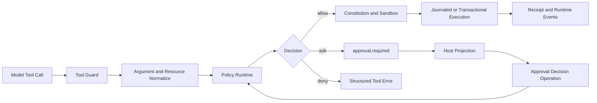

# Approval 架构升级方案

简体中文 | [English](../en/approval-architecture-upgrade.md)

> 状态：A0-A3 已于 2026-08-13 完成。A4 属于目标设计，不代表当前已交付能力。
>
> 范围：Tool Guard Policy、持久化授权、Approval 协议、Runtime 恢复、ACP
> 路由、VS Code 展示与 Approval 可观测性。

## 1. 摘要

CodeHelper 已具备正确的安全 Ownership：所有有副作用的 Tool 都经过统一 Guard，
Approval 是 Runtime Request，Decision 是可持久化 Operation，Child Approval 也保留
权威 Thread/Turn 身份。当前问题不在于缺少安全链路，而在于决策模型过粗、编辑器展示
过重。

当前 `suggest` 基本会询问所有非 Read Capability；Lifecycle Tool 带有无条件 `ask`
Grant；低风险例外仅覆盖 `file_write`。Approval Cache 与持久化 Permission 又使用
过于通用的 Resource 或 Command Prefix，无法精确说明未来到底授权了什么。VS Code
同时显示 Transcript Card 和阻塞 Modal，并暴露过长的原始请求信息。

目标是建立一条单调收敛的决策流水线：

```text
Authority Ceiling
  -> Hard Deny
  -> Effect Normalize
  -> Deterministic Risk
  -> Existing Typed Grant
  -> Bounded Auto Review
  -> Human Approval
```

Allow 可以消除不必要的询问，但绝不能覆盖 Authority Ceiling、Deny、Constitution 或
Sandbox。低风险、可恢复、受 Sandbox 约束的常规编码操作应自动执行；高风险操作保留
显式审批，Critical 操作 Fail Closed。

## 2. 当前架构

### 2.1 权威链路



必须保持以下 Ownership：

| 关注点 | Owner |
| --- | --- |
| Schema、Argument 与 Resource 校验 | `internal/adapter/tool/guard` |
| Mode、Posture、Repository Rule 与 Grant | `internal/security/policy` |
| Workspace 持久化 Permission | `internal/security/permissions` |
| Approval Request 与 Resolution 事实 | `internal/runtime` |
| Child Request 权威与路由 | Runtime 与 ACP |
| Host 展示 | CLI、TUI、VS Code 与 ACP Projection |
| Mutation 回滚与证据 | Journal、Tool Adapter 与 Receipt |

Host 不得执行 Tool，也不得重新解释安全决策。

### 2.2 当前决策语义

当前 Posture：

| Posture | 当前行为 |
| --- | --- |
| `never` | 只读，必须拒绝副作用 |
| `suggest` | Read 自动通过，大部分副作用询问 |
| `auto` | Read/Write 自动通过，Process/Network/Plugin 通常询问 |
| `bypass` | 较宽自动权限，但仍低于 Hard Deny 与 Sandbox |

Repository Rule 支持 `allow`、`ask`、`deny`、`hold`；Approval Scope 为
`once`、`session`、`always`。Pending Approval 与 Child Approval Proxy 已支持
重启恢复。

## 3. 审查结论

### 3.1 P0：持久化 Allow 可穿透 `never` Ceiling

`policy.Runtime.Evaluate` 当前在 Permission Posture 之前检查 Repository Allow。
Workspace 中 `.codehelper/permissions.toml` 的 Allow 因而可以直接返回 `allow`，
完全跳过 `never` 的副作用拒绝。

VS Code 会以 `posture=never` 启动未信任 Workspace，但 Runtime Wiring 仍会加载该
Workspace 的 Permission。因此这不是理论问题，而是真实 Trust Boundary 缺陷。

必须满足：

```text
allow_effective =
  authority_permits
  AND no_hard_deny
  AND grant_permits
  AND (policy_allows OR valid_approval)
```

Rule、Cache、Approval 和持久化 Amendment 都不得提升 Authority。

### 3.2 P1：Capability 粒度过粗

Policy 主要把 Invocation 分成 `read`、`write`、`process`、`network`、`plugin`，
无法区分：

- Journaled Edit 与不可逆外部写入；
- 网络隔离的 `go test` 与不受限 Process；
- 向既有 Child 发消息与创建 Writing Child；
- 单个 Workspace 文件与大范围 Tree Mutation；
- 可恢复本地删除与破坏性远端操作。

结果既产生过量 Approval，也无法给出准确解释。

### 3.3 P1：默认 Lifecycle Rule 强制询问

Lifecycle Grant 把 Agent 通信、Agent 生命周期、Task Cancel、Automation Mutation
和 GitHub Mutation 统一标记为 `ask`。Specific Ask 会压过 Wildcard Grant，即使在
`auto` 或 `bypass` 下仍会触发 Approval。

这些操作必须按 Effect 分类。向既有 Child 发送普通消息，不应等同于创建 Writing
Child 或修改远端仓库。

### 3.4 P1：可复用 Grant 缺少类型语义

Session/Persistent Grant 当前按通用 Resource Key 复用。Shell 持久化 Permission
只保存命令第一个 Token，因此批准 `go test` 可能变成批准所有 `go` 开头命令。其他
Tool 甚至可能退化为 `resource="*"`。

可复用 Decision 必须精确描述未来 Authority，并在持久化之前展示给用户。

### 3.5 P2：VS Code Approval UI 重复且信息过载

VS Code 同时渲染 Transcript Card 和阻塞 Modal。Modal 展示较长的 Request Detail，
五个 Action 权重接近。这既打断编辑流程，又让核心风险难以识别。

### 3.6 P2：无治理的调试副作用

Approval Summary 格式化与 File Edit Miss 路径包含 Fire-and-forget Loopback HTTP
调试上报。生产路径不得产生未声明的本地网络流量。

## 4. 参考实现结论

### 4.1 Codex

Codex 有四项值得吸收的设计：

1. Approval Policy 与 Sandbox 明确分离。
2. Known-safe/Known-dangerous Command 在询问前完成机械分类。
3. Restricted Execution 对普通操作依赖 Sandbox，而不是每个 Process 都询问。
4. 可复用 Approval 返回 Typed Policy Amendment，而非通用 Boolean。

Codex 还使用 Guardian Review Session：Read-only Permission、
`approval_policy=never`、结构化输出，并关闭无关能力。CodeHelper 只能把它作为
Deterministic Classification 之后的有界兜底，不能用它替代 Policy。

CodeHelper 保留自身更强的能力：Canonical Resource、Constitution、Journal、Durable
Runtime Request、Child Authority Ceiling 与 Receipt。

### 4.2 VS Code 原生 Agent UI

本次使用一次性 VS Code Workspace，通过 Chrome DevTools Protocol 实际触发原生
Approval，并在不执行操作的前提下采集 UI。观察到的 Card 包含：

- 一个简短问题；
- 一行风险解释；
- 语法高亮 Command；
- 主操作 `Allow`；
- 次操作 `Skip`；
- 更宽授权放入 Dropdown；
- Rule Detail 放入 Info 入口；
- 多个 Pending Approval 使用 Carousel。

CodeHelper 应复用这些交互原则，但所有内容必须来自自身 Runtime Fact。不得抓取原生
UI，也不得让 Webview 自行推断 Risk。

## 5. 目标决策模型

### 5.1 Authority Ceiling

Ceiling 首先执行且只能收紧：

```text
effective posture = min(requested posture, host ceiling, parent ceiling,
                        role ceiling, workspace trust ceiling)
```

示例：

- 未信任 VS Code Workspace 始终保持 `never`；
- Read-only Child 即使 Parent 为 `bypass` 仍保持 `never`；
- Plan Mode 始终只读；
- Host 不能把 Denied Request 改造成 Approval Prompt。

### 5.2 Normalized Effect

每个已校验 Invocation 都归一化为不依赖 Host 协议的内部 Effect：

```go
type Effect struct {
    Kind          EffectKind
    Targets       []CanonicalTarget
    Access        AccessSet
    Network       NetworkEffect
    Sandbox       SandboxStrength
    Reversibility Reversibility
    Scope         EffectScope
}
```

初始 Effect Kind：

- `workspace.read`
- `workspace.edit`
- `process.read_only`
- `process.mutating`
- `network.read`
- `network.mutating`
- `agent.message`
- `agent.lifecycle`
- `external.mutation`

Effect Normalize 属于 Guard Resource Resolution 邻近层。Policy 消费归一化结果；
Host 只负责 Projection。

### 5.3 Deterministic Risk

Risk 必须由显式事实计算：

| Risk | 典型 Effect | 默认动作 |
| --- | --- | --- |
| `low` | Read、Journaled Edit、隔离测试、Child Message | Allow |
| `medium` | 有界、可恢复 Process 或 Network Read | Allow 或 Auto Review |
| `high` | Broad Write、Credential Use、Remote Mutation | Human Approval |
| `critical` | Authority Escalation 或不受控破坏操作 | Deny |

Risk 不授予 Authority。`never` 下的低风险副作用仍然必须拒绝。

### 5.4 Typed Grant 与 Amendment

每种 Approval 生成自己的 Canonical Grant Key：

| Kind | Key 内容 |
| --- | --- |
| Shell | Normalized argv、cwd class、声明写集合、Network Effect |
| File | Canonical Path Set 与 Access |
| Network | Protocol、Normalized Host、Method/Effect |
| Agent | Agent ID/Path 与 Lifecycle Action |
| External | Provider、Repository/Object、Mutation Kind |

Runtime 生成 Proposed Amendment。Host 只能选择 Runtime 给出的 Decision。

规则：

- `once` 绑定 Request Fingerprint 与 Expiry；
- `session` 保存 Typed In-memory Grant；
- `always` 持久化与 UI 展示完全相同的 Amendment；
- 无法生成窄规则时，不提供 `always`；
- Deny、Hold、Constitution、Sandbox 与 Authority Ceiling 永不可 Amendment。

### 5.5 Bounded Auto Review

Auto Review 是可选能力，只处理 Deterministic Classification 无法确定的 Low/Medium
Risk。Reviewer：

- 以 Read-only 和 `approval_policy=never` 运行；
- 接收 Normalized Effect，而不是任意 Secret；
- 默认没有 Process、Network、MCP、Memory 或 Subagent Authority；
- 返回通过 Schema 校验的 Risk、Authorization、Outcome 与 Rationale；
- 快速超时，失败后回退 Human Approval；
- 永不批准 High/Critical，也不能覆盖 Deny。

## 6. 协议演进

`approval.required` 继续作为 Durable Request，并逐步增加：

```text
effect_kind
risk_level
reversibility
title
summary
reason_code
rule_source
available_decisions
grant_preview
```

`available_decisions` 是权威且按 Approval Kind 区分。后续协议版本应将模糊的
`approved + scope` 迁移为明确 Decision：

```text
allow_once
allow_session
apply_amendment
deny
cancel_turn
```

Compatibility 变更必须使用仓库生成命令，并同步更新 Go、TypeScript、Schema、
Traits 与 Golden。

## 7. VS Code 目标体验

Approval 收敛为 Composer 邻近的单个 Inline Carousel：

```text
[High risk] Run shell command?
Deletes one tracked file; journal recovery is available.

rm src/legacy.go

[Allow] [Skip] [v] [i]
```

展示规则：

- 一句话描述后果，不复述 Tool Schema；
- Command/Target 有界且支持语法高亮；
- Risk Badge 同时使用文字与颜色；
- Primary/Secondary Decision 位置稳定；
- Session/Persistent Grant 放入 Dropdown；
- Info 展示 Reason Code、Rule Source、Resource 与 Proposed Amendment；
- 完整文件变化留在 Changes/Diff；
- Dismiss 不代表批准；
- 多 Request 使用 Carousel 且保留 Agent Source；
- Approvals Tree 只做导航，不成为第二决策 Authority。

Projector 必须拒绝畸形 Risk/Decision 数据。Webview 不得重新分类 Invocation。

## 8. 可观测性与发布门禁

Approval Telemetry 只使用低基数字段：

```text
approval_evaluated_total
approval_auto_allowed_total
approval_human_required_total
approval_denied_total
approval_grant_hit_total
approval_reviewer_latency_ms
approval_wait_latency_ms
```

允许的 Dimension 包括 Effect Kind、Risk、Reason Code、Posture、Host Surface 与
Outcome。严禁记录 Raw Command、Path、Argument、Prompt、Credential 和 Resource ID。

发布目标：

| 指标 | 目标 |
| --- | --- |
| 常规编码 Fixture Approval 降幅 | 至少 70% |
| 低风险 Edit/只读测试/Child Message Prompt | 0 |
| Matching Grant 后重复询问 | 低于 2% |
| `never` 或 Deny 穿透 | 0 |
| High/Critical 自动批准 | 0 |
| Card 首次渲染 | 低于 50 ms |
| Decision 到 Runtime Resume | 低于 200 ms |

## 9. 实施计划

每个阶段使用独立语义分支，验收后通过 `--no-ff` 合并。完整升级期间生产代码净增长
必须 `<= 0`；替代能力落地时删除旧 Cache、Modal 与 Formatting Path。

### A0：安全基础

实施状态（2026-08-13）：`completed`。

- 在任何 Allow 之前评估 Mode 与 Permission Ceiling；
- 保持 Repository/Constitution Deny 与 Hold 优先；
- 证明未信任 Workspace 的持久化 Allow 无法穿透 `never`；
- 删除 Loopback Debug HTTP Post；
- 修复 Native Electron Fixture 基线；
- 不新增协议抽象。

验收：

- Policy、Permission、Guard、Wire、ACP 与 VS Code 聚焦测试通过；
- 相关 Race Test 通过；
- Native 与 Subagent Electron Approval 场景通过；
- Architecture、Docs、Book 与 Diff Check 通过；
- 生产代码净减少。

### A1：Effect 与 Risk Kernel

实施状态（2026-08-13）：`completed`。

已交付 Kernel 使用校验后的 Descriptor、Canonical Resource、Sandbox、Access 与
Journal Fact 完成归一化，不改变 Runtime Protocol。Low Risk 的 Journaled Edit、
Strong Sandbox Read-only Process 和有界 Agent Message 不再触发 Approval。Medium
Risk 在 A4 前仍由人工审批，Process Mutation 与 External Mutation 保持 High Risk。
缺少 Fact 的调用使用保守的 Legacy Classification。

- 在 Guard/Policy 边界引入 Normalized Effect；
- 分类 File、Shell、Network、Agent 与 External Effect；
- 删除 `file_write` 与 Lifecycle Name-based Exception；
- 增加 Deterministic Risk Table 和 Reason Code；
- 保持现有协议，并以 Shadow Mode 比较新旧决策。

### A2：Typed Grant 与 Amendment

实施状态（2026-08-13）：`completed`。

Runtime 现在为每个可复用 Approval 生成唯一 Typed Grant，其 SHA-256 Key 同时用于
Session Cache 复用、持久化 Permission 匹配和 UI Grant Preview。Shell Grant 绑定
精确 Canonical Command、cwd、声明 Resource 与 Write Set；File Grant 绑定完整
Canonical Path Set；Network Grant 绑定 Protocol 与 Host；Agent Grant 绑定 Operation
与 Agent Resource。无法生成窄 Grant 的 Request 只提供 `once`。缺少 Typed
`grant_key` 的持久化 Allow 将 Fail Closed。

- 替换 Approval Cache 通用 Resource Key；
- 结构化解析 Shell Command；
- 生成并校验 Typed Grant Preview；
- 无法生成窄规则时禁用 Persistent Approval；
- 除非存在真实消费者，不为 Pre-release Permission Format 增加兼容脚手架。

### A3：VS Code Approval Surface

实施状态（2026-08-13）：`completed`。

Runtime 现在随每个 Approval 发布经过校验的 Effect、Risk 与 Reason Code；VS Code
只投影这些权威事实，不重新分类。审批收敛为单一 Inline Decision Surface：Allow
Once 与 Skip 固定展示，可复用 Scope 和 Stop Turn 收入 More，Command/Target
有界展示，Details 按需展开，同时保留 Diff Preview 与 Agent Source。并发 Request
使用可访问的横向 Carousel。自动 Blocking Modal 及其重复 Formatter 已删除。

- 通过生成契约扩展协议数据；
- 删除 Blocking Modal 和重复 Transcript Control；
- 实现 Inline Card、Details、Dropdown 与 Carousel；
- 保留 Diff Preview 和 Agent Source；
- 增加 Projector、Accessibility、Snapshot 与 Electron Test。

### A4：Auto Review 与灰度发布

- 在 Feature Flag 后增加 Bounded Reviewer；
- 增加 Decision Funnel Telemetry 与 Dashboard；
- 自动 Outcome 启用前先运行 Shadow Evaluation；
- 以安全不变量和 Approval 降幅作为 Release Gate；
- 提供 Kill Switch，将不确定情况退回 Human Approval。

## 10. 验证矩阵

| 层 | 必须提供的证据 |
| --- | --- |
| Policy | 完整 Mode/Posture/Capability/Effect Truth Table |
| Permission | Amendment Round Trip、Canonical Key、无 Wildcard Escalation |
| Guard | Validate-before-policy、Deny 优先、Pause/Resume、Stale Plan |
| Runtime | Request Identity、Duplicate/Late Decision 拒绝、Restart |
| ACP | Authoritative Owner Binding 与 Cross-session 拒绝 |
| Multi-Agent | Child Ceiling、Approval Proxy、Restart Recovery |
| VS Code Unit | Strict Decode、Projection、Action、Accessibility |
| Electron | Native Approval、Deny、Session Grant、Child Approval、Carousel |
| Observability | Funnel Counter、Latency、无敏感 Label |
| Architecture | Ratchet、Size Budget、Docs、Book、Protocol、Race |

Electron 验收必须对同一 Request 同时记录 Runtime JSONL Event 与 UI Screenshot。仅 UI
成功而没有 `approval.required`/`approval.resolved` 关联，不算通过。

## 11. 回滚

- A0 是直接安全修复，不使用 Feature Flag。
- A1 在改变 Outcome 前先运行 Shadow Comparison。
- A2 可关闭 Reusable Grant，同时保留 Allow-once。
- A3 可回退到单个基础 Inline Card，但不回退 Blocking Modal。
- A4 的 Reviewer 与 Automatic Outcome 使用独立 Kill Switch。

回滚不得扩大 Authority。不确定时只能回到 Human Approval 或 Deny。

## 12. 最终验收定义

仅当以下条件全部满足，升级才算完成：

1. Host、Workspace、Parent、Child 与 Role 之间的 Authority 单调收紧；
2. 每个 Allow 都可由 Deterministic Effect/Risk 或 Typed Grant 解释；
3. 常规可恢复编码操作不再触发 Approval；
4. High Risk 保持显式，Critical Effect Fail Closed；
5. 持久化授权与用户看到的 Rule 完全一致；
6. 同一个 Runtime Request 在 CLI、TUI、ACP 与 VS Code 中一致投影；
7. Restart 保留原 Request，且不会重复执行；
8. Telemetry 同时证明 Prompt 数量下降与安全穿透为零；
9. Native 与 Child Electron Workflow 通过，并具备 Backend/UI 关联证据；
10. A0-A4 全阶段生产代码净增长 `<= 0`。
