# Multi Agent 架构升级方案

简体中文 | [English](../en/multi-agent-architecture-upgrade.md)

> 状态：目标架构与实施提案，不代表当前版本已经交付全部能力。
>
> 适用范围：CodeHelper Runtime、Subagent 编排、持久化、安全边界，以及
> CLI、TUI、VS Code、ACP 对同一组 Multi Agent 事实的投影。

## 1. 执行摘要

CodeHelper 已经具有一个可信的 Subagent 执行底座：Child 是真实 Runtime Turn，
会经过 Provider、Tool Guard、Journal、Sandbox、Verification 与 Receipt；写型
Child 可以进入隔离 Git Worktree，并通过受治理 Merge 回到父工作区。

当前问题不在“能否启动 Child”，而在“能否形成成熟、可恢复、可解释的 Multi Agent
产品”：

- 模型缺少明确的委派策略，因此不会稳定识别适合并行的任务；
- Parent Context 主要依赖手工字符串，无法可靠 Fork 历史或构造最小 Task Capsule；
- Manager、Child Runtime、Graph、Mailbox 与 Merge 的控制职责分散；
- Child 完成后需要 Parent 主动轮询，Completion 不会自动投递；
- Durable Graph 主要保存拓扑，不能完整恢复 Agent、消息、结果与集成状态；
- Child Approval 不能上送 Host，普通 `suggest` 模式下会直接失败；
- VS Code 没有 Agent Tree、独立 Child Timeline 与跨 Agent 全局时间线；
- 默认 8 Steps 只适合很小的探索任务，Role、Budget 与模型路由没有形成统一目录。

本方案不复制 Codex 的共享工作目录模式。它吸收其成熟经验，包括显式委派策略、
历史 Fork、自动 Completion、Canonical Agent Path、Durable Agent Tree 与按需恢复；
同时保留 CodeHelper 更强的 Guard、Receipt、Worktree 和受治理 Integration。

最终目标不是“尽可能启动更多 Agent”，而是：

> 只在任务边界清晰、并行收益高于协调成本、权限与预算允许时创建 Child；让每个
> Child 的上下文、动作、审批、结果、耗时与集成过程都可恢复、可验证、可投影。

## 2. 当前架构基线

### 2.1 已有执行链

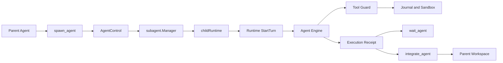

当前实现的重要事实来源：

| 能力 | 当前所有者 |
| --- | --- |
| Role、Stance、Depth、Parallel Budget | `internal/orchestration/subagent` |
| Model 可见 Agent Tool | `internal/adapter/tool/agent` |
| Child Session、Turn、Event Pump | `internal/runtime/app/wire` |
| 写型 Child Worktree | `internal/runtime/app/wire` 与 Platform Git 能力 |
| Merge Preview 与 Apply | `internal/adapter/tool/agent` |
| Runtime Turn、Receipt、Recovery | `internal/runtime/agent` 与 `internal/runtime/app` |
| VS Code Event Projection | `extensions/vscode/src/chat/projector` |

### 2.2 当前优势

1. Child 使用真实 Runtime Turn，而不是绕过安全体系的裸模型请求。
2. Consequential Tool 仍经过 Policy、Approval、Constitution、Journal 与 Sandbox。
3. 写型 Agent 默认可以隔离到 Worktree，避免直接污染 Parent Workspace。
4. Result 能引用真实 Diff、Evidence、Verification 与 Usage。
5. Depth、Parallel、Token、Cost、Wall Time 已有基础限制。
6. Agent Tool 与普通 Tool 共用 Registry 和 Guard，没有第二条特权执行通道。

### 2.3 核心缺口

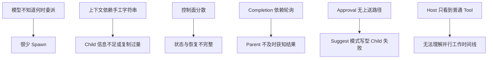

## 3. 目标、非目标与设计原则

### 3.1 目标

- 模型能稳定区分本地执行、复用 Existing Agent 与 Spawn New Agent。
- Context Fork 有结构化、可测试、受预算约束的语义。
- Agent 生命周期、消息、结果与集成状态完整持久化。
- Parent 无需轮询即可收到有界 Completion，但仍可显式 Wait。
- Child Approval 能经过原有 Runtime Operation 上送 Host。
- 写型 Child 保持 Worktree 隔离，并通过原子 Integration 回到 Parent。
- Nested Agent 具有统一 Depth、Authority 与 Tree Budget。
- 所有 Host 投影相同的协议事实，VS Code 提供完整可视化。
- Crash/Restart 后不存在永久假 `running`、丢失 Completion 或重复 Apply。

### 3.2 非目标

- 不让 Runtime 根据关键词绕过模型、偷偷创建 Agent。
- 不把 Agent 数量作为质量指标。
- 不允许 Child 绕过 Guard、Sandbox、Journal 或 Verification。
- 不让 VS Code 成为另一套编排控制面。
- 不默认让多个写型 Agent共享同一目录。
- 不复制无界 Parent Transcript 或 Tool Output。
- 不为未公开的旧 Subagent Persisted Format 增加长期兼容层。

### 3.3 设计原则

1. **一个 Runtime**：Parent 和 Child 只在 Scope、Context 与 Authority 上不同。
2. **结构化事实优先**：状态来自 Operation、Event、Receipt 与 Projection。
3. **权限单调收紧**：Child Authority 是 Parent Authority 与 Role Policy 的交集。
4. **结果有界、详情可寻址**：摘要进入 Parent，完整内容通过 Handle 懒加载。
5. **并行必须有所有权**：写任务必须声明 Owned Paths 或独占 Worktree。
6. **恢复是正常路径**：每个异步边界都必须定义 Crash 前后行为。
7. **Host 只提交意图**：Follow-up、Interrupt、Close、Integrate 都是 Runtime Operation。

## 4. 目标总体架构

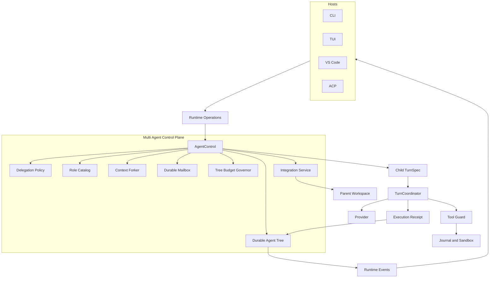

### 4.1 Package 所有权

| Package | 目标职责 |
| --- | --- |
| `internal/orchestration/subagent` | AgentControl、Role、Policy、Tree、Mailbox、Budget、状态机 |
| `internal/runtime/agent` | Child Turn 与普通 Turn 共用的执行语义 |
| `internal/runtime/app` | Agent Operation Handler、Event、Terminal Commit、Recovery |
| `internal/runtime/app/wire` | 构造 AgentControl、Context Forker、Child Factory、Store |
| `internal/adapter/tool/agent` | 仅保留模型可见 Tool Adapter，不拥有业务状态 |
| `internal/security` | Authority Derivation 与 Child Approval Policy |
| `internal/persist` | Agent Node、Message、Result、Integration 投影 |
| `internal/runtime/eventview` | Host 无关的 Agent 语义视图 |
| `extensions/vscode` | Agent Tree、Timeline 与操作入口投影 |

`AgentControl` 是统一控制入口，但不是 God Object。它协调窄接口：

```go
type AgentControl struct {
    roles        RoleCatalog
    policy       DelegationPolicy
    contexts     ContextForker
    store        AgentStore
    mailbox      MailboxStore
    children     ChildTurnFactory
    budgets      TreeBudgetGovernor
    integrations IntegrationService
}
```

## 5. 委派策略与创建时机

### 5.1 Policy 模式

```go
type DelegationMode string

const (
    DelegationDisabled DelegationMode = "disabled"
    DelegationExplicit DelegationMode = "explicit"
    DelegationAdaptive DelegationMode = "adaptive"
    DelegationCustom   DelegationMode = "custom"
)
```

| 模式 | 行为 |
| --- | --- |
| `disabled` | 不向模型暴露 Spawn 能力 |
| `explicit` | 只有用户、Skill 或受信规则明确授权时允许 Spawn |
| `adaptive` | 模型可根据结构化策略主动委派，Runtime 仍执行 Admission |
| `custom` | 加载 Workspace 管理的委派规则 |

初始 Rollout 使用 `explicit`；当 Eval、成本与误触发指标达标后，`act` Profile 可以选择
`adaptive`。`bypass` 只是 Permission Posture，不自动切换 Delegation Mode。

### 5.2 创建时机

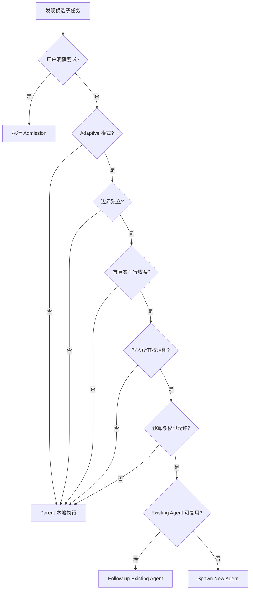

适合 Spawn：

- 两个以上相互独立的代码探索问题；
- 不同 Package、不同文件所有权的并行实现；
- Parent 可以继续工作时的独立审查或验证；
- 长时间等待任务可以转交 Awaiter；
- 用户明确要求多个视角、独立复核或并行执行。

不适合 Spawn：

- 少量 Tool Call 即可完成的简单任务；
- 单一线性关键路径；
- Parent 下一步立即依赖该结果，且没有其他工作；
- 需要频繁共享隐式状态或修改同一文件；
- 需要持续用户交互；
- Spawn、Context 与 Integration 成本高于任务本身。

### 5.3 Delegation Intent

Spawn 不再只接收自由文本：

```go
type DelegationIntent struct {
    TaskName       string
    Role           RoleID
    Objective      string
    ExpectedOutput string
    OwnedPaths     []string
    ContextMode    ContextMode
    ParentAgent    AgentPath
    Limits         LimitOverride
}
```

Runtime Admission 负责验证 Role、Depth、并发、Tree Budget、Authority、Owned Paths、
Workspace Mode 与 Context Budget。模型负责提出委派，不负责最终授权。

## 6. Tool Surface 与 Role Catalog

### 6.1 Tool API

使用语义单一、符合模型先验的工具：

| Tool | 语义 |
| --- | --- |
| `spawn_agent` | 创建异步 Child |
| `send_message` | 向 Mailbox 投递消息，不自动开启新 Turn |
| `followup_task` | 给 Existing Agent 新任务并开启后续 Turn |
| `wait_agent` | 等待一个或任意 Agent 的下一次状态变化 |
| `list_agents` | 查询 Tree 或过滤后的 Snapshot |
| `interrupt_agent` | 中断运行中的 Child Turn |
| `close_agent` | 释放 Resident Runtime 与 Workspace |
| `integrate_agent` | Preview 或 Apply Child 变更 |

旧的统一 `agent` Tool 与重复控制工具在预发布阶段直接替换，不维持两套长期语义。

### 6.2 Role Catalog

```go
type RoleSpec struct {
    ID               RoleID
    Description      string
    Prompt           string
    ModelRoute       string
    ReasoningEffort  string
    Stance           Stance
    AllowedTools     []string
    DefaultLimits    Limits
    CanDelegate      bool
    WorkspacePolicy  WorkspacePolicy
    OutputContract   OutputContract
}
```

内置 Role：

| Role | 用途 | 默认 Workspace |
| --- | --- | --- |
| `explorer` | 定位代码、建立事实、回答窄问题 | Read-only Shared Snapshot |
| `planner` | 跨模块方案与风险分析 | Read-only Shared Snapshot |
| `implementer` | 有明确 Owned Paths 的实现 | Isolated Worktree |
| `reviewer` | 独立审查 Result、Diff 与契约 | Read-only Snapshot |
| `verifier` | 运行测试、检查 Evidence 与 Failure | Snapshot 或目标 Worktree |
| `awaiter` | 等待长任务并总结终态 | No Write |
| `general` | 显式任务，不作为 Adaptive 首选 | Policy 决定 |

Role 配置允许 Workspace 扩展，但不能扩大 Parent Authority。

## 7. Context Fork 与 Task Capsule

### 7.1 Context 模式

```go
type ContextMode string

const (
    ContextFresh       ContextMode = "fresh"
    ContextTaskCapsule ContextMode = "task_capsule"
    ContextLastNTurns  ContextMode = "last_n_turns"
    ContextFull        ContextMode = "full"
)
```

默认使用 `task_capsule`。`full` 只在用户明确要求或 Role Policy 允许时使用。

### 7.2 Task Capsule

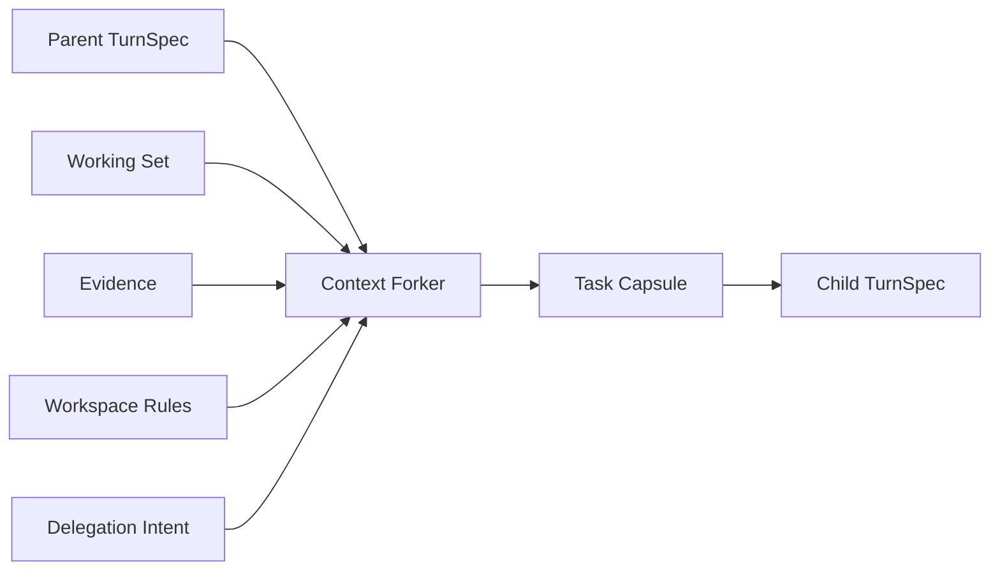

Task Capsule 包含：

- Parent Goal 与当前 User Request；
- Child Objective、Expected Output 与完成条件；
- Role Prompt、Authority Snapshot 和 Limits；
- Owned Paths 与 Relevant Files；
- 已验证 Evidence 的摘要和 Handle；
- 必须遵循的 Workspace Rule；
- 可选的最近 N 个相关 Turn；
- 明确排除的范围和禁止动作。

不直接复制：

- 无关 Parent Transcript；
- 完整 Tool Output；
- Secret Value；
- 未验证的模型推理；
- 与 Child 任务无关的 Working Set；
- Parent 专属 Tool Call/Result 对。

### 7.3 Context Receipt

每次 Fork 生成 `ContextReceipt`：

```go
type ContextReceipt struct {
    Version       int
    Mode          ContextMode
    SourceThread  string
    SourceTurn    string
    Included      []ContextItem
    Excluded      []ContextItem
    Bytes         int
    MaxBytes      int
    TokenEstimate int
    MaxTokens     uint64
    Digest        string
}
```

`Digest` 是最终 Capsule Prompt 的 SHA-256。Receipt 可以验证 Child 为何看到某个文件，
并证明实际字节数和 Token 估算没有超过冻结预算。

## 8. 生命周期与状态机

### 8.1 Canonical Agent Path

每个 Agent 同时具有不可复用 ID 与可读 Path：

```text
/root
/root/explore_subagent
/root/explore_runtime
/root/implement_storage
/root/implement_storage/verify_recovery
```

Path 用于 UI、日志和消息寻址；稳定 ID 用于持久化主键和幂等。

### 8.2 状态机

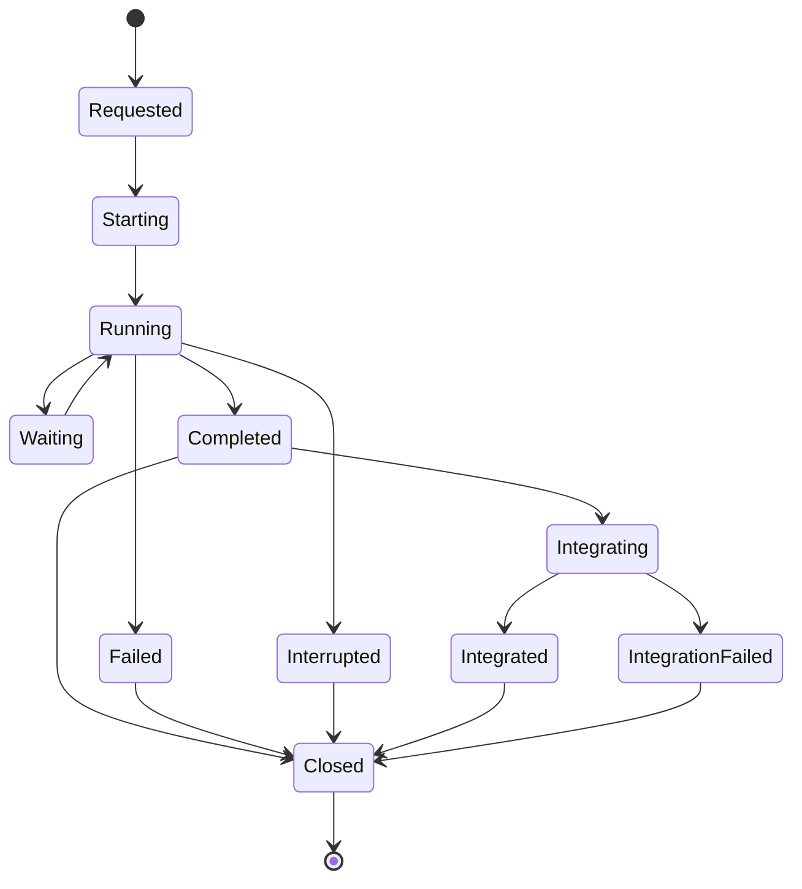

每次状态转换必须包含：

- Stable Operation ID；
- Expected Revision；
- Source Agent 与 Actor；
- Timestamp；
- Reason；
- 对应 Event ID；
- 必要时的 Receipt 或 Problem Handle。

非法转换必须被 Store 以 Compare-and-Swap 拒绝，不能只依赖内存锁。

## 9. Mailbox、Follow-up 与结果回传

### 9.1 消息模型

```go
type AgentMessage struct {
    ID          string
    Sequence    uint64
    From        AgentPath
    To          AgentPath
    Kind        MessageKind
    PayloadRef  string
    TriggerTurn bool
    CreatedAt   time.Time
    DeliveredAt *time.Time
}
```

- `send_message` 只入队，用于补充上下文或状态提示；
- `followup_task` 创建一条触发新 Turn 的任务消息；
- Completion、Approval、Interrupt 与 Integration Result 使用系统消息类型；
- Sequence 在 Agent Mailbox 内单调递增；
- Delivery 采用 At-least-once，消费端通过 Message ID 幂等。

### 9.2 自动 Completion

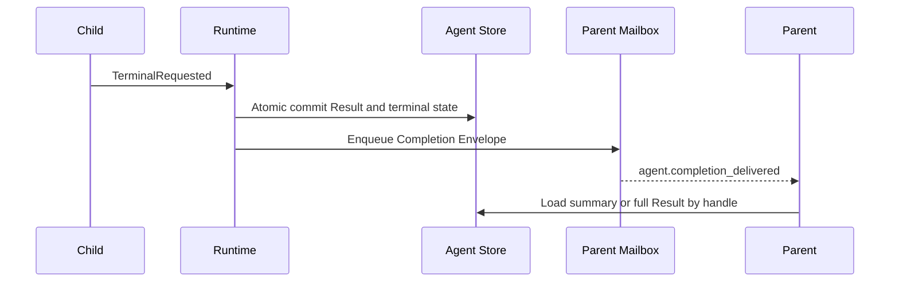

Completion Envelope 必须有界：

```go
type CompletionEnvelope struct {
    AgentPath        AgentPath
    Status           AgentStatus
    Summary          string
    ResultRef        string
    ReceiptRef       string
    ChangedPaths     []string
    Verification     VerificationSummary
    Usage            UsageSummary
    IntegrationReady bool
}
```

`wait_agent` 仍然存在，用于 Parent 主动同步或外部 Host 等待；它不再是获得终态结果的
唯一方式。

## 10. Durable Agent Tree 与恢复

### 10.1 持久化模型

| Projection | 关键字段 |
| --- | --- |
| `agent_nodes` | ID、Path、Parent、Thread、Role、Status、Depth、Workspace、Base Revision |
| `agent_messages` | Sequence、From、To、Kind、Payload Ref、Delivery |
| `agent_results` | Terminal Turn、Summary、Receipt Ref、Usage、Verification |
| `agent_integrations` | Candidate、Preview Digest、Conflict、Approval、Apply Receipt |
| `agent_budget_ledger` | Reserved、Spent、Released Token/Cost/Time Slots |

Runtime Event 是事实，关系表是查询和恢复投影。关键状态与 Terminal Result 使用同一
SQLite Transaction 提交。

### 10.2 Restart Reconciliation

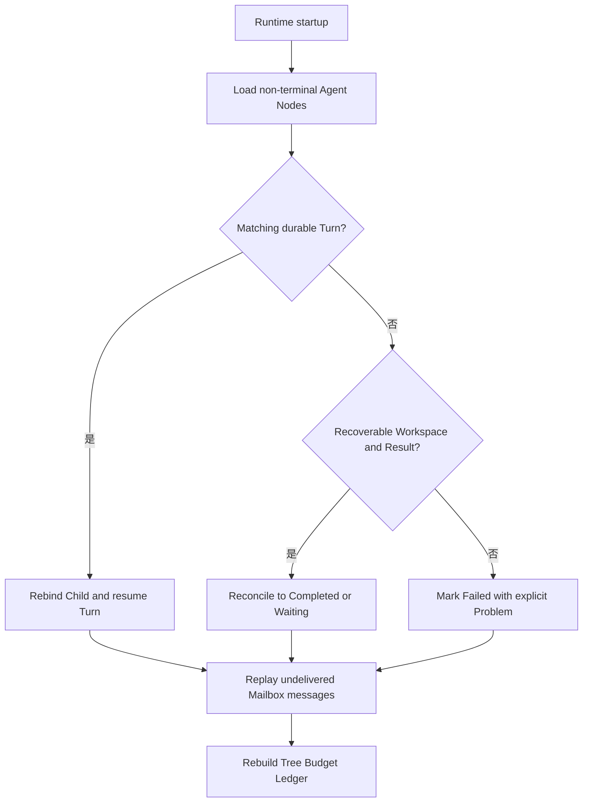

必须覆盖：

- Spawn Commit 前后 Crash；
- StartTurn Accepted 但 Child Handle 未注册；
- Result 已提交但 Completion 未投递；
- Completion 已投递但 Parent 未确认；
- Worktree 存在但 Agent Node 缺失；
- Integration Preview 完成但 Apply 未开始；
- Apply Journal 已开始但终态未提交；
- Close 过程中 Runtime 重启。

恢复后不得：

- 永久显示假 `running`；
- 重复启动已完成 Child；
- 重复扣减 Tree Budget；
- 重复投递不可幂等的 Follow-up；
- 未经检查重复 Apply Child Diff。

## 11. Authority、Approval 与安全边界

### 11.1 Authority Derivation

```text
Child Authority =
    Parent Authority
    ∩ Role Tool Policy
    ∩ Workspace Policy
    ∩ Delegation Policy
    ∩ Session Constitution
```

`bypass` 允许 Policy 范围内的本地动作跳过普通交互审批，但不能绕过 Constitution、
Sandbox Requirement、Secret Policy 或 Workspace Boundary。

### 11.2 Child Approval Proxy

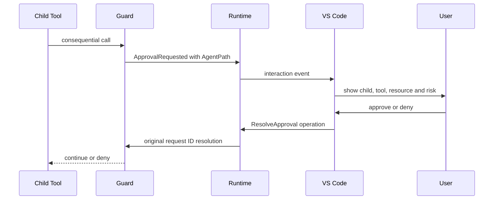

Approval UI 必须显示：

- Parent 与 Child Agent Path；
- Child Objective 与 Role；
- Tool、Resource、Risk 与 Workspace；
- 是否位于 Isolated Worktree；
- Authority 来源和记忆范围；
- Approve Once、Deny，以及适用时的 Workspace-bound Remember。

Child 不能直接与 Host 建立第二套审批协议。恢复继续使用原 Request ID。

## 12. Workspace Isolation 与 Integration

### 12.1 Workspace 策略

| Stance | 默认策略 |
| --- | --- |
| Read-only | Shared Snapshot |
| Write with disjoint paths | Isolated Worktree |
| Write without ownership | 拒绝 Adaptive Spawn |
| Serialized compatibility task | Same Workspace Serialized，仅显式允许 |

### 12.2 Integration Pipeline

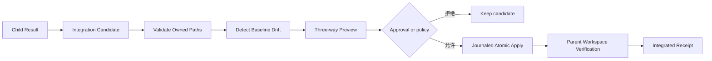

`integrate_agent` 支持：

- `preview`：返回 Diff、冲突、Owned Path 违规和 Baseline Drift；
- `apply`：基于 Preview Digest 执行，防止 Preview 后内容变化；
- `discard`：保留 Result，清理 Worktree；
- `retry`：解决冲突后生成新 Candidate，不复用旧 Digest。

默认不自动 Apply。后续可增加 `auto_verified_disjoint` Policy，但必须同时满足：

- Owned Paths 不重叠；
- Parent Baseline 未漂移；
- Child Verification Passed；
- Parent Policy 明确允许；
- Apply 后 Parent Verification Passed；
- 失败时 Journal 可恢复。

## 13. Nested Agent 与 Tree Budget

Child Tool Registry 通过同一个 AgentControl 获得作用域视图，而不是构造第二个 Manager。

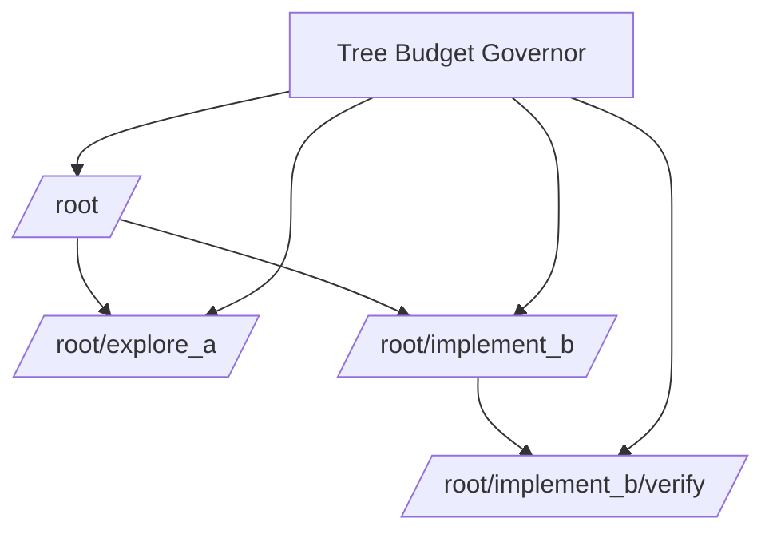

预算分两层：

| 层级 | 限制 |
| --- | --- |
| Per Agent | Steps、Tokens、Cost、Wall Time、Tool Spend |
| Agent Tree | Running、Resident、Total Spawn、Depth、Tokens、Cost、Wall Time |

Child Limit 只能缩小 Parent Remaining Budget。Reservation 在 Spawn 时发生，在 Terminal
或 Close 时结算和释放。Budget Ledger 必须持久化。

建议初始默认值：

```toml
[execution.subagent]
delegation = "explicit"
max_depth = 3
max_parallel = 4
max_resident = 8
max_total = 16
default_context = "task_capsule"
max_steps = 24
max_tokens = 0
max_cost_usd = 0
wall_time = "10m"
workspace = "auto"
completion_summary_tokens = 800
```

Role 可以给出更小默认值；用户配置只能在 Session Policy 允许范围内调整。

## 14. VS Code 信息架构

### 14.1 三层展示

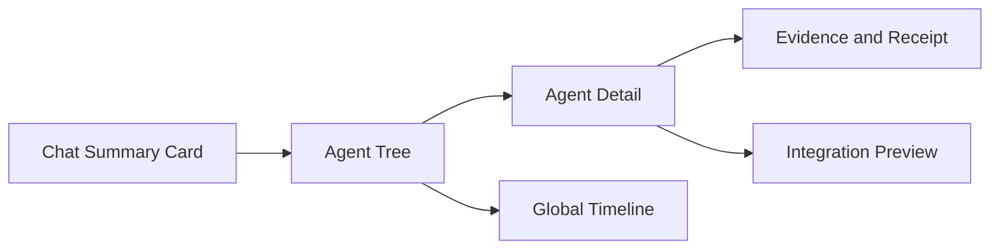

1. **Chat Summary Card**：只显示 Agent 数量、状态、关键 Completion 与异常。
2. **Agent Tree**：显示 Parent/Child 拓扑、Role、Task、状态、耗时与预算。
3. **Agent Detail**：显示单个 Agent 的完整结构化时间线。
4. **Global Timeline**：按墙钟时间合并所有 Agent Event，可按泳道查看并行度。

### 14.2 Agent Tree

```text
root                                      running
├── explore/subagent                      completed  43s
├── explore/runtime                       completed  37s
└── implement/persistence                 running    step 11/24
    └── verify/recovery                    waiting    approval
```

节点字段：

- Canonical Path、Role 与 Objective；
- Status、Current Step、Last Tool；
- Token、Cost、Wall Time；
- Workspace/Worktree 与 Owned Paths；
- Approval、Verification 与 Integration 状态；
- Result、Receipt、Diff 与 Trace 入口。

### 14.3 时间线事件

```go
type AgentTimelineEvent struct {
    Sequence    uint64
    Timestamp   time.Time
    AgentPath   string
    ParentPath  string
    ThreadID    string
    TurnID      string
    OperationID string
    Kind        EventKind
    Summary     string
    DetailRef   string
    Duration    time.Duration
}
```

核心 Event：

```text
agent.requested
agent.spawned
agent.status_changed
agent.message_sent
agent.turn_started
agent.tool_started
agent.tool_completed
agent.approval_requested
agent.evidence_added
agent.result_committed
agent.completion_delivered
agent.integration_started
agent.integrated
```

Event Traits 继续由单一 Manifest 生成 Go、Schema、TypeScript 与 Golden。VS Code
Projector 只按 Event Class 和 Traits 投影，不解析自由文本猜状态。

### 14.4 交互与性能

- 点击 Agent 节点过滤 Global Timeline；
- 点击 Event 懒加载 Tool Detail、Diff 或 Receipt；
- Running Event 显示持续时间，不伪造完成时间；
- Follow-up、Interrupt、Close、Integrate 只提交 Runtime Operation；
- Snapshot 加 `last_sequence`，随后从 Event Hub 增量 Replay；
- Timeline 使用虚拟列表；
- Transcript、Tool Output 与大 Diff 通过 Content Handle 懒加载；
- 慢 Consumer 使用现有 Event Hub Policy，不阻塞 Runtime。

## 15. Protocol 与配置影响

### 15.1 Operation

建议增加或明确化：

```text
SpawnAgent
SendAgentMessage
FollowupAgent
WaitAgent
InterruptAgent
CloseAgent
PreviewAgentIntegration
ApplyAgentIntegration
```

模型 Tool Adapter 调用 Application Port，Host 也提交同一类 Operation。不能让 Tool 与
Host 分别进入两套业务实现。

### 15.2 Event

Agent Event 必须携带：

- Agent ID、Path、Parent；
- Session、Thread、Turn；
- Operation ID 与 Causation ID；
- Revision 与 Sequence；
- Durable/Transient Trait；
- Bounded Summary 与 Detail Handle；
- Terminal 和 Correlation Trait。

### 15.3 Config

新增配置必须进入 `internal/config` 的 Default、TOML、Environment、Validation 与
Provenance 全链路，并更新双语配置文档。禁止由 VS Code 保存一份独立默认值。

## 16. 实施计划

升级分六个可独立验收的变更集。每个变更集使用语义分支，验收后以 `--no-ff` 合入。
本计划不设置生产代码净增长为零的硬门禁；必要的持久化、协议与恢复代码可以增加，
但禁止长期保留重复控制面。

### MA1：统一控制面与模型可发现性

交付：

- 建立 `AgentControl` 与 `DelegationPolicy`；
- 引入 `DelegationIntent` 和 Admission；
- 建立 Role Catalog；
- 替换 Tool API；
- 注入明确的 Multi Agent Developer Instructions；
- Characterize 当前 Spawn、Wait、Close、Merge 行为。

退出条件：

- Explicit Prompt 必定能触发两个异步 Explorer；
- 简单任务 Fixture 不 Spawn；
- Tool Adapter 不再拥有生命周期状态；
- 旧 Tool Surface 被删除而不是长期双写。

实施状态（2026-08-13）：`completed`。

- `AgentControl`、Delegation Policy、Role Catalog、八个独立 Agent Tool、
  Prompt Instructions 与配置全链路已经落地；
- 旧统一 `agent` Tool 和 `agent_*` 命名已删除；
- `make vscode-subagent-integration` 在真实 VS Code Electron Extension Host
  中提交以下显式授权 Prompt：

  ```text
  Explicitly delegate two read-only explorers to inspect independent aspects
  of context.ts. Use two spawn_agent calls now, then report that both
  delegated tasks started.
  ```

- 场景验证两次 Chat Approval、Parent `turn.completed`、两个
  `agent.spawned` 和两个 Child `agent.status=completed`；
- 验收同时修复了 Persistent Child Thread Seed、Agent Event 原子序号分配、
  Durable + Live Event 单一发布路径及 macOS `/var` 路径规范化；
- Agent Event 当前携带 Runtime Hook Session Identity；精确绑定到发起它的
  ACP Chat Session 属于 MA3 Durable Agent Tree，不在 MA1 中伪造关联。

### MA2：Context Fork 与 Task Capsule

交付：

- `fresh/task_capsule/last_n_turns/full`；
- Frozen Parent Turn Snapshot；
- Context Receipt、Budget 与 Redaction；
- Child Prompt 不再依赖手工 `parent_context`。

退出条件：

- Golden 明确每种 Fork 模式包含和排除的消息；
- Tool Call/Result 不出现孤立配对；
- Secret 与无关 Tool Output 不进入 Child；
- Task Capsule Token 有确定上限。

实施状态（2026-08-13）：`completed`。

- Parent Runtime 从当前 TurnSpec、History、Working Set、Evidence 和 Prompt
  Partition 冻结构化 Snapshot；Provider Reasoning、Opaque Data、Image 和 Search
  Payload 不进入 Snapshot；
- Runtime 将权威 Parent Thread/Turn Identity 注入 Tool Context；Context lookup
  只读已存在 Engine，TurnSpec 冻结 Parent History，未知 Thread、缺失或漂移 Turn
  均 fail closed；
- `spawn_agent` 默认生成 `task_capsule`，旧 `fork_context` / `parent_context`
  字段已删除；模型 Spawn 和 Durable Worker 共享同一 Capsule 路径；
- Redactor、完整 Tool Call/Result Pair、UTF-8 安全裁剪、稳定排序、确定性预算和
  SHA-256 Digest 均有 Unit 与 Race 覆盖；`task_name` 同样经过脱敏和限长；
- `fresh/task_capsule/last_n_turns/full` 的包含、排除、完整 Tool Pair 和 Secret
  Redaction 由四模式 Golden 固定；`full` 只接受明确 Trigger 或 Role Policy；
- Durable Worker 结果通过 Contract Test 固定 Capsule Mode、Digest 与预算；
- `go test ./...`、聚焦 `go test -race`、ACP Protocol Contract、43/43
  Architecture Ratchet、VS Code Check 与 220 项测试、文档和 Book 门禁均通过；
- `make vscode-subagent-integration` 在真实 Electron 中验证两个异步 Explorer、
  Parent Turn `source_turn`、真实 `user_request`、默认 `task_capsule`、Digest
  和 `bytes <= max_bytes`。

### MA3：Durable Agent Tree 与自动 Completion

交付：

- Agent Node、Mailbox、Result、Budget Ledger Store；
- 状态机与 CAS Revision；
- Atomic Terminal Result + Completion Outbox；
- Startup Reconciliation；
- Canonical Agent Path。

退出条件：

- 每个 MA3 所属 Crash Point 重启后得到唯一终态；
- Completion 不丢失且消费幂等；
- 无假 `running`；
- `wait_agent` 与自动通知观察同一事实。

实施状态（2026-08-13）：`completed`。

- Schema V2 使用 `agent_nodes`、`agent_messages`、`agent_results` 和
  `agent_budget_ledger`；预发布阶段不引入兼容迁移；
- Canonical Agent Path、Revision、Stable Operation ID、Actor、Reason、Event ID
  和 SQLite CAS 组成唯一状态机写路径；
- Terminal Result、Budget 结算和 Completion Outbox 在同一个 Agent Event
  Transaction 提交；Outbox 使用 Message ID 幂等发布；
- Mailbox 提供 per-target Sequence、`Receive/Ack` At-least-once Delivery，
  `send_message` 只入队，`followup_task` 在 Task Message 持久化后启动 Turn；
- Startup Reconciliation 覆盖 Spawn Commit、StartTurn Accepted、Result/Outbox、
  未确认 Completion、假 Running、Orphan Worktree 和 Close；Integration
  Preview/Apply Crash Point 属于 MA5；
- 验收后复核补齐了 Active Child Turn Observation：在 Interrupted Operation
  Replay 前重建 Child Turn 并启动 Runtime Event Pump，使恢复后的 `waiting`
  Child 可以继续 Resume/Settle，而不会形成假 Active Node；
- ACP/VS Code Agent View 暴露 Path、Parent Path、Revision 和 Thread；真实
  Electron 验证两个 Child 在 Parent 不调用 `wait_agent` 时自动发送 Completion；
- `go test ./...`、聚焦 Race、ACP/Protocol Contract、43/43 Architecture
  Ratchet、VS Code Check 与 220 项测试均通过。

### MA4：Authority 与 Approval Proxy

交付：

- Authority Derivation；
- Child Approval 上送；
- Host 显示 Child 来源；
- Approval Restart Recovery；
- Bypass、Suggest、Auto、Never 的 Contract Test。

退出条件：

- Suggest 模式写型 Child 可以等待用户批准；
- Child 不能获得 Parent 没有的 Tool 或 Workspace 权限；
- 原 Request ID 在恢复后保持稳定；
- Deny 产生结构化 Problem 与 Child 可理解反馈。

实施状态（2026-08-13）：`completed`。

- Permission Derivation 使用 `never < suggest < auto < bypass` 对所有 Posture
  执行 Ceiling Clamp，未知值 Fail Closed；Child Tool 权限是 Parent Tool Catalog
  与 Role Contract 的交集，每个 Child 使用独立 Approval Cache；
- `approval.required` 与 `approval.resolved` 携带 Canonical Agent Source、Role、
  Session 和 Host Workspace Identity；ACP/VS Code 只跨未绑定 Child Thread 投影
  Source-bound Child Interaction；
- Host 通过 Parent Session 提交原 Request ID。Runtime 根据 Durable Pending
  Request 将 Thread/Turn 重写为 Child 权威身份，保留 Decision Item Identity，并
  驱动 Agent `running -> waiting -> running`；
- Guard Pending Request、Runtime Pending Approval 和 Waiting Agent Node 均可在
  重启后恢复；Deny 产生结构化 Problem 与 Child 可理解的 `approval_denied`
  Tool Feedback；
- 验收后复核增加了生产 `ThreadManager` 恢复契约：Approval/Input Wait 在不重复
  发布 Host Event 的前提下重建 Turn Kernel 与 Request Ledger，保持原 Request ID，
  并安全暂存早于 Tool Replay Wait 到达的 Decision/Reply；
- VS Code Approval Card 与 Approvals Tree 显示 Agent Path、Parent Path 和 Role；
  真实 Electron 验证写型 Child 在 `suggest` 下等待、接收 Parent-proxied
  Decision、恢复执行、验证改动并在 Parent 不调用 `wait_agent` 时自动 Completion；
- Go 全量、聚焦 Race、Protocol Contract、43/43 Architecture Ratchet、
  VS Code Check、222 项测试、文档检查和 Electron 场景均通过。

### MA5：Workspace Integration 与 Nested Agent

交付：

- Integration Candidate 与 Preview Digest；
- Owned Path 与 Baseline Drift；
- Apply 后 Parent Verification；
- Nested Agent Control View；
- Persistent Tree Budget。

退出条件：

- 并行写不同路径可独立集成；
- 同路径冲突在 Apply 前失败；
- Preview 后漂移不能使用旧 Digest Apply；
- Depth、Parallel 与 Budget 在整个 Tree 生效。

实施状态（2026-08-13）：`completed`。

- `integrate_agent` 已提供 `preview`、`apply`、`discard` 和 `retry`。Preview
  持久化不可变 Candidate 与精确 Change；Apply 必须提交对应 SHA-256 Preview
  Digest，并在 Guard 授权前重新生成 Plan。Child Content、Result Turn、选择 Path
  或 Parent Baseline 任一漂移都会使旧 Digest 在写入前 Fail Closed；
- Owned Path 和 Live Write Claim 拒绝越界写与同路径写；不同路径 Candidate 可独立
  Preview，并复用现有 Guard Resource Claim、Workspace Journal、Expected-write
  Fingerprint 和 Atomic File Transaction 完成 Apply；
- `agent_integrations` 投影 Candidate Revision 以及
  `previewed -> applying -> applied|failed`、`previewed -> discarded` 状态机。
  Startup Reconciliation 会在 Journal Recovery 后将中断 Apply 收敛为明确失败，也会
  补齐已 Apply 但 Agent Status Commit 中断的 Candidate；Owned Path 与 Write Claim
  同样在重启后重建；
- Apply 生成包含 Changed Paths、Apply Time 和 Parent Workspace Verification 的
  Integration Receipt；Verification Failed/Unavailable 与文件是否已经 Apply 明确
  区分；
- Nested Caller 由权威 Child Thread Identity 解析。伪造 Parent ID、控制 Sibling
  或 Ancestor 均 Fail Closed；Child 只能操作自身 Descendant Subtree。可委派 Role
  保留 Agent Lifecycle Tool 但不会获得普通写 Tool，Read-only Descendant 继承
  Parent Worktree，Descendant Integration 以该 Parent Workspace 为目标；
- Tree Admission 持久化执行 Depth、Active Parallel、Resident Node、Total Spawn
  与 Token/Cost Reservation。每个 Child 只能收窄 Parent 的 Step/Token/Cost
  Ceiling；Terminal/Close 释放 Reservation，Spend 与 Total Spawn 在重启后仍计费；
- 生成的 retained `agent.integration` Event 由 Go、JSON Schema、ACP 和
  TypeScript 共享。VS Code 可重放 Candidate/Receipt，将 Nested Agent 显示为真实
  Tree，并在所属 Agent 下展示 Digest、Path、Conflict、Verification 与 Applied
  Change；
- Unit 与 Persistence Contract 覆盖 Child/Parent Stale Preview、Apply 前同路径
  Conflict、Discard/Retry、Parent Verification、Candidate CAS、Applying/Applied
  Crash Recovery、Nested Scope、Execution Root 继承和 Persistent Tree Budget；
- 串行 `go test -p 1 ./...`、聚焦 Race、Protocol Contract、43/43 Architecture
  Ratchet、VS Code Check 与全部 223 项测试、Docs/Book 门禁和
  `make vscode-subagent-integration` 均通过。真实 Electron 验证一个 Parent Turn
  在 Git Worktree 中执行 `spawn -> wait -> child approval proxy -> preview ->
  apply -> parent verify -> complete`，并观察到
  `previewed -> applying -> applied`、`integrated` 和最终 Parent 文件。

### MA6：Host 投影、Eval 与 Rollout

交付：

- Event Trait 与 Schema；
- Go `eventview`；
- VS Code Agent Tree、Detail、Global Timeline；
- TUI Compact Tree；
- Multi Agent Eval Pack、真实 Provider Smoke 与性能基线。

退出条件：

- CLI/TUI/VS Code/ACP 观察同一 Agent Status；
- VS Code Restart 后 Timeline 连续且不重复；
- 大事件流保持 Extension Host 性能预算；
- Explicit 与 Adaptive Eval 达到发布阈值。

## 17. 验证体系

### 17.1 测试金字塔

| 层级 | 覆盖 |
| --- | --- |
| Unit | Policy、Role、Context、状态转换、Budget、Message |
| Contract | Operation/Event、Store、Authority、Integration、Traits |
| Integration | Parent/Child Runtime、Worktree、Approval、Recovery |
| Race | Spawn/Settle/Close、Mailbox、Budget、Event Replay |
| Fault Injection | Transaction、Outbox、Worktree、Apply Crash Point |
| VS Code | Tree、Timeline、Approval、Result、Restart |
| Live Model | 委派质量、上下文质量、并行收益、误触发 |

### 17.2 场景矩阵

| 场景 | 预期 |
| --- | --- |
| 一个简单文件查询 | Parent 本地完成 |
| 两个独立 Package 调研 | 两个 Explorer 并行 |
| 两个不相交文件修改 | 两个 Worktree，可分别 Preview |
| 两个 Agent 修改同一文件 | Admission 拒绝或 Integration Conflict |
| Child 请求 Shell Approval | Host 显示 Child 来源并可恢复 |
| Child 完成时 Parent 忙 | Completion 入 Mailbox，不丢失 |
| Result Commit 后立即 Crash | 重启只投递一次逻辑 Completion |
| Integration Apply 中 Crash | Journal 恢复到明确终态 |
| Nested Child 超过 Depth | Admission 结构化拒绝 |
| Tree Token 超预算 | 停止新 Spawn，不破坏已提交 Result |

### 17.3 真实 VS Code Explorer Prompt

```text
这是一次 Multi Agent 功能验收。我明确授权并要求你启动 subagent。

必须使用 spawn_agent 启动两个 role=explorer 的 Child，并行执行：
A. 研究 internal/orchestration/subagent 的状态与持久化边界。
B. 研究 internal/runtime/app/wire 中 Child Turn 的启动和终态回传。

使用 task_capsule，不要复制完整历史。两个 Child 完成后汇总结论，
列出 Agent Path、耗时、关键文件和 Result Handle。不要由 Parent
重复执行 Child 已完成的研究。
```

### 17.4 真实 VS Code Write Prompt

```text
这是一次写型 Multi Agent 验收。使用 bypass Posture，但仍保持 Guard、
Sandbox、Journal 和 Worktree。

启动一个 implementer Child，在隔离 Worktree 创建指定测试文件。
等待 Completion 后先执行 integrate_agent preview；确认 Owned Paths、
Baseline Drift 和 Verification 正常后再 apply。最后在 Parent Workspace
验证文件，并展示完整 Agent Timeline 与 Integration Receipt。
```

### 17.5 标准命令

```bash
go test ./internal/orchestration/subagent/... \
  ./internal/adapter/tool/agent/... \
  ./internal/runtime/app/...
go test -race ./internal/orchestration/subagent/... \
  ./internal/runtime/app/...
make architecture-ratchet
make protocol-contract
make vscode-check
make vscode-test
make vscode-runtime-integration
make docs-check
make book-check
git diff --check
```

## 18. 指标与发布门槛

### 18.1 正确性

- Explicit Spawn 场景 100% 创建要求数量的 Child；
- 简单任务 Eval 不产生无意义 Spawn；
- Terminal Result、Completion 与 Integration 不丢失、不重复生效；
- Restart 后所有 Non-terminal Agent 收敛到可解释状态；
- Authority Escalation 测试为零容忍。

### 18.2 效率

- 记录并行墙钟收益，而不是只记录 Agent 数；
- 记录 Task Capsule 与 Full Fork Token 差值；
- 记录 Spawn Overhead、Idle Wait 与 Integration Cost；
- Adaptive 只有在整体完成时间或质量改善时才视为成功。

### 18.3 体验

- Chat 不被 Child Transcript 淹没；
- 从 Summary 到完整 Receipt 不超过两次交互；
- Agent Tree 状态与 Runtime Snapshot 一致；
- Global Timeline 能解释 Spawn、Wait、Approval、Failure 与 Integration。

## 19. Rollout 与兼容策略

1. MA1 至 MA5 置于 Feature Flag 后，默认 `explicit`。
2. 先对 Hermetic Fixture 和内部 VS Code 开启。
3. Durable Store 变更在预发布阶段使用 Repository Command 生成，不手写兼容迁移。
4. 收集 Spawn Rate、Completion Latency、Failure、Cost 与 User Interrupt。
5. 达到门槛后将 Agent Tree 对所有 Host 开放。
6. `adaptive` 先按 Profile Opt-in，再根据 Eval 决定是否扩大。
7. 出现恢复、安全或集成异常时，可以关闭 Spawn，但仍允许读取 Existing Agent Tree。

## 20. 风险与缓解

| 风险 | 缓解 |
| --- | --- |
| 模型过度 Spawn | Explicit 默认、Adaptive Eval、Spawn Admission 与 Tree Budget |
| Child 上下文不足 | Task Capsule Receipt、Follow-up、Relevant Working Set |
| Child 上下文过大 | 默认 Capsule、Detail Handle、Token Gate |
| 并行写冲突 | Owned Paths、Worktree、Baseline Drift、Preview Digest |
| Approval 阻塞整个会话 | Durable Approval、Parent 可继续非依赖工作、Timeline 提示 |
| Crash 后幽灵 Agent | Durable State Machine、Startup Reconciliation |
| Completion 淹没 Parent | Bounded Envelope、Mailbox Priority、Detail Lazy Load |
| VS Code 性能下降 | Snapshot + Incremental Replay、Virtual List、Handle Lazy Load |
| 控制面继续重复 | MA1 明确删除旧 Manager/Tool 旁路，Architecture Test 锁定所有权 |

## 21. 最终验收定义

Multi Agent 架构只有同时满足以下条件才算成熟：

1. 模型在明确授权时稳定 Spawn，在简单任务中稳定不 Spawn。
2. Adaptive 委派有可解释 Admission，而不是关键词启发式。
3. Child 使用结构化 Context Fork，并有 Context Receipt。
4. Child 是完整受治理 Turn，权限不会扩大。
5. Completion 自动、持久、幂等地回到 Parent。
6. Crash/Restart 后 Agent Tree、Mailbox、Result 与 Budget 一致。
7. 写入只通过 Worktree 与 Integration Service 进入 Parent。
8. CLI、TUI、VS Code 与 ACP 投影同一协议事实。
9. VS Code 能清晰展示 Agent Tree、独立 Timeline 与 Global Timeline。
10. Contract、Race、Fault Injection、Electron 与真实 Provider 验证均通过。

达到这些条件后，CodeHelper 才从“提供 Subagent Tool”升级为“真正可用、可治理、
可恢复、可观测的 Multi Agent Runtime”。
