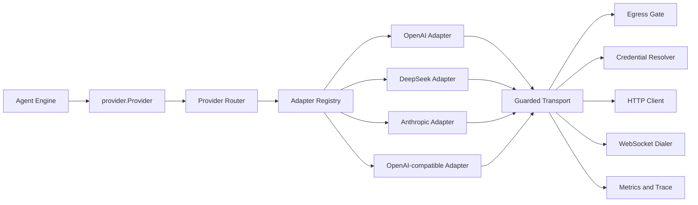

# Provider 架构升级方案

简体中文 | [English](../en/provider-architecture-upgrade.md)

> 状态：P2 `generic_paths_isolated`。版本化证据见
> [`provider-architecture-p0-baseline.json`](../provider-architecture-p0-baseline.json)
> [`provider-architecture-p1-evidence.json`](../provider-architecture-p1-evidence.json)
> 与 [`provider-architecture-p2-evidence.json`](../provider-architecture-p2-evidence.json)。
>
> 范围：Model Route 元数据、Provider-neutral Request 与 Stream 契约、Wire
> Adapter、HTTP 与 WebSocket Transport、DeepSeek 专属行为、Provider
> Failure、Retry Ownership、Replay State、Usage Accounting、Diagnostics、
> Fixture 与验收门禁。
>
> 参考：DeepSeek Harness `0.1.0-rc.5`，上游 Commit
> `47f943859bef60e4160492346772ded9b24f765a`。

## 1. 执行摘要

CodeHelper 已经具备正确的 Provider-neutral Engine 边界：
`provider.Provider.Stream(context.Context, ModelRequest)` 返回标准化的
`provider.Stream`。问题不在这条边界，而在边界后的实现没有完成职责分离。

`internal/adapter/provider/httpclient.Client` 当前同时承担：

1. 并发限制与请求速率限制；
2. Credential 解析与认证 Header；
3. 经过 Egress Gate 的 HTTP 执行；
4. 请求 Retry 与 Backoff；
5. OpenAI Chat 序列化；
6. OpenAI Responses 序列化；
7. Anthropic 序列化；
8. OpenAI 与 DeepSeek 兼容条件；
9. Stream Decoder 选择；
10. Responses WebSocket Continuation；
11. HTTP Failure 分类；
12. Idle Timeout 与健康状态计数；
13. 脱敏诊断文件。

结果是一个 1,117 行的生产文件，并且通用 OpenAI 路径包含 DeepSeek-only
行为。修复一个 Provider 时，可能改变无关 OpenAI-compatible Route 的请求字节、
缓存 Prefix、Replay 行为或错误语义。

本升级引入四个明确层次：

```text
Engine Logical Request
        |
        v
Provider Router（选择 AdapterID）
        |
        v
Provider-owned Wire Adapter
        |
        v
Single-attempt Guarded Transport
        |
        v
Provider-normalized Stream / Failure
```

DeepSeek 成为一等 Adapter，并拥有两个 Wire Mode：

- `deepseek-chat` 与 `deepseek-reasoner` 使用 DeepSeek Chat
  Completions；
- 当前 `deepseek-v4-flash` Route 使用 DeepSeek Responses。

改造不新增第二套 Model Loop、Provider Side Channel 或 Host 执行路径。Engine
继续只依赖 `provider.Provider`；具体构造仍属于
`internal/runtime/app/wire`；Egress、Credential、Usage、Trace 与 Durable
Turn Effect 仍然是强制路径。

## 2. 目标

本升级必须：

1. 将 Provider 语义与共享 Transport 隔离；
2. 通过显式 Adapter 元数据路由，禁止按 Provider 或 Model 名称猜测；
3. 让 DeepSeek 拥有唯一权威的 Request、Stream、Usage 与 Failure 实现；
4. 让一次网络请求对应一次可观测的 Durable Provider Attempt；
5. 仅向拥有者 Adapter 提供 Provider-private Replay Data；
6. 让每类 Provider Failure 可按机器字段路由，Engine 不解析人类错误文本；
7. 保留完整 Logical Request，同时让 Transport 优化继续受 Capability 控制；
8. 保持 Credential Reference 与 Egress 强制执行；
9. 将测试从子串检查升级为精确 Wire Contract；
10. 删除被替代的通用分支，最终生产代码净增长不得为正；
11. 通过 Architecture Ratchet，并新增 Provider Hotspot 上限。

## 3. 非目标

本升级不负责：

- 替换 Runtime、Turn Kernel 或 Agent Engine；
- 引入“everything is a plugin”的 Runtime；
- 允许 Provider Plugin 绕过 Policy、Approval、Journal、Sandbox 或 Egress；
- 从 Model 名称推断 Provider；
- 为 DeepSeek 开启 Incremental Responses；
- 把 Request Bytes 降低声明为 Token 降低；
- 提供公开 Provider SDK；
- 增加自动 Model Discovery；
- 增加 Pre-release Compatibility Migration；
- 把 Provider 执行移动到 CLI、TUI、VS Code 或 ACP；
- 用 Model-written Summary 替换 CodeHelper 的确定性 Compaction。

## 4. 当前实现审计

### 4.1 应保留的正确基础

以下能力已经正确，不应在改造中推翻：

- `provider.ModelRequest` 是 Provider-neutral 类型，并校验 Route、
  Capability、Image、Tool、Reasoning、Output 与 Cache 要求；
- `provider.StreamEvent` 标准化 Text、Reasoning、Tool Call、Search、
  Citation、Usage、Response State 与终止原因；
- `provider.Usage` 明确 Cached Input 是总 Input 的子集，Reasoning 是总
  Output 的子集；
- `model.ReadyRoute` 阻止调用方手工伪造未解析 Route；
- `model.RouteSet` 冻结按 Purpose 选择的 Route；
- `TurnSpec` 为一个 Turn 冻结 Route、Policy、Context、Tool 与 Extension
  Snapshot；
- `EffectSampleProvider` 已是 Durable Turn Effect；
- Egress Fail-closed，并且在 Provider 之前构造；
- Credential 只保存 Environment、File 或 Keyring Reference；
- Provider Diagnostic 在写盘前执行脱敏；
- Incremental Responses 受 Capability 控制，无法使用时回退到完整 Logical
  Request。

### 4.2 责任集中

主要集中点是 `internal/adapter/provider/httpclient/client.go`。Request Encoding
只按 `WireProtocol` 选择，因此某个 Provider Dialect 无法拥有自己的规则，只能把
条件继续加入共享 Encoder。

`providerBuildState` 保存具体 `*httpclient.Client`，Engine 与 Model-sampling
Tool 共用它。这样 Transport 实现泄漏到 Composition Output，而不是只发布窄接口
`provider.Provider`。

Model Probe 也直接构造 `httpclient.Client`。当新 Provider 需要专用 Adapter 时，
生产 Sampling 与 Probe 可能走不同路径。

### 4.3 Route 元数据混合了两个维度

`model.ProviderKind` 当前同时包含：

- `openai` 与 `anthropic`，表示 Provider 语义；
- `local` 与 `custom`，表示部署来源。

因此 DeepSeek 与 OpenRouter 都是 `custom`，尽管二者需要不同 Wire 行为。
`WireProtocol` 只能说明 Chat、Responses 或 Anthropic，无法标识
OpenAI-compatible Protocol 内部的 Provider Dialect。

这正是 DeepSeek-only 行为进入通用 OpenAI 代码的根因。

### 4.4 通用代码中的 DeepSeek 条件

共享 Request Encoder 当前会：

- 对所有含 Reasoning 的 Assistant Message 输出 `reasoning_content`；
- 在 Responses Function Call 之前插入 DeepSeek Reasoning Placeholder；
- 使用 DeepSeek-specific Responses Native Search 拼写；
- 根据 DeepSeek Responses Live Failure 丢弃或重建 Reasoning Item。

这些规则对 DeepSeek 有价值，但并不适用于所有 OpenAI-compatible Endpoint。
特别是 Chat 历史中不含 Tool Call 的普通 Turn 不需要回传 Reasoning；继续回传只会
增加 Input。

### 4.5 Stream Contract 缺口

当前通用 Chat Stream：

- 收到 `finish_reason` 后，即使缺少 `[DONE]` 也接受 EOF；
- 丢弃 SSE Comment，无法把 Heartbeat 记录为 Transport Activity；
- 不会把无 Content、无 Tool Call 的正常 Stop 分类为 Empty Response；
- 读取 `prompt_tokens_details.cached_tokens`，但不读取 DeepSeek 原生
  `prompt_cache_hit_tokens`；
- 把 In-stream Failure 转成非结构化错误。

Provider 返回空成功响应时，它可能进入普通 Completion Policy，继而错误触发
Completion Repair，而不是 Provider Recovery。

### 4.6 Failure 分类过粗

当前 Non-2xx Response 主要被映射为：

- 大部分非 429 的 4xx 映射为 `invalid_argument`；
- 其他状态映射为 `unavailable`。

Response 会保留 HTTP Status 与 Rate-limit Header，但会丢失以下稳定事实：

- Authentication Failure；
- Quota 或 Balance 耗尽；
- Context Window Overflow；
- Invalid Request；
- Transient Rate Limit；
- Server Failure；
- Provider Request ID；
- Malformed Stream；
- Truncated Stream；
- Empty Completion。

Engine 因此无法在不解析人类错误文本的前提下做精确 Recovery。

### 4.7 Retry 有两个 Owner

`httpclient.Client` 会重试 Transport Failure 与部分 HTTP Status。
`Engine.modelStep` 又会重试发生在 Meaningful Stream Output 之前的 Failure。

两层 Attempt Budget 可能相乘。HTTP 内层 Attempt 不是独立 Durable Attempt Fact，
尽管外层 Provider Retry Count 已进入 Turn Kernel。

### 4.8 Replay State 缺少 Adapter Provenance

`ContentBlock.ProviderType` 与 `ProviderData` 保存 Provider-private Response
Item，`EventResponseState` 保存 Responses Continuation State。这些机制有价值，
但没有将 Data 绑定到产生它的 Adapter Instance 或 Adapter Identity。

共享 Encoder 依赖 `openai_responses.reasoning` 之类的字符串。Route 切换时，如果
调用方忘记过滤，就可能把 Private Replay Data 暴露给语义不同的 Adapter。

### 4.9 Fixture 覆盖广，但 Wire 不够精确

Provider Fixture 已覆盖大量完整 Product Journey，但 Fixture Server 主要检查：

- Path 与 Model；
- `stream: true`；
- 一个 Expected Prompt 子串；
- 可选 Request 子串。

对于“字段必须缺失”、Canonical Message Ordering、Header、精确 Tool Shape、
Reasoning Passback 与 Cache Prefix Stability，这种检查强度不够。

## 5. DeepSeek Harness 的可借鉴设计

需要借鉴的是架构原则，不是直接复制源码。

### 5.1 Provider-owned Translation

DeepSeek Harness 把以下责任放在 DeepSeek Package：

- Request Serialization；
- SSE Framing；
- Wire Chunk Translation；
- Model Metadata；
- Usage Normalization；
- Error Classification；
- Request-specific Header。

CodeHelper 应采用同样的 Ownership，同时保留自己的 Go Transport、Egress Gate、
Credential Resolver 与 Durable Runtime。

### 5.2 一次 Adapter Call 对应一次 Attempt

Harness Adapter 每次只发送一个 Provider Request。Retry Policy 位于 Agent Step
Recovery Boundary。这避免隐藏的 SDK Retry，并让每次 Attempt 可观测。

CodeHelper 已拥有更强的 Durable Effect 基础，应删除 HTTP 内层 Retry，并完成 Retry
Fact 向 Durable Effect 的归一。

### 5.3 稳定 Stream Ordering

Harness Adapter 保证：

```text
Block Delta
Block Completion
Usage
Finish
End of Stream
```

缺少 `[DONE]`、Malformed Payload 与 Empty Successful Completion 是三类不同
Failure。

### 5.4 Provider-private Replay

只有 Historical Provider 与 Target Provider 由同一个 Adapter Instance 拥有时，
Harness 才允许回放 Replay State。Provider-neutral Content 可以跨 Adapter；
Private Replay State 不可以。

### 5.5 Operation-local Configuration Snapshot

Connection Fact 每个 Operation 只解析一次，并在 Operation 内保持不可变。
CodeHelper 已通过 `TurnSpec` 冻结大部分 Route Fact；新 Router 必须保持该性质，不能
在 Stream 中重新解析 Adapter Identity 或 Endpoint。

### 5.6 不应复制的部分

CodeHelper 不应让 Agent Loop、Session Authority 或 Security Component 变成可替换
Provider Plugin。对于受治理 Runtime，静态 Go Composition 是合理选择。

应吸收的最小集合是：

- 显式 Adapter Registration；
- Duplicate Detection；
- 单次 Operation 内不可变选择；
- Provider-owned Wire Behavior；
- 标准化 Failure Fact；
- Real API Conformance Test。

## 6. 目标架构



### 6.1 Ownership

| 关注点 | Owner |
| --- | --- |
| Logical Message、Tool、Usage、Stream Event | `internal/adapter/provider` |
| Provider/Model/Adapter Route Metadata | `internal/adapter/model` |
| Adapter Interface 与 Prepared Wire Call | `internal/adapter/provider/wire` |
| OpenAI 语义 | `internal/adapter/provider/openai` |
| DeepSeek 语义 | `internal/adapter/provider/deepseek` |
| Anthropic 语义 | `internal/adapter/provider/anthropic` |
| 通用 OpenAI-compatible Fallback | `internal/adapter/provider/openaicompat` |
| HTTP/WebSocket、Egress、Credential、并发 | `internal/adapter/provider/httpclient` |
| Retry Decision 与 Attempt Lifecycle | `internal/runtime/agent` |
| Registry 与 Transport 具体构造 | `internal/runtime/app/wire` |
| Usage Persistence 与 Reporting | `internal/observability` |

## 7. Route 与 Adapter Identity

### 7.1 新增 `AdapterID`

Provider 语义变成显式 Closed Value：

```go
type AdapterID string

const (
    AdapterOpenAI           AdapterID = "openai"
    AdapterDeepSeek         AdapterID = "deepseek"
    AdapterAnthropic        AdapterID = "anthropic"
    AdapterOpenAICompatible AdapterID = "openai_compatible"
)
```

`model.Provider` 与 `model.ReadyRoute` 携带 `AdapterID`。

`WireProtocol` 保持独立：

```text
AdapterID       = 谁拥有语义转换
WireProtocol    = 使用哪个外部协议族
ProviderID      = 选择哪个配置 Route 与 Credential Domain
ModelID         = 选择该 Route 下的哪个 Model
```

示例：

| Provider | AdapterID | WireProtocol |
| --- | --- | --- |
| OpenAI Chat | `openai` | `openai_chat` |
| OpenAI Responses | `openai` | `openai_responses` |
| DeepSeek Chat | `deepseek` | `openai_chat` |
| DeepSeek V4 Responses | `deepseek` | `openai_responses` |
| Anthropic | `anthropic` | `anthropic` |
| OpenRouter | `openai_compatible` | `openai_chat` |
| 未知 Custom Chat Endpoint | `openai_compatible` | `openai_chat` |

### 7.2 删除 `ProviderKind`

当前 `ProviderKind` 混合 Provider 语义与部署来源。目标方案删除它，不保留两个含义
重叠的字段。

- Adapter 语义进入 `AdapterID`；
- Catalog、Config 与 CLI 来源继续使用 `Provenance`；
- Local Deployment 由 Endpoint 与 Provenance 表达。

这是 Pre-release Contract Replacement，不是 Compatibility Migration。

### 7.3 禁止名称推断

以下做法被禁止：

- `strings.HasPrefix(provider, "deepseek")`；
- `strings.HasPrefix(model, "deepseek")`；
- Engine 根据 Endpoint Host 匹配；
- Dispatch 后根据 Response Payload 猜 Adapter。

覆盖已知 Provider Endpoint 时，保留 Catalog 中的 Adapter。未知 Custom Endpoint
按显式 Protocol 选择默认值：

- `anthropic` Protocol 使用 Anthropic Adapter；
- OpenAI Protocol 使用 `openai_compatible`。

Custom Route 若要使用 DeepSeek 语义，在 Custom Provider Profile 暴露该字段后，必须
显式配置 DeepSeek Adapter。

## 8. Provider-neutral Contract

Engine-facing Interface 保持不变：

```go
type Provider interface {
    Stream(context.Context, ModelRequest) (Stream, error)
}
```

Engine 不得 Import：

- `httpclient`；
- `openai`；
- `deepseek`；
- `anthropic`；
- Wire Request Struct；
- Provider Error Body Struct。

`provider.ModelRequest` 仍是完整 Logical Request，不携带：

- Bearer Token；
- HTTP Header；
- Serialized Wire JSON；
- WebSocket Response ID；
- Connection Handle。

### 8.1 Assistant Provenance

Assistant Message 增加显式 Producer Provenance：

```go
type AssistantProvenance struct {
    Adapter  model.AdapterID `json:"adapter"`
    Provider string          `json:"provider"`
    Model    string          `json:"model"`
    Replay   *ReplayState    `json:"replay,omitempty"`
}

type ReplayState struct {
    Version uint32          `json:"version"`
    Data    json.RawMessage `json:"data"`
}
```

仅 Model 产生的 Assistant Message 携带该值。User、System 与 Tool Message
不携带。

Provider-neutral Reasoning Text 继续位于 Content Block。Adapter-private Response
ID、Signature 与 Native Response Item 进入 `ReplayState`。

Dispatch 前，Router 会在 Historical `Adapter` 与 Target Route `AdapterID`
不一致时删除 `ReplayState`。Target Adapter 仍需校验 Version、
Provider/Model Consistency 与 Content Consistency。

## 9. Wire Adapter Contract

新增 `internal/adapter/provider/wire` Package，定义 Semantic Adapter 与
Transport 之间的窄契约。

```go
type Adapter interface {
    ID() model.AdapterID
    Prepare(provider.ModelRequest) (PreparedCall, error)
    OpenStream(io.ReadCloser, PreparedCall) (provider.Stream, error)
    ClassifyHTTP(HTTPFailure) provider.Failure
}
```

实现时具体 Go 命名可以调整，但 Ownership 不得改变。

### 9.1 `PreparedCall`

`PreparedCall` 是 Detached、Immutable Request Data：

```go
type PreparedCall struct {
    Method   string
    Path     string
    Body     []byte
    Headers  http.Header
    Auth     AuthStyle
    Stream   StreamKind
    Adapter  model.AdapterID
    Protocol model.WireProtocol
}
```

要求：

- `Body` 是 Digest 与 Transport 使用的精确 Request Payload；
- `Headers` 只包含非 Secret Adapter Header；
- Authorization 由 `AuthStyle` 描述，Raw Credential 在解析后由 Transport
  应用；
- Adapter 不得修改 `ModelRequest`；
- `Prepare` 在网络 I/O 前执行语义校验；
- 一次 Attempt 内 Prepared Adapter、Endpoint、Property 与 Body 保持固定。

### 9.2 Adapter Registry

Registry 构造后不可变：

```go
type Registry struct {
    adapters map[model.AdapterID]wire.Adapter
}
```

构造时校验：

- Adapter ID 非空；
- Adapter ID 不重复；
- `adapter.ID()` 与注册 Key 一致；
- 每个 Active Route 都能找到 Adapter；
- Adapter 支持 Route Protocol；
- 不允许静默替换 Adapter。

与 DeepSeek Harness 不同，生产 Registry 不支持 Hot Unload。CodeHelper 使用静态
Runtime Composition，动态替换 Provider 对安全性与产品行为没有必要收益。

### 9.3 Provider Router

`provider.Router` 实现 `provider.Provider`：

1. 校验 Logical Request；
2. 根据 `ReadyRoute.AdapterID` 选择 Adapter；
3. 为目标 Adapter 过滤 Replay State；
4. 请求 Adapter Prepare Call；
5. 解析 Route Credential；
6. 执行恰好一次 Transport Attempt；
7. 让 Adapter 分类 Non-success Response；
8. 让 Adapter 打开 Stream；
9. 附加 Transport Metadata 与公共生命周期计数。

`providerBuildState` 发布 `provider.Provider`，不再发布
`*httpclient.Client`。

以下调用方使用同一个 Router：

- Main Engine；
- `ToolSampler`；
- Model Capability Probe；
- 未来的 Summary 或 Judge Purpose。

## 10. 共享 Transport

`httpclient` 变成 Transport Infrastructure，不再是 Protocol Implementation。

它拥有：

- `http.Client`；
- Egress Wrapping；
- Credential Resolution；
- Authentication Header Application；
- Concurrency Limit；
- Request Rate Limit；
- Single-attempt Request Execution；
- Failure Response Body Limit；
- Cancellation；
- Idle Watchdog；
- Transport Metadata；
- Health Counter；
- Metrics；
- Static Application Attribution；
- Redacted Diagnostic Persistence。

它不拥有：

- Message 或 Tool Serialization；
- 除声明式 Auth 应用外的 Provider-specific Header；
- Reasoning Policy；
- Response Event Translation；
- Provider Failure Code；
- Retry Loop；
- Context-overflow 文本匹配；
- Replay-state Conversion。

### 10.1 单次 Attempt

`Transport.Do` 只发起一次网络请求，不执行 Sleep 与 Retry。

从 `httpclient.Client` 删除：

- `MaxAttempts`；
- `BaseDelay`；
- `MaxRetryDelay`；
- `Random`；
- `Sleep`。

Idempotency Key 仍是 Prepared Logical Attempt 的稳定事实。后续 Durable Retry
是否复用该 Key，由 Adapter 的 Provider Contract 明确规定。

### 10.2 Idle Activity

Idle Timeout 衡量正在等待 Provider Read 时的无活动时间，不包括：

- Consumer 尚未请求下一个 Event 的时间；
- 处理前一个 Event 的时间。

SSE Comment 与 Protocol Heartbeat 会重置 Read Watchdog，但不会成为
Model-visible Event。

Watchdog 对 Request 与 Body Read 使用同一个 Cancellation Source。若 Turn 更早发起
Cancel，则 Turn Cancellation 优先于之后发生的 Timeout。

### 10.3 Responses WebSocket

Incremental Responses 仍是可选 OpenAI Adapter Capability。

- Common Transport 只暴露经过 Egress 的 WebSocket Dial/Read/Write Primitive；
- OpenAI 拥有 `previous_response_id`、Property Digest、Strict-extension
  Comparison、Replay-output Conversion 与 Continuation Commit；
- `incremental_responses=false` 时，DeepSeek 永远不进入此路径；
- Compaction、Retry Uncertainty、Route Change、Property Change、
  Non-strict Extension 或 Connection Reset 强制完整 Request；
- Logical Digest 与 Transport Digest 保持独立。

Generic Transport 不得检查或重写 `input` JSON Array。

## 11. Stream Contract

所有 Adapter 必须满足同一个标准化契约。

### 11.1 Ordering

Successful Stream：

```text
message_start 恰好一次
零个或多个 Content/Tool/Search/Citation Event
零个或多个 Usage Event
message_stop 恰好一次
EOF
```

附加规则：

- Usage Total 必须在 `message_stop` 前完成；
- `message_stop` 后不得再发 Event；
- Tool Arguments 保持 Raw JSON Fragment；
- Block/Tool Index 在一个 Stream 内稳定；
- Unknown Provider Finish Reason 不得静默映射为成功；
- 当 Adapter 要求 Provider-native Terminal Marker 时，该 Marker 必须存在；
- Close 恰好一次终止底层 Read 并释放 Capacity。

### 11.2 Empty Completion

Normal Stop 若不含以下任何内容，则属于 `empty_response`，不是成功：

- Text；
- Reasoning；
- 完整 Tool Call；
- Search Result；
- Citation。

Reasoning-only Output 属于 Meaningful Output；初始空
`reasoning_content` 不属于。

在 Adapter Boundary 分类 Empty Output，可以避免 Completion Policy 把 Provider
Failure 当成 Agent Completion Defect。

### 11.3 Partial Output

Meaningful Output 之后发生的 Failure 不自动 Retry。Engine 保留现有规则：只有
Meaningful Output 之前的 Failure 才有资格进行 Transparent Provider Retry。

Max-token 与 Incomplete Terminal Reason 属于 Output Continuation，不属于
Transport Retry。

## 12. Provider Failure Contract

### 12.1 Failure Fact

新增 Provider-neutral、Serializable Failure：

```go
type FailureCode string

const (
    FailureAuth                  FailureCode = "auth"
    FailureQuota                 FailureCode = "quota"
    FailureRateLimit             FailureCode = "rate_limit"
    FailureContextWindowExceeded FailureCode = "context_window_exceeded"
    FailureInvalidRequest        FailureCode = "invalid_request"
    FailureServer                FailureCode = "server"
    FailureTransport             FailureCode = "transport"
    FailureTimeout               FailureCode = "timeout"
    FailureAborted               FailureCode = "aborted"
    FailureMalformedResponse     FailureCode = "malformed_response"
    FailureStreamClosed          FailureCode = "stream_closed"
    FailureEmptyResponse         FailureCode = "empty_response"
    FailureUnsupportedContent    FailureCode = "unsupported_content"
    FailureUnknown               FailureCode = "unknown"
)

type Failure struct {
    Code         FailureCode `json:"code"`
    Message      string      `json:"message"`
    HTTPStatus   int         `json:"http_status,omitempty"`
    RetryAfterMS uint64      `json:"retry_after_ms,omitempty"`
    RequestID    string      `json:"request_id,omitempty"`
}
```

`Failure` 只记录事实，不决定 Retry。

### 12.2 Problem Projection

进入 Runtime Boundary 时：

| Provider Failure | Runtime Problem |
| --- | --- |
| Auth、Invalid Request、Unsupported Content | `invalid_argument` |
| Quota | `resource_exhausted`，不可 Retry |
| Context Window Exceeded | `resource_exhausted`，可进入 Recovery |
| Rate Limit、Server、Transport、Stream Closed、Empty Response | `unavailable` |
| Timeout | `deadline_exceeded` |
| Aborted | `canceled` |
| Malformed Response、Unknown | 默认 `unavailable`，Invariant Failure 除外 |

原始 `Failure.Code` 保留在 Durable Sample/Retry Fact 与 Diagnostic 中。Runtime
必须按稳定 Code 路由，不能解析 Message。

### 12.3 DeepSeek HTTP 分类

DeepSeek 分类规则：

- 401/403 -> `auth`；
- Quota、Balance 或 Credit Exhaustion -> `quota`；
- 其他 429 -> `rate_limit`；
- 明确表示 Context Capacity 的 400 -> `context_window_exceeded`；
- 其他 400 -> `invalid_request`；
- 5xx -> `server`；
- 其他 Status -> `unknown`，并保留 Status。

Request Identity 从 `x-request-id` 与 `x-deepseek-request-id` 读取。
`Retry-After` 接受正整数秒或未来 HTTP Date。

## 13. Retry Ownership 与 Durability

### 13.1 Policy Separation

Adapter 分类 Failure，并可发布默认 Retry Policy Metadata。Engine/Turn Kernel
决定是否 Retry。

Policy 至少考虑：

- Failure Code；
- 是否已发出 Meaningful Output；
- Provider-requested Delay；
- Configured Maximum Attempts；
- Turn Cancellation；
- Attempt History；
- Recovery 是否改变 Model-visible State。

### 13.2 Durable Attempt Lifecycle

目标生命周期：

```text
Sample Requested
Effect Requested
Attempt Started and Persisted
Provider Call
Attempt Succeeded -> Sample Result Persisted
或
Attempt Failed -> Failure Persisted
Retry Scheduled and Persisted
Delay
Effect Requeued
Next Attempt Started and Persisted
```

`ProviderRetryRequested` 增加：

- 标准化 `Failure`；
- Retry Number；
- Effective Delay；
- Policy Digest 或 Revision；
- Attempt Identity。

进程在 Delay 中或 Requeue 后崩溃，恢复时从 Durable State 继续，不能重置 Retry
Budget。

### 13.3 默认 Retry Matrix

| Failure | 默认行为 |
| --- | --- |
| Auth、Quota、Invalid Request、Unsupported Content | 不 Retry |
| Context Window Exceeded | Compact/Prune，只有 Visible History 改变后才能 Retry |
| Rate Limit | Bounded Retry，并遵循合法 `Retry-After` |
| Server、Transport、Stream Closed | Meaningful Output 前 Bounded Retry |
| Timeout | Turn 未取消时 Bounded Retry |
| Empty Response | Completion Policy 前执行一次 Bounded Retry |
| Malformed Response | 默认不 Retry |
| Aborted | 不 Retry |

## 14. Replay-state Ownership

### 14.1 Capture

Adapter 只有在获得合法 Successful Terminal Event 后才能返回 Versioned Replay
State。Incomplete、Filtered、Malformed 或 Canceled Output 不提交 Replay State。

### 14.2 Dispatch

Dispatch 前：

1. 保留 Provider-neutral Block；
2. 仅在 Neutral Contract 要求时保留 Signature；
3. 仅为相同 `AdapterID` 保留 Replay State；
4. Target Adapter 校验 Provider/Model Compatibility；
5. Malformed State 在网络 I/O 前失败。

### 14.3 Content Consistency

若 Extension、Compaction、Steering Merge 或 Recovery 改写 Assistant Message，
旧 Replay State 必须删除，除非改写 Owner 能重新生成并校验匹配状态。

### 14.4 Responses Continuation State

WebSocket Response ID 与 Connection Object 不进入 Durable History。Durable Replay
State 可以保存重建完整 Request 所需的 Provider Response Item，但
Connection-local Continuation Evidence 属于 Transport State，出现不确定性时必须
丢弃。

## 15. Usage Accounting

CodeHelper 保持当前 Inclusive 口径：

```text
CachedTokens <= InputTokens
ReasoningTokens <= OutputTokens
UncachedInputTokens = InputTokens - CachedTokens
```

这样无需迁移持久化语义，并与当前 Cost 和 Report 代码一致。

每个 Adapter 负责标准化自己的 Provider。

### 15.1 DeepSeek Chat

```text
InputTokens     = prompt_tokens
CachedTokens    = prompt_tokens_details.cached_tokens
                  或 prompt_cache_hit_tokens
OutputTokens    = completion_tokens
ReasoningTokens = completion_tokens_details.reasoning_tokens
```

若两种 Cache 字段同时存在，二者必须一致，否则 Diagnostic 记录 Protocol Anomaly。
`prompt_cache_miss_tokens` 可作为 Diagnostic Evidence 保留，并与 Total Input
校验，但它不是第五个可累加 Usage 字段。

### 15.2 OpenAI

OpenAI 继续使用其 API 定义的 Nested Input/Output Detail Field。

### 15.3 Anthropic

Anthropic 继续把 Cache Read 与 Cache Creation Input 加入普通 Input Count，使
`InputTokens` 表示 Total Input。只有 Cache Read 进入 `CachedTokens`。

### 15.4 Ordering 与 Persistence

Usage 必须在 Terminal Success 前到达。Final Sample Result 持久化：

- Logical Input/Output Usage；
- Cache 与 Reasoning Subset；
- Logical Request Digest；
- Transport Payload Digest；
- Serialized Request Bytes；
- Incremental Transport Flag。

Provider 未返回 Usage 时保持显式缺失；Adapter 不得根据 Request Bytes 伪造 Token
Count。

## 16. DeepSeek Adapter

### 16.1 Package Layout

```text
internal/adapter/provider/deepseek/
  adapter.go
  chat_request.go
  chat_stream.go
  responses_request.go
  responses_stream.go
  failure.go
  usage.go
  replay.go
```

若合并文件能提高可读性，可以合并；但 Chat 与 Responses 的 Wire Type 和 Test
必须保持可区分。

### 16.2 共享 DeepSeek 规则

Adapter 拥有：

- Bearer Authentication Style；
- DeepSeek Request Header；
- Model Reasoning-effort Validation；
- 适用时的 Text-only Capability Rejection；
- Cache Usage Field；
- DeepSeek Error Body；
- Request ID Extraction；
- Empty-response Classification；
- Strict Stream Termination；
- Reasoning Passback；
- Provider-private Replay Validation。

### 16.3 Chat Request 规则

DeepSeek Chat：

- 使用 `/chat/completions`；
- 永远开启 Streaming 与 Usage；
- 使用 Function Tool Shape；
- 对 Tool-only 或 Reasoning-only Historical Turn，Assistant `content`
  使用空字符串，禁止 `null`；
- 只有 Assistant Turn 同时含 Tool Call 时才回传 `reasoning_content`；
- Tool-call-free Historical Turn 不回传 Reasoning；
- Empty Tool Output 使用显式非空 Sentinel；
- Transport 前拒绝 Image；
- `off` 映射为 `thinking.type=disabled`，不发送
  `reasoning_effort=off`。

支持哪些 Effort 由 Adapter/Model Metadata 定义。Generic Engine 不负责把
`xhigh` 重写为 `max`。

### 16.4 Chat Stream 规则

Decoder：

- 忽略初始空 `reasoning_content`；
- 按 Wire 顺序先发 Reasoning、后发 Visible Text；
- 按 Wire Index 关联 Parallel Tool Call；
- 支持 Usage 位于 Finish Chunk 或 Trailing Usage-only Chunk；
- 保留最后一个合法 Usage Snapshot；
- 强制要求 `[DONE]`；
- `[DONE]` 前 EOF -> `stream_closed`；
- Normal Empty Stop -> `empty_response`。

### 16.5 Responses 规则

DeepSeek Responses 拥有当前嵌在 Generic OpenAI 代码中的行为：

- Plaintext Reasoning-item Reconstruction；
- 删除 Empty Reasoning Shell；
- 只有 DeepSeek 要求时，才在 Function Call 前插入非空 Reasoning
  Placeholder；
- 保持 Tool Call/Result Pairing；
- 翻译 DeepSeek Native Search 拼写；
- Harvest Final Reasoning Snapshot，且不重复 Delta；
- 拒绝 Malformed Native Replay State。

这些规则不再作用于 OpenAI 或任意 Responses Gateway。

DeepSeek Responses 保持完整 HTTP/SSE：

```text
incremental_responses = false
previous_response_id  = absent
WebSocket             = disabled
```

### 16.6 Purpose-specific Behavior

Provider Purpose 可供 Adapter 执行非 Model-visible Transport 或 Request Policy。
任何 Purpose-specific Request Field 都必须显式定义并测试。

首个实现不得增加 Model-visible Prose。Compaction、Title、Vision、Subquery 与
Main Sampling 都继续使用其 Runtime Owner 组装的 Logical Request。

## 17. OpenAI、Anthropic 与 Compatible Adapter

### 17.1 OpenAI

OpenAI 拥有：

- Chat 与 Responses Native Request Shape；
- Encrypted Reasoning Replay；
- OpenAI Native Search Tool；
- OpenAI Finish/Error Event；
- Capability-gated Responses WebSocket Continuation。

其中不再出现 DeepSeek Placeholder 或 DeepSeek Error Wording。

### 17.2 Anthropic

Anthropic Request Serialization 从 `httpclient` 移动到现有 Stream Decoder
旁边。它拥有：

- System Block；
- Cache-control Placement；
- Thinking Budget；
- Tool-use JSON Decoding；
- Native Search；
- Anthropic Usage Normalization。

### 17.3 OpenAI-compatible

Compatible Adapter 有意保持保守：

- 支持标准 OpenAI Chat 与 Responses Field；
- 不发送 Provider-specific Thinking Toggle；
- 不生成 DeepSeek Placeholder；
- 不假设 Encrypted Reasoning；
- 只接受 Route Metadata 显式声明的 Capability；
- 根据 Status 与标准 Error Field 分类 Failure，不使用 Provider-name
  Heuristic。

Provider-specific Behavior 必须通过一等 Adapter 实现，不能再增加 Compatibility
Flag。

## 18. Diagnostics 与 Security

### 18.1 Credential

Adapter 在 Config 或 Replay State 中都不能接触 Credential Value。Transport：

1. 解析 Route Credential Reference；
2. 校验其可用于 Header；
3. 根据 `AuthStyle` 应用；
4. 不把它放入 `PreparedCall`、Trace Attribute、Dump 或 Error；
5. 保持当前 File Ownership 与 Permission 检查。

Endpoint 与 Credential Reference 来自同一个 Frozen Route Snapshot。

### 18.2 Egress

所有 HTTP 与 WebSocket Connection 使用现有 Egress-wrapped Client。Adapter
不能提供备用 Client 或绕过 Gate Dial。

Redirect Policy 仍由 Transport 拥有，并禁止 Redirect 到未在 Route Set 中授权的
Host。

### 18.3 Diagnostic Dump

Diagnostic Summary 支持 Adapter Extension，但不暴露 Raw Body：

```go
type DiagnosticSummarizer interface {
    Summarize(PreparedCall) []InputSummary
}
```

Dump Invariant：

- 不含 Credential 或 Authorization Header；
- 不含 Raw Prompt Text；
- 不含 Raw Replay Data；
- Provider Error Text 有上限；
- Directory 与 File 仅 Owner 可读写；
- 保留 Adapter、Provider、Model、Protocol、Path、Size 与 Block Kind；
- 安全时保留 Request ID；
- 分享前显示人工检查提示。

### 18.4 Application Attribution

所有 Adapter 发送由 Build Metadata 生成的统一 CodeHelper `User-Agent`。
Provider-specific Attribution Header 必须有显式 Adapter Contract，且不得包含
User、Session、Path、Prompt 或 Credential Data。

## 19. Context Recovery 集成

Provider Classification 让 Runtime 能做精确 Recovery，但 Context Policy 仍属于
Runtime，不进入 Adapter。

### 19.1 Context Overflow

收到 `context_window_exceeded` 后：

1. 保留 Failed Attempt Fact；
2. 调用 `internal/runtime/agent` 已有 Token-native Compaction；
3. 独立 Context Feature 完成后，在 Summary Replacement 前执行确定性
   Tool-result Pruning；
4. 重新测量完整 Logical Request；
5. 仅当 Model-visible History 发生变化并满足 Policy 时 Retry；
6. 没有安全 Reduction 时保留原始 Failure。

Adapter 不修改 History。

### 19.2 Empty Response

`empty_response` 在任何 Completion-repair Decision 前执行一次 Bounded Provider
Retry。若重复出现，Turn 以 Provider Failure 失败，不要求 Model 修复它从未产生的
Content。

### 19.3 Tool-result Pruning

Tool-result Surface Pruning 与本方案相关，但 Owner 仍是
`internal/runtime/agent`，不是 Provider。它应：

- 保留完整 Durable Original Result；
- 只替换 Model-visible Projection；
- 保持 Call/Result Pairing；
- 保留 Bounded Head/Tail 与 Retrieval Handle；
- Pruning 后重新测量；
- Pruning 已解除压力时，不调用 LLM Summary。

该 Feature 可以在 Provider Failure Taxonomy 之后落地，因为精确 Context Overflow
是其最强触发信号。

## 20. Construction 与 Lifecycle

`providerModule.Build` 按以下顺序构造：

```text
Resolve Routes
Grant Route Hosts to Egress
Construct Credential Resolver
Construct Guarded Transport
Construct Concrete Adapters
Construct Immutable Adapter Registry
Construct Provider Router
Construct ToolSampler over Router
Publish provider.Provider and Catalogs
```

Partial Construction 使用现有 Resource Stack。任何 Adapter 或 Transport Resource
都在其中注册 Closer。

`providerBuildState` 变为：

```go
type providerBuildState struct {
    routes            model.RouteSet
    route             model.ReadyRoute
    egress            *egress.Gate
    provider          provider.Provider
    toolSampler       *agentengine.ToolSampler
    providerCatalog   protocol.ProviderCatalog
    modelCatalog      protocol.ModelCatalog
    modelCapabilities protocol.ModelCapabilities
}
```

除非后续 Module 拥有明确的 Construction-only Requirement，否则不能接收 Concrete
Router、Registry、Adapter 或 Transport。

## 21. 预期文件变化

### 21.1 新增

```text
internal/adapter/provider/wire/
internal/adapter/provider/router.go
internal/adapter/provider/deepseek/
internal/adapter/provider/openaicompat/
```

### 21.2 移动或重写

| 当前 Owner | 目标 Owner |
| --- | --- |
| `httpclient/client.go` 中的 OpenAI Request Encoding | `provider/openai` |
| `httpclient/client.go` 中的 Anthropic Request Encoding | `provider/anthropic` |
| OpenAI Encoding 中的 DeepSeek Chat 条件 | `provider/deepseek` |
| Generic Responses Encoding 中的 DeepSeek Responses 条件 | `provider/deepseek` |
| `httpclient` 中的 Protocol Stream Dispatch | Adapter Registry |
| HTTP Failure Wording/Classification | 各 Adapter |
| Responses Continuation Semantics | `provider/openai` |
| Shared Request Execution | 精简后的 `provider/httpclient` |

### 21.3 删除

迁移完成后删除：

- `httpclient` 的 `encodeRequest` Protocol Switch；
- `httpclient` 的 `decodeStream` Protocol Switch；
- OpenAI Generic Code 中的 DeepSeek Comment 与 Placeholder；
- `httpclient` 的 HTTP Retry Loop 与 Test Hook；
- `providerBuildState` 中直接保存的 `*httpclient.Client`；
- Model Probe 对 `httpclient.New()` 的直接使用；
- 若无 Host Contract 使用，则删除 `ProviderKind`。

Default Enablement 后不保留 Legacy 与 New Provider 双路径。

## 22. 迁移计划

每个阶段必须可独立 Review，通过 Focused Test 与 Architecture Ratchet，并保持生产代码
净增长 `<= 0`。

### P0：Characterization Baseline

目标状态：`baseline_frozen`。

工作：

- 为 OpenAI Chat、OpenAI Responses、Anthropic、DeepSeek Chat 与 DeepSeek
  Responses 增加精确 Request Golden；
- 增加 Stream Ordering Golden；
- 记录 Failure Classification Fixture；
- 记录 Logical 与 Transport Digest；
- 通过仓库命令执行 DeepSeek Live Control；
- 分开记录 Provider Request Count 与 Model Sample Count；
- 增加 Provider Package 生产代码规模 Baseline。

不改变生产行为。

Exit：

- 当前 Request 与已知 Defect 均可复现；
- Test 不依赖被忽略的本机 Credential Runbook；
- 所有 Secretless Fixture 通过；
- Credential 缺失时 Live Test 明确报告 Skip。

### P1：Adapter Identity 与 Router

状态：`infrastructure_ready`。

工作：

- 新增 `AdapterID`；
- 替换 `ProviderKind`；
- 在 Provider、ReadyRoute、Descriptor 与 Golden 中携带 Adapter Identity；
- 新增 Immutable Registry 与 Router；
- `providerBuildState` 发布 `provider.Provider`；
- ToolSampler 与 Probe 通过 Router；
- 临时把当前 Protocol Encoder 放入 Adapter 后方，保持行为。

Exit：

- Engine 与 Probe 使用同一 Provider Path；
- Duplicate 或 Missing Adapter 在构造时失败；
- 不存在 Provider/Model-name Inference；
- Behavior Golden 不变；
- Concrete Client 不再逃逸 Composition。

结果：

- 28 个 Bundled Provider 全部声明闭集 `AdapterID`；
- DeepSeek Chat 与 Responses 通过 `deepseek` Adapter 显式路由，无名称推断；
- Immutable Registry 在 Duplicate 或 Active Adapter 缺失时拒绝构造；
- Engine、ToolSampler 与 Capability Probe 共享同一个 Router；
- P0 Wire、Stream、Failure 与 Request Count Golden 保持不变；
- Provider Ownership 生产代码相对 P0 净减 41 行。

### P2：抽取 Wire Adapter

状态：`generic_paths_isolated`。

工作：

- 把 OpenAI Request Encoding 移到 OpenAI Decoder 旁；
- 把 Anthropic Request Encoding 移到 Anthropic Decoder 旁；
- 新增保守的 OpenAI-compatible Adapter；
- 把 `httpclient` 精简为 Transport；
- 删除 HTTP Inner Retry；
- 保持完整 HTTP/SSE 行为。

Exit：

- `httpclient` 不 Import Concrete Provider Adapter；
- Adapter 不构造 Unguarded Client；
- 一次 Router Call 只产生一次 Network Attempt；
- OpenAI 与 Anthropic Golden 保持等价；
- `httpclient/client.go` 不再是 Repository Hotspot。

结果：

- OpenAI 与 Anthropic 各自拥有精确 Request Serialization 和 Stream Opening；
- OpenAI 拥有 Responses WebSocket Continuation 与 Replay State；
- `openai_compatible` 成为显式的保守 Adapter；
- `httpclient` 不 Import Concrete Adapter，且每次只执行一个 HTTP Attempt；
- P0 Request、Stream 与 Failure Golden 保持字节级等价；
- `httpclient/client.go` 从 1,087 行降至 406 行；
- Provider Ownership 生产代码相对 P1 净增长 0 行。

### P3：专用 DeepSeek Adapter

目标状态：`deepseek_isolated`。

工作：

- 实现 DeepSeek Chat Request 与 Stream；
- 实现 DeepSeek Responses Request 与 Stream；
- 把所有 DeepSeek 分支移出 OpenAI Generic Code；
- 增加 Native Cache Accounting；
- 增加 Strict Terminal 与 Empty-response Handling；
- 增加 DeepSeek Failure Classification；
- V4 保持完整 HTTP/SSE；
- Bundled DeepSeek Route 改为 `AdapterDeepSeek`。

Exit：

- Generic OpenAI Package 不含 DeepSeek 条件；
- DeepSeek Chat Reasoning Passback 遵循 Tool-call-only Rule；
- DeepSeek Native Cache Usage 可见；
- V4 不发送 `previous_response_id`；
- 每个 DeepSeek Wire Scenario 均通过 Fixture 与 Live Control；
- Capability 与 Token Benchmark 不回退。

### P4：Replay Provenance

目标状态：`replay_owned`。

工作：

- 新增 Assistant Provenance 与 Versioned Replay State；
- 迁移 OpenAI Responses Reasoning/Private Item；
- 在需要时迁移 Anthropic Signature；
- I/O 前校验 Replay；
- Adapter Change 或 Content Rewrite 时删除 Replay；
- 删除 Generic Encoding 中的 Stringly-typed Replay Dispatch。

Exit：

- Cross-adapter Test 证明 Private State 不存在；
- Same-adapter Replay Lossless；
- Malformed Replay 在网络 I/O 前失败；
- Restart 与 Context Fork Reconstruction 保持正确；
- Raw Provider Object 不进入 Host Protocol。

### P5：Durable Retry 与 Recovery

目标状态：`attempts_durable`。

工作：

- 持久化标准化 Provider Failure；
- Wait 前持久化 Retry Schedule；
- 为下一次 Attempt Requeue Provider Effect；
- 在配置上限内遵循 Provider Delay；
- Context Overflow 进入 Compaction；
- Empty Response 进入 Bounded Provider Retry；
- Usage Report 区分 Provider Attempt、Model Sample 与 Completion Repair。

Exit：

- 不存在 Hidden Network Retry；
- Retry 中 Restart 不重置 Budget；
- Permanent Failure 不 Retry；
- Retryable Failure 不重复执行 Tool；
- Context-overflow Retry 要求 Visible Context Progress；
- Read-only Empty Failure 不会变成 Completion Repair。

### P6：Context Pruning 与最终启用

目标状态：`accepted`。

工作：

- 新增 Deterministic Tool-result Surface Pruning；
- 执行兼容 T0/T6 的 Token 对比；
- 删除全部 Obsolete Provider Code 与 Compatibility Branch；
- 收紧 Architecture Baseline；
- 更新中英文 Product Doc；
- 不使用 Experimental Toggle，默认启用 Router 与 DeepSeek Adapter。

Exit：

- 下列全部 Acceptance Gate 通过；
- 不存在双 Provider Path；
- 生产代码净增长 `<= 0`；
- T5 生产规模债务减少而不是增加；
- Branch 可执行 `--no-ff` 集成。

## 23. 测试策略

### 23.1 Pure Adapter Test

每个 Adapter 测试：

- Exact Canonical Request JSON；
- Required 与 Forbidden Field；
- 不含 Credential 的 Header；
- Text、Reasoning、Tool、Image 与 Tool-result Mapping；
- Empty 与 Mixed Content；
- Parallel Tool Call；
- Finish Reason Mapping；
- Usage Normalization；
- Malformed Payload；
- Terminal-marker Rule；
- Empty Completion；
- Failure Classification。

当 Cache Identity 依赖字节时，同时比较 Decoded Structured JSON 与精确 Serialized
Bytes。

### 23.2 Transport Test

Transport Test 覆盖：

- Egress Denial；
- Credential Resolution 与 Redaction；
- Single Network Attempt；
- Header 前 Cancellation；
- Body Read 中 Cancellation；
- Idle Timeout；
- SSE Heartbeat Activity；
- Failure Response-body Limit；
- Concurrency Release；
- Rate-limit Admission；
- HTTP 与 WebSocket 使用相同 Egress Client；
- Cleanup 与 Close Idempotence；
- Transport Metadata Digest。

Transport Test 使用 Fake Adapter，不重复 Provider Wire Test。

### 23.3 Router Test

Router Test 覆盖：

- 显式 AdapterID Selection；
- Unknown 与 Duplicate Adapter Rejection；
- Route Snapshot Immutability；
- Replay Filtering；
- Provider Failure Projection；
- Probe 与 ToolSampler 使用同一路径；
- 不按 Provider/Model 名称 Fallback。

### 23.4 Durable Retry Test

测试覆盖：

- Delay 前 Retry Fact；
- Delay 中 Cancellation；
- Delay 中 Restart；
- Requeue 后 Restart；
- Provider Delay Cap；
- Policy Exhaustion；
- Meaningful Output 后不 Retry；
- Quota/Auth/Invalid Request 不 Retry；
- Empty Response 执行一次 Retry；
- Compaction Progress Requirement；
- 精确 Provider Request Count。

### 23.5 Product Fixture

Fixture Schema 增加可选字段：

```json
{
  "expected_method": "POST",
  "expected_headers": {},
  "forbidden_headers": [],
  "expected_request": {},
  "forbidden_json_paths": [],
  "expected_adapter": "deepseek"
}
```

Secret 只通过 Header Presence 或固定测试值表达。Fixture 使用 JSON Decode 与
JSON-path-aware Comparison，不使用 Raw Substring Matching。

### 23.6 Live DeepSeek Test

Live Test 使用仓库命令与 Credential Wrapper，不读取或打印被忽略的 Owner
Runbook。

必测场景：

1. Plain Visible Answer；
2. Reasoning 后 Answer；
3. 一个 Tool Call 与 Result Passback；
4. Parallel Tool Call；
5. Reasoning-only Historical Turn 后的新 Prompt；
6. Empty Tool Result；
7. Cache Usage Reporting；
8. 通过同一 Adapter 运行 HTTP Rate-limit/Error Fixture；
9. Mid-stream Cancellation；
10. 带 Heartbeat 的长 Stream；
11. Context-overflow Classification；
12. V4 Full HTTP/SSE，确认无 Incremental Field。

### 23.7 验证命令

最低要求：

```bash
go test ./internal/adapter/model
go test ./internal/adapter/provider/...
go test ./internal/runtime/agent/turnkernel
go test ./internal/runtime/agent/engine
go test ./internal/runtime/app/wire
make architecture-ratchet
make docs-check
git diff --check
```

根据阶段风险扩展到 Capability、Benchmark、VS Code 与 Live DeepSeek Gate。

## 24. 验收指标

### 24.1 Correctness

| Gate | 要求 |
| --- | --- |
| Logical Request Equivalence | 非 DeepSeek Fixture 不变，修复已记录 Defect 除外 |
| DeepSeek Request Conformance | 全部 Required/Forbidden Wire Field 通过 |
| Stream Ordering | Usage 位于唯一 Stop 前，Stop 后无 Event |
| Tool Pairing | Retry、Restart、Compaction 后 Call/Result 100% 配对 |
| Replay Isolation | Adapter 间 Private-state Crossing 为 0 |
| Egress | Unguarded Provider Connection 为 0 |
| Credential | Config、Log、Dump、Fixture、Doc 中 Raw Secret 为 0 |
| Recovery | Failed Provider Attempt 不产生 Tool Side Effect |

### 24.2 Efficiency 与 Observability

| Gate | 要求 |
| --- | --- |
| Hidden Attempt | 0 |
| Network-attempt Count | 等于 Durable Provider-attempt Count |
| DeepSeek Plain-turn Reasoning Passback | 0 Bytes |
| DeepSeek Cache Field | Native 与 Compatible Spelling 均覆盖 |
| Unsupported Incremental DeepSeek | Incremental Request 为 0 |
| Usage Arithmetic | Cached <= Input；Reasoning <= Output |
| Diagnostic Request Bytes | 精确且有界 |

### 24.3 Architecture

| Gate | 要求 |
| --- | --- |
| Engine Dependency | 只依赖 `provider.Provider` |
| Construction | 只有 `runtime/app/wire` 构造 Concrete Adapter |
| Transport Dependency | 不 Import Concrete Adapter |
| Generic OpenAI Code | 不含 DeepSeek 条件 |
| Provider Production Net Growth | 每阶段 `<= 0` |
| Architecture Ratchet | 全部通过 |
| Hotspot | Provider Production File 不超过约定上限 |

P2 后为以下目标增加 Ratchet：

- `internal/adapter/provider/httpclient`；
- `internal/adapter/provider/openai`；
- `internal/adapter/provider/deepseek`；
- `internal/adapter/provider/anthropic`；
- `internal/adapter/provider/wire`；
- `internal/runtime/app/wire/modules_provider.go`。

## 25. 风险与控制

| 风险 | 控制 |
| --- | --- |
| Request-byte Drift 破坏 Cache | Exact Byte Golden 与 Paired Cache Lane |
| Adapter Identity 与 Protocol 重复 | 独立定义与 Route Table Test |
| DeepSeek 行为泄漏到 OpenAI-compatible | Import/Text Ratchet 与 Adapter Test |
| Retry 重构导致 Restart 后重复请求 | Durable Attempt Identity 与 Effect Requeue Test |
| Replay State 在 Content Rewrite 后残留 | Provenance Validation 与 Rewrite Test |
| Error Classifier 把普通 400 当 Overflow | Code/Type/Message Matcher 与 Negative Corpus |
| SSE Strictness 拒绝合法 Stream | Adapter-specific Terminal Policy，不做 Global Policy |
| Transport Abstraction 过宽 | 只保留 Prepared-call 与 Single-attempt Interface |
| 新 Package 增加生产代码 | 同阶段删除被替代 Generic Code |
| Probe Path 分叉 | 注入同一个 Router |
| Custom Endpoint 丢失行为 | 显式 Compatible Fallback 与 Adapter Metadata |

## 26. 被拒绝的替代方案

### 26.1 继续增加 Provider 条件

拒绝。一个 Provider Fix 会持续改变 Generic Request Bytes，测试无法证明
Ownership。

### 26.2 每个 Provider Fork 整个 HTTP Client

拒绝。这样会重复 Egress、Credential、Concurrency、Timeout、Diagnostic 与
Transport Security。

### 26.3 从 Provider 或 Model 名称推断 DeepSeek

拒绝。Alias、Proxy、Renamed Model 与 Custom Route 会让行为不确定。

### 26.4 把 DeepSeek 当成标准 OpenAI-compatible

拒绝。Reasoning Passback、Thinking Control、Native Usage Field、Responses
Replay 与 Failure Semantics 均存在实质差异。

### 26.5 把 Retry 放回各 Adapter

拒绝。Retry 会再次对 Durable Turn State 不可见，并可能跨层相乘。

### 26.6 向 Engine 暴露 Raw Provider Error

拒绝。Runtime Policy 会开始解析 Provider Text，并耦合 Wire Schema。

### 26.7 引入 Harness Plugin Runtime

拒绝。CodeHelper 需要唯一受治理执行 Authority。Static Composition 与 Narrow
Immutable Registry 已能提供所需 Extensibility，不需要替换 Security 或 Loop
Ownership。

## 27. 完成清单

只有满足以下全部条件，升级才算完成：

- [x] 每个 Provider Route 都有显式 `AdapterID`；
- [x] `ProviderKind` 已删除，或只保留一个不重叠且有文档的用途；
- [x] Engine、ToolSampler 与 Probe 使用同一个 Router；
- [x] `httpclient` 不再拥有 Request Serialization 或 Provider Error Mapping；
- [x] Transport 每次只执行一个 Attempt；
- [ ] DeepSeek Chat 与 Responses 有专用 Request/Stream 代码；
- [ ] Generic OpenAI Code 不含 DeepSeek Special Case；
- [ ] DeepSeek Chat 只在含 Tool Call 时回传 Reasoning；
- [ ] DeepSeek V4 保持 Full HTTP/SSE，Incremental Disabled；
- [ ] Empty Response 与 Truncated Stream 有稳定 Failure Code；
- [ ] DeepSeek Native Cache Usage 已持久化；
- [ ] Retry Fact 与 Delay 可持久恢复；
- [ ] Replay State 绑定 Adapter 且有 Version；
- [ ] Context Overflow 进入 Runtime-owned Recovery；
- [ ] Tracked 或 Diagnostic Material 中没有 Raw Secret；
- [ ] Exact Fixture、Restart Test 与 Live DeepSeek Scenario 通过；
- [ ] 中英文文档一致；
- [ ] Architecture 与 Size Gate 通过；
- [ ] Obsolete Code 已删除，最终生产代码净增长 `<= 0`。
