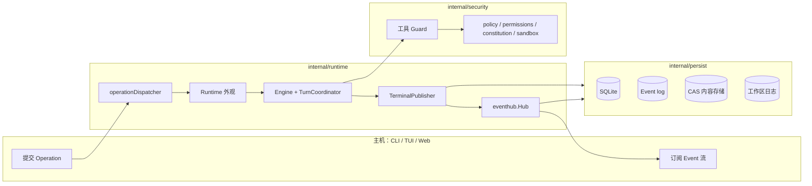
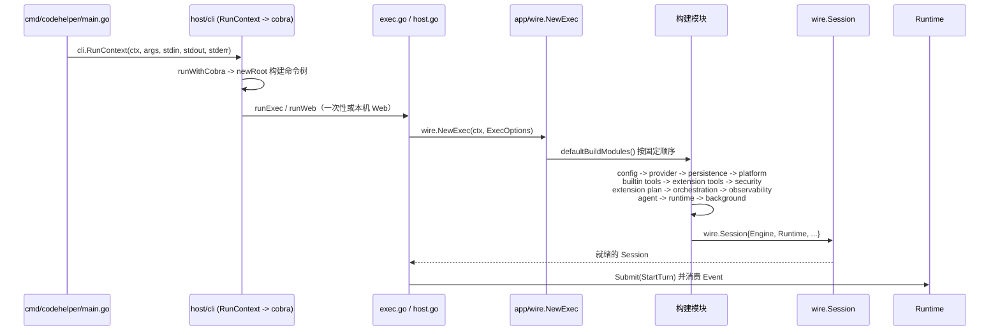
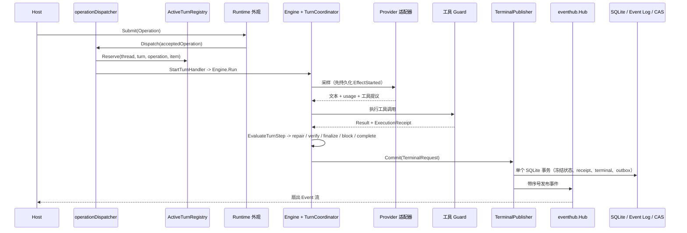
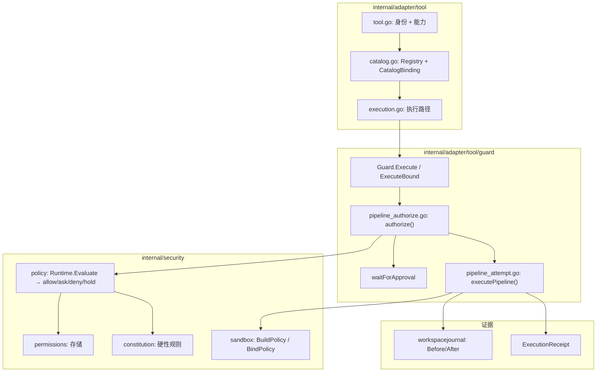
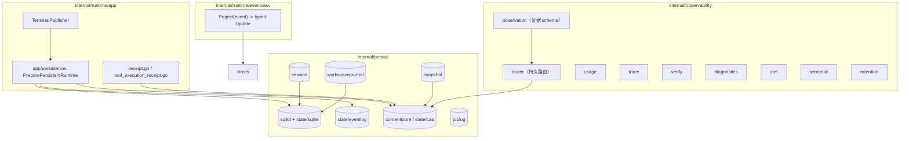
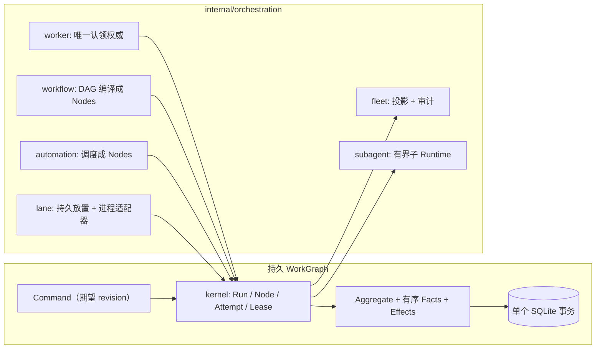

# 阅读 CodeHelper 源码

CodeHelper 是一个体量很大的 Go 代码库（1800+ 个文件）。这份指南为你提供一条渐进式的
阅读路线，让你能从“不知从哪下手”走到“端到端理解一次完整的工作回合（turn）”，而不必
按顺序读完每一个文件。

请先读 [架构设计](./architecture.md)。这份指南假设你已经理解了分层模型和硬性依赖
规则；它回答的实际问题是“下一个该打开哪个文件”。

> 提示：把下面每个包和它对应的 `*_test.go` 配对阅读。CodeHelper 的测试是非常好的
> 文档：它们锁定文档里只描述未写实的契约。下面每条路线都会点名具体的测试文件，让你
> 能看着循环跑起来，而不只是读代码。

## 系统的整体形状

一个心智模型把一切串起来：

> 主机（Host）提交 Operation；Runtime 把它们变成 Event；Engine 做 Agent 的工作；
> 每一次有副作用的工具调用都要经过 Guard；所有持久状态落在 SQLite / Event Log /
> CAS；主机再把 Event 投影回 UI。



自上而下的分层：

```text
cmd/codehelper            进程入口
internal/host             CLI、TUI、Web Transport 展示层
internal/runtime          协议、应用状态、Agent 循环、装配
internal/adapter          Provider、模型、工具、MCP、技能、插件
internal/security         策略、权限、宪法、沙箱
internal/orchestration    任务、worker、工作流、lane、fleet、子代理
internal/persist          SQLite、事件、会话、日志
internal/observability    用量、trace、验证、诊断
internal/platform         进程、PTY、OS 集成
internal/config           默认值、TOML、环境变量、校验
web         TypeScript 编辑器扩展
```

如果想先建立概念背景再读代码，[Agent 工程书](../book/zh-CN/README.md) 里的
[全局架构](../book/zh-CN/02-codehelper-overview/02-system-architecture.md)、
[Package 所有权](../book/zh-CN/02-codehelper-overview/03-package-ownership.md) 和
[Runtime 词汇表](../book/zh-CN/02-codehelper-overview/04-runtime-vocabulary.md)
与上面的分层一一对应。

## 路线 1 — 入口与装配（最小表面）

**目标：** 理解一个二进制如何变成一个运行中的 runtime，以及每一个具体依赖在哪里被构造。



1. `cmd/codehelper/main.go` —— 只有约 15 行。它只安装 `signal.NotifyContext`
   处理 SIGINT，然后转发给 `cli.RunContext`。其余逻辑都在 `internal/` 边界之下，
   `main` 里没有任何业务逻辑。

2. `internal/host/cli/run.go` —— `RunContext` 是真正的进程入口。它识别
   `--error-format=json`（机器可读错误），然后委托给 `runWithCobra`。退出码会被
   归一化成 `protocol.Problem` 供机器消费。

3. `internal/host/cli/cobra.go` —— `newRoot` 构建命令树。命令大多是“透传”分组
   （`config`、`plugin`、`skill`）加直接命令（`exec`、`web`、
   `runtime-observe`、`auth`、`model`、`thread`、`fleet`、`automation`、
   `worker`、`workflow`、`lane`、`sandbox`、`tui` 等）。`exec.go` 是单次执行命令，
   也是最好的端到端示例：解析参数、调用 `wire.NewExec`、提交 `StartTurn`
   Operation、消费事件流。

4. `internal/host/cli/web.go` —— `runWeb` 是持久化主机路径。它先启动 Boot
   Surface，再把 `PersistentStore` 注入 `wire.NewExec`，最后激活
   `internal/host/runtimeapi/web/server.go`。

5. `internal/runtime/app/wire/` —— 组合根。`runtime.go` 定义 `ExecOptions`、
   `Session` 和 `NewExec`。`defaultBuildModules()` 是封闭的模块序列：

   ```text
   config -> provider -> persistence -> platform -> builtin tools
          -> extension contributors -> security -> extension plan
          -> orchestration -> observability -> agent -> runtime
          -> background services
   ```

   先读 `modules_core.go`（config/provider/persistence/platform/builtin
   tools/security），再读 `modules_runtime.go`（agent + runtime），然后是
   `modules_extensions.go`、`modules_observability.go`、
   `modules_orchestration.go` 和 `module_background.go`。每个模块只负责一个构造
   边界，并通过 `buildState` 只发布后续模块需要的东西；之后模块绝不保留
   `buildState`。

6. `internal/runtime/app/wire/module_background.go` —— `backgroundModule.Build`
   先做首次 MCP 刷新，启动 Runtime 恢复（`application.Start`），启动 MCP prewarm，
   对账 Automations，最后构建并启动 Worker 调度器。构造失败即关闭：某一步失败会
   中止构建，并由 `wire.ResourceStack` 回滚。

7. `internal/runtime/app/wire/background_executors.go` —— Turn 之外运行的后台任务
   执行器：`shellCommandExecutor` 与 `workflowRunExecutor`。定时任务和工作流步骤
   就是通过这些最终回调进同一套 Runtime / 工具 / 安全边界的。

**关键符号：** `RunContext`、`newRoot`、`runExec`、`runHost`、`NewExec`、
`defaultBuildModules`、`buildState`、`backgroundModule`。

**配套测试：** `wire/bootstrap_test.go`、`wire/persistent_test.go`、
`wire/background_executors_test.go`、`cli/run_test.go`。

**路线 1 回答：**“一个二进制是如何变成一个运行中的 runtime 的？”

## 路线 2 — 一次操作端到端（核心循环）

**目标：** 沿着一条用户请求（Operation），从主机的 `Submit` 一路走到 Engine、
Guard、终端提交与事件发布。



1. `internal/runtime/app/operation_dispatch.go` —— `operationDispatcher.Dispatch`
   按类型化 Operation 载荷分发。Turn 类操作映射到 handler：`StartTurnHandler`、
   `CancelTurnHandler`、`SteerTurnHandler`、`ApprovalHandler`、`InputHandler`、
   `CompactThreadHandler`、`ForkThreadHandler`、`RevertTurnHandler`。编排类载荷
   （`SubmitRun`、`CancelRun`、`ResumeRun`、`RetryNode`、`SkipNode`）交给
   `OrchestrationHandler`。handler 返回 `OperationOutcome`
   （`committed` / `rejected` / `async` / `terminal`）；只有 Dispatcher 执行同步
   提交与拒绝。

2. `internal/runtime/app/active_turn_registry.go` —— `Reserve` 原子地把一个
   Thread 绑定到一个活跃 Turn，并附带内存 token；一个 Thread 不能并发跑两个 Turn。
   `Release` 必须携带匹配的 token，因此过期释放会被拒绝。

3. `internal/runtime/app/runtime.go` —— Runtime 外观。文件很大，但它是枢纽而不是
   上帝对象：先浏览方法名（`Submit`、`SubmitWithKey`、`Events`、`ReplayEvents`、
   `Snapshot`、`Close`、`loop`、`dispatch`）。它拥有已接受操作通道、事件循环、
   session/artifact 服务以及 `TerminalPublisher`。

4. `internal/runtime/agent/engine/engine.go` —— Engine。`Options` 携带 provider、
   路由表、工具注册表、静态上下文、预算、guard 工厂、工作区、日志、验证选项以及
   `TurnCoordinatorRuntime`。导出的 `State` 常量就是引擎的公开状态机：
   `Preparing`、`Compacting`、`CallingModel`、`Streaming`、`PreparingTools`、
   `RunningTools`、`AwaitingApproval`、`AwaitingInput`、`FeedingResults`、
   `Verifying`、`Completed`、`Failed`、`Canceled`。

   ```mermaid
   stateDiagram-v2
       [*] --> Preparing
       Preparing --> CallingModel
       CallingModel --> Streaming
       Streaming --> PreparingTools: 工具调用
       PreparingTools --> RunningTools
       RunningTools --> AwaitingApproval
       AwaitingApproval --> RunningTools
       RunningTools --> FeedingResults
       FeedingResults --> CallingModel
       Streaming --> Verifying: 最终回答
       Verifying --> Completed
       Verifying --> Failed
       Preparing --> Canceled
       CallingModel --> Canceled
   ```

5. `internal/runtime/agent/turnkernel/runtime_kernel.go` —— Engine 执行循环与权威的
   `turnkernel.TurnCoordinator` 之间的适配层。`newEngineTurnKernelForTurn` 构建全新
   `State`，从 `CoordinatorRuntime` 打开一个协调器句柄，应用 `StartTurn` +
   `PreparationFinished`，此后 kernel 就是唯一事实来源。`turn_scope.go` 保存每个
   Turn 的 `Scope`（冻结的 `TurnSpec`、kernel、调度器、diff 跟踪器、世界状态、目录
   快照）。

6. `internal/runtime/agent/turnkernel/` —— 纯状态机。`state.go` 定义阶段
   （`created`、`preparing`、`sampling`、`executing_tools`、`awaiting_approval`、
   `awaiting_input`、`verifying`、`committing`、`completed`、`failed`、
   `canceled`）。`coordinator.go` 是 `Reducer.Apply` 的唯一生产入口：
   `Submit(command)` 校验转换、追加 Domain Facts 并返回 `Transition`。
   `reducer.go` 是纯函数 `Apply(current, command) -> Transition`；
   `effect_dispatcher.go` 在调用 provider 之前先持久化 `EffectStarted`。把
   `coordinator_test.go` 和 `reducer_test.go` 与 kernel 一起读——它们编码了每一条
   转换不变式。

7. `internal/runtime/agent/engine/turn_handler.go` 与 `model_handler.go` ——
   `Scope.Run` 是真正的循环：日志草稿恢复、创建 kernel，然后反复执行 `modelStep`
   （构造请求、流式、归并 usage）和工具执行。`EvaluateTurnStep` 让 Reducer 选择
   Repair / Verification / Finalize / Block / Complete。终端路径提交
   `TerminalRequested`，日志 Commit/Suspend/Rollback 作为持久化 Effect 运行。读
   `turn_handler.go` 里的 `StepAction*` 常量和终端决策 switch。

8. `internal/runtime/app/eventhub/terminal.go` —— `TerminalPublisher.Commit`
   校验冻结状态是终态、receipt 与 terminal 材料都存在，然后在单个事务里持久化
   operation + receipt + terminal + outbox，并通过 hub 发布。这是“回合结束”的原子
   边界。

9. `internal/runtime/app/eventhub/hub.go` —— 负责序号分配、追加、回放、订阅扇出、
   慢消费者策略与关闭。`Publish` 分配下一个序号、追加到持久化 Store，再扇出给订阅者；
   `Events` 从游标开始流式读取；`Replay` 分页读取。

**关键符号：** `OperationOutcome`、`StartTurnHandler`、`ActiveTurnRegistry`、
`TurnCoordinator`、`Reducer.Apply`、`Engine.Run`、`Scope.Run`、`modelStep`、
`TerminalPublisher.Commit`、`Hub.Publish`。

**配套测试：** `app/application_e2e_test.go`（完整循环）、`app/runtime_test.go`、
`engine/engine_test.go`（114 KB 的契约测试）、`engine/turn_kernel_test.go`、
`turnkernel/coordinator_test.go`、`turnkernel/reducer_test.go`、
`app/eventhub/terminal`（经由 runtime 测试）。

**路线 2 回答：**“我的提示词从头到尾发生了什么？”

## 路线 3 — 受守护的工具执行（安全，差异化优势）

**目标：** 理解每一次有副作用的工具调用必须经过的单一决策点，以及 policy、审批、
日志与 OS 沙箱如何组合。



1. `internal/adapter/tool/tool.go` —— 工具身份与能力的词汇表：`Capability`、
   `AccessMode`、`SandboxRequirement`、`ParallelPolicy`、`RepeatPolicy`，以及错误
   分类（`invalidArguments`、`Precondition`、`RecoveryHint`）。

2. `internal/adapter/tool/catalog.go` —— `Registry`（构造后封闭）、`Registration`、
   `CatalogBinding`、`CatalogSnapshot` 和 `Materialize`。工具用稳定的
   `CatalogToolID` 引用；binding 钉住 name、source 和 revision，确保 Turn 不会静默
   运行与模型看到的不一样的工具。

3. `internal/adapter/tool/execution.go` —— 汇入 guard 的执行路径：`ToolRef`、
   `PreparedInvocation`、`Outcome`、`OutcomeFacts`、`WorkspaceChange`、
   `ExecutionDisposition`。

4. `internal/adapter/tool/guard/guard.go` —— 管线 `policy -> approval -> journal
   -> sandbox`。`Execute` / `ExecuteBound` 是入口；它盖上 `InvocationIdentity` 并
   调用 `executePipeline`。Guard 还负责文件写入准备（先做指纹）、写入后记录文件变更、
   处理出网主机审批，以及带过期与替换规则的审批状态。`pipeline_authorize.go` 实现
   `authorize`：评估策略、查询 grant/审批、需要时等待人工审批，并对文件写入重新校验
   已批准的编辑计划。`pipeline_attempt.go` 跑 `additional_permission` 与
   `egress_approval` 升级的重试循环。

5. `internal/security/policy/` —— `policy.go` 定义规则引擎：
   `Runtime.Evaluate(Invocation) -> Decision`，动作是
   `allow / ask / deny / hold`。规则按 Grants、User、Repository 排序，权限上限会
   收紧结果。`effect.go`、`granular.go`、`network.go`、`command.go`、
   `approval.go` 细分策略面。

6. `internal/security/permissions/` —— 持久化权限存储，记住用户对某个工作区允许过
   什么。读 `permissions.go` + `store.go`；权限是工作区绑定的，比全局权威更窄。

7. `internal/security/constitution/` —— 从用户与仓库的 `constitution.json`
   （`deny_write_globs`、`hold_tools`、`deny_tools`、prompt）加载的硬性、不可绕过
   约束。普通会话配置无法覆盖它；`constitution.go` 把它编译成策略规则 + prompt。

8. `internal/security/sandbox/` —— OS 隔离。`policy.go` 构建 `Policy`
   （读写根、网络策略、临时目录）；`backend.go` 把平台能力映射到后端：
   `seatbelt`（macOS）、`bwrap+landlock`（Linux）、`restricted-token`（Windows），
   或者失败即关闭的 `unavailable`。平台细节在 `workspace_fs_unix.go`、
   `workspace_fs_windows.go`、`seccomp_linux.go` 和 `landlock_helper_linux.go`。
   如果必需边界不可用，执行失败即关闭。

然后阅读模型与 Provider 如何接入（路线 3 的延续）：

- `internal/adapter/provider/` —— Provider 抽象；读 `types.go`（消息、工具调用、
  流事件、usage），再读一个具体实现（如 `openai/` 或 `deepseek/`），然后读
  `router/`（不可变路由表）和 `wire/`（协议相关请求构造器）。
- `internal/adapter/model/` —— 模型目录（`catalog.go`、`catalog.v1.json`）、能力
  协商（`capability.go`）、基于 purpose 的路由（`route.go`、`routeset.go`、
  `purpose.go`）。
- `internal/adapter/mcp/` —— 外部 MCP 服务器的协议适配器：`config.go`、
  `connection.go`、`health.go`、`http.go`、`stdio.go`、`pool.go`、`server.go`、
  `oauth.go`。健康检查、超时、熔断与工具绑定隔离让一个失败服务器无法毁掉全部工具。
- `internal/adapter/skill/` —— 技能发现、manifest、锁、选择与启用；`selection.go`
  在施加有界词法候选上限之前，先保留精确指定/必需/之前用过的技能。
- `internal/adapter/plugin/` —— 激活链：注册表签名、发布者信任、不可变暂存、
  receipt、启用、回滚、撤销（`registry.go`、`trust.go`、`staging.go`、
  `distribution.go`、`lifecycle.go`）。
- `internal/adapter/hooks/` —— 有界的生命周期观察者/闸门；它们绝不能成为另一条
  不受守护的执行路径。

**关键符号：** `tool.Capability`、`Registry`、`CatalogBinding`、`guard.Guard`、
`executePipeline`、`authorize`、`policy.Runtime.Evaluate`、`constitution.Load`、
`sandbox.BuildPolicy`、`sandbox.BindPolicy`、`workspacejournal.Before/After`。

**配套测试：** `guard/guard_test.go`、`guard/pipeline_test.go`、
`guard/changes_test.go`、`guard/concurrency_test.go`、`policy/policy_test.go`、
`sandbox/backend_test.go`、`sandbox/workspace_test.go`、
`permissions/permissions_test.go`、`constitution/constitution_test.go`。

**路线 3 回答：**“是什么阻止了一次工具调用去做越权的事？”

## 路线 4 — 状态、持久化与可观测性

**目标：** 理解运行时状态如何在重启后存活，以及事后如何解释发生了什么。



1. `internal/persist/sqlkit/` —— SQLite 基础（打开、schema、所有权、WAL 处理）。
   下面的一切都构建在它之上。
2. `internal/persist/contentstore/` 与 `internal/persist/state/cas/` ——
   内容寻址的不可变载荷存储。工具结果的完整原文保存在这里，只给模型一个有界的摘要
   和 `result_get` 句柄。
3. `internal/persist/state/eventlog/` —— 有序的持久化运行时事实日志（`eventhub`
   背后的 Event 来源）。
4. `internal/persist/session/`、`internal/persist/snapshot/`、
   `internal/persist/joblog/` —— 会话元数据、显式线程检查点/计划产物、任务日志。
5. `internal/persist/workspacejournal/` —— 写前镜像与编辑恢复：`Before` /
   `After` 指纹、草稿恢复、回滚。
6. `internal/runtime/app/wire/persistent_runtime.go` —— `PreparePersistentRuntime`
   构建持久化 Runtime：在创建任何 Engine 之前注入 SQLite Turn Coordinator Store，
   装配仓库，并用可续期的活跃 Turn 租约做生命周期恢复。
7. `internal/observability/receipt/receipt.go` 与 `tool_execution_receipt.go` —— 结构化证据：
   上下文选择、使用的工具、工作区变更、审批、验证尝试、成本与最终闸门动作。执行
   receipt 是主机投影的解释性产物。
8. `internal/observability/` —— 非权威的证据平面：
   - `observation/` —— 版本化的 `ObservationEnvelope` schema 与 traits。
   - `router/` —— 持久路由，在任何日志/CAS 写入前先施加隐私策略，普通/批量记录用
     有界队列。
   - `usage/`、`trace/` —— token/成本汇总与 W3C Trace Context。
   - `verify/` —— 验证执行器证据（尝试、分类、修复次数、闸门动作）。
   - `diagnostics/` —— 诊断执行器 receipt。
   - `otel/`、`semantic/`、`retention/`、`privacy/`、`supportbundle/` ——
     OTLP 导出、可解释图重建、保留级别、脱敏与支持包构建。
   采集由 `CODEHELPER_OBSERVATION_CAPTURE` 控制（`off` / `metadata` / `failure`
   / `full`）。
9. `internal/runtime/eventview/view.go` —— 供 Go 主机消费的 Event 载荷的单一类型化
   解释：`Project(event) -> Update` 返回 `TextUpdate`、`ToolUpdate`、
   `InteractionUpdate`、`AccountingUpdate`、`EvidenceUpdate`、`LifecycleUpdate`、
   `ArtifactUpdate`、`AgentUpdate`、`OrchestrationUpdate`、`TerminalUpdate` 或
   `IgnoredUpdate`。

**关键符号：** `sqlkit`、`contentstore.Store`、`eventlog`、`snapshot`、
`workspacejournal.Manager`、`PreparePersistentRuntime`、`ExecutionReceipt`、
`ObservationEnvelope`、`eventview.Project`。

**配套测试：** `persist/sqlkit/sqlkit_test.go`、`persist/state/eventlog/log_test.go`、
`persist/workspacejournal/journal_test.go`、`app/persistence`（经由
`wire/persistent_test.go`）、`app/receipt_test.go`、
`observability/router/router_test.go`、`observability/verify/verify_test.go`、
`runtime/eventview/view_test.go`。

**路线 4 回答：**“状态存在哪里，我如何解释发生了什么？”

## 路线 5 — 编排与 Web 扩展

**目标：** 理解产品更长生命周期、多步骤的那一侧：持久的 Run/Workflow/Subagent，
以及编辑器如何投影运行时 Event。



1. `internal/orchestration/kernel/kernel.go` —— 纯 WorkGraph 状态机：Run、Node、
   Attempt、Lease Epoch 与 Effect 转换，无 I/O。`store/store.go` 原子提交转换、
   去重命令 ID、检测快照/事实漂移。
2. `internal/orchestration/worker/worker.go` —— 唯一认领权威；心跳与结算由 owner、
   Lease Epoch、权威摘要与 revision 围栏保护。`fairqueue/` 提供公平认领排序。
3. `internal/orchestration/workflow/` —— `spec.go` / `compiler.go` /
   `controller.go` / `runtime.go` 把 DAG 工作编译成 WorkGraph Nodes，而不是另一套
   检查点状态机。
4. `internal/orchestration/automation/` —— 编译成 WorkGraph Nodes 的定时工作
   （`schedule.go`、`repository.go`）。
5. `internal/orchestration/lane/` —— 持久放置记录与 inline 或 tmux 支撑的进程
   适配器；放置不是生命周期权威。
6. `internal/orchestration/fleet/` —— 投影与审计 WorkGraph 状态；它不能入队、认领、
   结算或恢复工作。
7. `internal/orchestration/subagent/` —— 有界子 Runtime，带持久 Agent Tree、
   Mailbox、Result、预算账本、worktree 所有权、审批路由与日志集成
   （`subagent.go`、`graph.go`、`lifecycle.go`、`worktree.go`、`control.go`）。
8. `internal/orchestration/task/` —— 持久任务状态与 `background_executors.go`
   使用的执行器契约。
9. `web/src/chat/projector/` —— `index.ts` 拥有 `ChatProjector`：
   它跟踪序号与 Turn 身份，按序应用每个 Event，并暴露 `snapshot()`、
   `pendingApprovals()`、`pendingInputs()`。`turn-projector.ts` 穷尽分发每一个
   Event Class；领域模块处理 stream、tool、interaction、evidence、terminal 与
   snapshot 行为（`tool-projector.ts`、`stream-projector.ts`、
   `interaction-projector.ts`、`evidence-projector.ts`、`terminal-projector.ts`、
   `snapshot.ts`、`model.ts`、`helpers.ts`）。
10. `internal/host/tui/` 与 `internal/host/runtimeapi/` —— 其它主机表面。TUI
    （`host.go`、`app.go`、`view.go`、`reducer.go`、`projection.go`）是 Event 的纯
    投影；`runtimeapi/` 包含 Web Transport 服务器（`web/server.go`）、线程生命周期
    （`thread/`）与类型化视图（`view/`）。

**关键符号：** `kernel`、`Attempt`、`Lease`、`worker`、`workflow.Compiler`、
`subagent`、`ChatProjector.apply`、`projectTurnEvent`、`eventview.Project`。

**配套测试：** `orchestration/kernel/kernel_test.go`、
`orchestration/store/store_test.go`、`orchestration/worker/worker_test.go`、
`orchestration/workflow/workflow_test.go`、`orchestration/subagent/*_test.go`、
`web/src/chat/projector.test.ts`。

**路线 5 回答：**“任务、工作流与子代理如何保持持久，编辑器如何把它们全部渲染出来？”

## 迷你词汇表

- **Operation** —— 一个被请求的状态转换（`StartTurn`、`CancelTurn`、
  `SteerTurn`、`ApprovalDecision`、`InputReply`、`SubmitRun` 等）。
- **Event** —— 转换发出的不可变、带序号的观察结果；这是主机协议。
- **Receipt** —— 关于上下文、工具、变更、审批、验证或成本的结构化证据。
- **Projection** —— 从事件与关系记录重建的、面向查询的状态（TUI/Web 永远不
  拥有运行时真相）。
- **Turn / Thread** —— Turn 是一次 Agent 执行；Thread 是它所属的对话容器。
- **Sample** —— Turn 内一次 provider 请求/响应周期。
- **Effect** —— Turn Kernel 跟踪的持久副作用（provider 调用、工具执行、验证、
  日志提交）。
- **Domain Fact** —— 在状态提交或效果派发之前追加的已接受转换记录；这是恢复的基础。
- **Lease** —— 所有权 token（内存中的活跃 Turn，或持久的 WorkGraph Lease
  Epoch），让过期释放/认领失败即关闭。
- **Guard** —— 每一次有副作用的工具调用都必须经过的
  policy -> approval -> journal -> sandbox 管线。

## 建议的阅读顺序

- **第 1 次（1–2 小时）：** README -> architecture.md -> 路线 1（入口与装配）。
  你应该能解释 `defaultBuildModules()`。
- **第 2 次（2–3 小时）：** 路线 2，跟着 `application_e2e_test.go` 走。从
  `Submit` 到终端提交追踪一次 StartTurn。
- **第 3 次（2–3 小时）：** 路线 3 —— 守护管线与沙箱。读 `guard_test.go` 和一个
  策略测试，看 allow/ask/deny 的实际表现。
- **第 4 次（1–2 小时）：** 路线 4 —— 持久化与可观测性。读
  `wire/persistent_test.go` 理解持久恢复如何工作。
- **第 5 次（2 小时）：** 路线 5 —— 编排 kernel，然后是 Web projector。
  可选：重跑路线 2，同时在 TUI/扩展里观察事件流动。

如果你喜欢概念先行的学习方式，可以把[书](../book/zh-CN/README.md)穿插进来：
第 2 次前读
[Turn 生命周期](../book/zh-CN/02-codehelper-overview/05-turn-lifecycle.md)，
第 2 次配 [Application Runtime](../book/zh-CN/03-runtime-kernel/02-application-runtime.md)，
第 3 次配 [Agent 循环](../book/zh-CN/03-runtime-kernel/03-agent-loop.md)，
第 1 次配 [依赖装配](../book/zh-CN/03-runtime-kernel/04-dependency-wiring.md)，
第 4 次配 [Resume 与恢复](../book/zh-CN/03-runtime-kernel/06-resume-and-recovery.md)。

## 让这件事更容易的工具

- `go doc <package>` 查看签名。
- `go test ./path/to/package` 运行一个包的契约测试。
- `go test -run <TestName> -v ./path/to/package` 观察某一个行为。
- 在已索引的编辑器里，对符号（`TurnCoordinator`、`operationDispatcher`、
  `guard.Guard`、`TerminalPublisher`、`eventview.Project`）使用
  `search_definition` / `search_references` 追踪归属。
- `go list -deps ./cmd/codehelper` 查看完整依赖图。
- `go test ./internal/runtime/agent/turnkernel ./internal/runtime/agent/engine`
  运行收敛/转换基线测试。
- `./codehelper exec --help` 与 `./codehelper <command> --help` 确认主机实际暴露
  了什么（CLI 名称与参数归 `internal/host/cli` 所有）。
