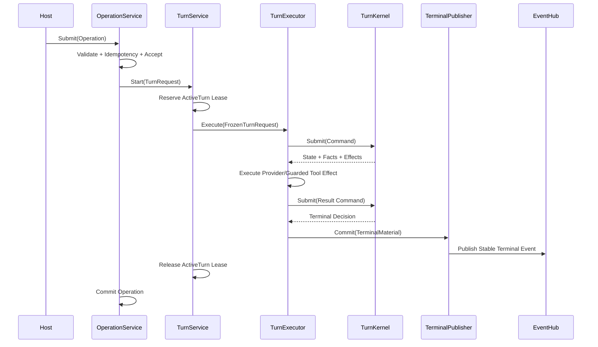

# Runtime 可维护性与核心流程重构方案

## 1. 文档状态

本文定义 CodeHelper 在保持行为、安全和持久化语义不变的前提下，降低代码组织复杂度、
提高核心流程可读性并收敛抽象边界的技术改造方案。

本文同时记录实施结果。已交付行为以当前代码、测试、
`docs/protocol/runtime-protocol.schema.json` 和
[`architecture.md`](./architecture.md) 为准。

基线日期：2026-08-22。

| 阶段 | 状态 | 主要结果 |
| --- | --- | --- |
| M0 | 已完成 | Golden Path、恢复、交互、Race 与架构基线沿用现有门禁 |
| M1 | 已完成 | 生产 Turn 入口收敛为 `Engine.Execute(TurnRequest, sink)` |
| M2 | 已完成 | Owner、锁与适配器边界完成下沉，`runtime/app` 为 5,643 行 |
| M3 | 部分完成 | Context Authority 已成为独立状态 Owner，Runtime Kernel 已迁入 `turnkernel`；`engine` 为 7,587 行，尚未达到 6,000 行目标 |
| M4 | 已完成 | Reducer 按 Command Family 拆分，并由机器可读 Command Matrix 检查完整性 |
| M5 | 已完成 | Session 资源按领域 Bundle 分组，构造与关闭继续统一使用 `ResourceStack` |
| M6 | 已完成 | Agent 与 App 子目录已收敛为目标结构；Runtime Package 从 30 降至 20 |
| M7 | 已完成 | 收紧热点文件预算，并为 Runtime Package 总数和单文件 Package 数建立 Ratchet |

## 2. 背景与问题

CodeHelper 已形成完整的 Runtime、Agent、Tool、安全、持久化和编排能力，但随着功能
增长，代码结构出现了两个方向相反的问题：

1. 目录和 Package 按能力持续细分，读者需要在大量小目录间跳转；
2. 真正的复杂逻辑仍集中在少数大 Package 和大对象中，没有随目录拆分同步形成清晰的
   领域边界。

当前静态基线包括：

| 指标 | 当前值 | 说明 |
| --- | ---: | --- |
| `internal` 生产 Go 代码 | 约 18.2 万行 | 不含 `*_test.go` |
| `internal` 生产 Go 文件 | 647 个 | 不含 `*_test.go` |
| `runtime/agent/engine` | 约 13,448 行 | 25 个内部依赖，61 个 Options 字段 |
| `runtime/app` | 约 10,508 行 | 23 个内部依赖，8 个 Mutex 字段 |
| `runtime/app/wire` | 约 9,191 行 | 78 个内部依赖，71 个 Options 字段 |
| 一文件生产 Package | 数量较多 | 部分是真实边界，部分只是文件级拆分被提升为 Package |

这些数字不是缺陷数量，但说明当前导航成本、变更影响分析和所有权理解已经成为主要维护
成本。

### 2.1 核心流程不够直接

一次普通 Turn 当前大致经过：

```text
Host
  -> Runtime.Submit
  -> operationDispatcher
  -> StartTurnHandler
  -> ThreadManager
  -> EngineAdapter
  -> Engine.RunForTurnWithRequest
  -> Scope.Run
  -> TurnCoordinator.Submit
  -> Reducer.Apply
  -> EffectDispatcher
  -> Provider / Guarded Tool
  -> TerminalPublisher
```

这些层并非都多余，但其角色没有通过统一入口和一致命名直接表达。读者必须同时理解
Operation、Handler、Manager、Adapter、Engine、Scope、Coordinator、Reducer、Effect
和 Sink，才能建立完整心智模型。

### 2.2 应用 Facade 承担过多所有权

`runtime/app.Runtime` 同时持有：

- Operation 校验、幂等、队列和提交；
- Active Turn、Cancel、Approval 和 Input；
- Event Hub、Replay 和订阅；
- Session、Profile、Workspace 和 Artifact；
- Terminal Commit 和恢复；
- Orchestration Effect；
- 多组并发锁和生命周期资源。

虽然部分行为已经拆到 Service 文件中，但 `Runtime` 仍然是共享状态和依赖汇聚点。
新增能力容易继续向 Facade 增加字段、锁和条件分支。

### 2.3 Engine 内部同时承担策略与执行

`runtime/agent/engine` 同时包含：

- Turn 请求准备和冻结；
- Scope 生命周期；
- Context、World State 和 Working Set；
- Provider Sampling；
- Tool、Approval 和 Input 处理；
- Verification、Compaction 和 Narrative；
- Kernel 适配、Terminal 和 Session Delta；
- Trace、Usage、Budget 和恢复。

这些能力属于同一 Turn 业务域，但并不属于同一个变化原因。大量能力通过 `Engine` 和
`Scope` 字段间接共享状态，导致局部修改必须理解整个执行器。

### 2.4 小 Package 并未形成稳定抽象

部分 Package 只有一个生产文件，且：

- 没有独立生命周期或不变量；
- 只有一个调用方；
- 导出符号主要用于绕过 Go Package 边界；
- 测试只是对实现文件做局部镜像；
- 名称表达技术动作，而不是稳定领域概念。

这类 Package 增加了 Import、别名和跳转成本，却没有提供有效封装。

### 2.5 抽象层级不统一

当前既存在较宽的 `Engine`、`Runtime`、`Session` 对象，也存在大量只有一两个方法的
局部接口。问题不在接口数量本身，而在于：

- 一个接口混合执行、控制、查询和恢复；
- 相邻层重复表达相同概念；
- 便利方法形成调用梯子；
- `Options` 逐步演化为参数袋；
- `Manager`、`Service`、`Adapter`、`Runtime` 等名称不能稳定说明所有权。

## 3. 改造目标

### 3.1 主要目标

1. 让新贡献者在 30 分钟内定位一次 Turn 的入口、状态机、Effect 和终态提交路径；
2. 建立一个生产级 Turn 执行入口，消除平行 convenience API；
3. 让每份可变状态只有一个明确 Owner；
4. 将 `Runtime` 收敛为 Facade，而不是共享业务状态容器；
5. 按领域内聚性合并过细 Package，减少无意义目录跳转；
6. 降低核心 Package 的代码量、依赖扇出和配置字段数量；
7. 保持 Protocol、持久化格式、事件顺序、安全和恢复语义兼容。

### 3.2 非目标

本轮不做：

- 不重写 Turn Kernel；
- 不改变 Operation、Event、Receipt 和 Projection 的外部语义；
- 不删除 Event Sourcing、Terminal Outbox、Journal 或 Checkpoint；
- 不把 Provider、Tool、Sandbox 逻辑移动到 Host；
- 不为了减少目录合并安全、持久化或并发所有权边界；
- 不同步引入新的 DI Framework、通用 Event Bus 或反射式 Handler Registry；
- 不以减少文件数或代码行作为单独成功标准；
- 不增加预发布兼容迁移，除非改造确实修改了持久化格式。

## 4. 必须保持的不变量

改造全过程必须保持以下约束：

1. Host 只提交 Operation、读取 Query 并消费 Event；
2. Turn 业务循环只存在于 `internal/runtime/agent`；
3. Concrete Construction 只存在于 `internal/runtime/app/wire`；
4. Turn Kernel 是终态、收敛和 Effect 状态的唯一权威；
5. 所有有副作用 Tool 必须经过 `internal/adapter/tool/guard`；
6. Terminal State、Measurement、Receipt、Session Delta、Terminal Event 和 Outbox
   保持原子提交；
7. Event Sequence、Replay、Fanout 和 Retention Gap 语义不变；
8. Approval、Input、Cancel 和 Resume 保持可持久化、可重放和幂等；
9. Policy、Permission、Constitution、Journal 和 Sandbox 不得被旁路；
10. Observation Failure 不能改变 Turn 业务结果；
11. 多 Workspace 授权和 Session 归属校验必须继续在服务端执行；
12. 改造期间不覆盖无关工作区变更。

## 5. 设计原则

### 5.1 先收敛职责，再移动目录

目录移动只能改善表面导航，不能自动降低概念数量。实施顺序必须是：

```text
冻结行为 -> 收敛入口 -> 明确 Owner -> 缩小依赖 -> 合并或移动 Package
```

禁止在同一个变更中同时进行大范围行为修改、类型重命名和目录迁移。

### 5.2 一个状态，一个 Owner

| 状态 | 唯一 Owner |
| --- | --- |
| Operation 接受、幂等和 Commit | Operation Service |
| Active Turn 和控制 Lease | Turn Service |
| Turn Phase、Effect 和终态决策 | Turn Kernel |
| Session/Profile/Workspace | Session Service |
| Event Sequence 和 Fanout | Event Hub |
| Terminal 原子提交和 Outbox | Terminal Publisher |
| Context Authority 和 Session Delta | Context Domain |
| Tool 副作用许可 | Guard |
| Concrete Construction 和关闭顺序 | Wire |

非 Owner 只能通过窄化 Command 或 Port 请求变更，不能直接修改字段。

### 5.3 抽象必须减少概念

新增抽象至少满足一项：

- 消除两个以上调用方的真实重复；
- 隔离独立生命周期或并发不变量；
- 稳定跨层契约；
- 允许测试替换外部副作用；
- 显著减少上层依赖。

仅仅把函数包装进 `Service`、`Manager` 或单方法接口不视为有效抽象。

### 5.4 Package 是所有权边界，不是文件夹

新建 Package 至少满足一项：

- 有独立状态和生命周期；
- 有需要强制保护的不变量；
- 有两个以上消费者；
- 是可替换 Adapter；
- 是稳定协议或持久化边界。

否则优先使用同一 Package 中按职责命名的文件。

## 6. 目标架构

保持现有顶层分层，收敛 Runtime 内部结构：

```text
internal/
├── host/                         输入输出与 Projection
├── runtime/
│   ├── protocol/                 Operation/Event/Receipt 公共契约
│   ├── app/                      应用 Facade 与应用级 Owner
│   │   ├── runtime.go            窄 Facade
│   │   ├── operation_*.go        Admission、Dispatch、Commit
│   │   ├── turn_*.go             Active Turn 与控制
│   │   ├── session_*.go          Session/Profile/Artifact Query
│   │   ├── event_*.go            Event 与 Terminal 协调
│   │   ├── recovery_*.go         启动与终态恢复
│   │   ├── eventhub/             顺序、Replay、Fanout 并发边界
│   │   ├── extension/            Extension 生命周期边界
│   │   ├── persistence/          Durable Runtime 装配
│   │   └── wire/                 唯一 Concrete Construction
│   └── agent/
│       ├── engine/               Turn Executor 与 Effect Handler
│       ├── turnkernel/           纯状态机和持久化事实
│       ├── context/              Authority、Window、Delta、Compaction
│       ├── prompt/               Model-visible Context 投影
│       ├── repository/           Repo Map 与 Repository Context
│       └── rlm/                  独立 RLM 执行边界
├── adapter/                      Provider、Tool、Extension Adapter
├── security/                     Policy、Guard、Sandbox
├── orchestration/                WorkGraph、Worker、Workflow、Subagent
├── persist/                      Durable Store
└── observability/                Observation、Trace、Usage、Verify
```

目标结构不是要求立即创建全部目录。只有依赖和职责完成收敛后，才进行对应移动。

## 7. 目标核心流程

### 7.1 应用层流程



### 7.2 唯一 Turn 执行契约

生产路径统一使用一个入口：

```go
type TurnExecutor interface {
    Execute(
        context.Context,
        FrozenTurnRequest,
        TurnEventSink,
    ) (TurnResult, error)
}
```

其中：

- `FrozenTurnRequest` 包含 Turn Identity、Session/Profile Revision、Route、Policy、
  Budget、Tool Catalog、Context Snapshot 和 Recovery Metadata；
- `TurnEventSink` 只投影非权威进度事件，不能决定终态；
- `TurnResult` 包含 Kernel 冻结状态和待提交的 Terminal Material；
- Cancel、Approval、Input 和 Steer 通过独立 `TurnControl` Port 提交 Kernel Command；
- 不再保留 `Run`、`RunForTurn`、`RunForTurnWithAttachments` 等生产级入口梯子；
- 测试 Fixture 可以提供 Builder，但必须最终调用同一 `Execute`。

### 7.3 Kernel 流程

Kernel 继续保持确定性模型：

```text
Command
   |
   v
Reducer.Apply(current, command)
   |
   +-> Next State
   +-> Domain Facts
   +-> Effects
            |
            v
      Durable Dispatch
            |
            v
      Result Command
```

Reducer 不读取文件、网络、时钟、随机数或外部可变配置。所有外部结果必须先转换为
Command。

## 8. 详细改造设计

### 8.1 Application Runtime 瘦身

将当前 `Runtime` 的内部所有权拆为组合对象：

```go
type Runtime struct {
    operations *OperationService
    turns      *TurnService
    sessions   *SessionService
    events     *EventService
    recovery   *RecoveryService
}
```

`Runtime` 只保留 Host 需要的 Facade 方法：

- `Submit`、`SubmitWithKey`；
- `Events`、`ReplayEvents`；
- `Snapshot`；
- 窄化 Session、History 和 Artifact Query；
- `Start`、`Close`。

具体要求：

- Operation Queue 和幂等 Map 迁入 `OperationService`；
- Active Turn Registry、Worker WaitGroup 和 Cancel 迁入 `TurnService`；
- Approval/Input 的权威状态来自 Kernel 和 Durable Store，应用层只保留路由索引；
- Terminal 分支统一进入 `TerminalPublisher`，移除 Handler 内重复 Commit/Reject 分支；
- Session Mutation Lock 只由 `SessionService` 持有；
- WorkGraph Effect Drain 由 Orchestration Port 管理，不在通用 Dispatcher 中内联。

当前进度：

- Chat Merge 已迁入 `internal/orchestration/chatmerge`；
- Durable History 编解码与重建已迁入 `internal/persist/history`；
- Checkpoint、Plan 和 Turn Recovery Artifact 已迁入
  `internal/persist/artifact`，通过窄 `ArtifactRuntime` Port 访问应用能力；
- Execution Receipt 已迁入 `internal/observability/receipt`；
- Editor Context 渲染与校验已迁入 `runtime/agent/prompt`；
- Persistent Runtime 构造已从 `app/persistence` 移回 `app/wire`，消除
  Persistence 对 App 的反向组合依赖；
- Engine Options 已重组为六个类型化配置组，单组最多 12 个字段；
- `runtime/app` 已从 11,222 行降至 5,643 行；History Projection、Terminal
  Publisher 和 Engine Adapter 已分别迁入其 Owner；
- `agent/context.Authority` 统一持有 Working Set、Evidence、Failures、World、
  Window 和 Compaction，并负责完整克隆与恢复；
- `turnkernel.RuntimeKernel` 已接管 Coordinator、Effect Dispatcher、Mailbox、
  Request Ledger、Tool Scheduler 和 Turn Diff，且通过观察回调与 Trace 解耦；
- Provider Delta Stream 聚合已迁入 `adapter/provider/assembly`；
- Provider transport 生命周期、Tool 批执行与生命周期闭合已分别迁入
  `adapter/provider/assembly` 和 `turnkernel`；
- Session Delta 解码、校验、恢复准备、Post-turn Narrative 状态机与 Context
  Evidence 折叠已迁入 `runtime/agent/context`；
- `runtime/agent/engine` 已由 13,841 行降至 7,587 行，后续继续下沉主循环中的
  Provider/Tool Effect 协调与终态 Context 冻结。

### 8.2 Operation Dispatch 收敛

保留显式类型分派，避免反射式注册，但将流程固定为：

```text
Decode/Validate -> Admit -> Handle -> Commit Outcome
```

所有 Handler 返回统一结果：

```go
type OperationOutcome struct {
    Status     OutcomeStatus
    Events     []protocol.EventData
    AsyncTurn  *AsyncTurn
    Problem    *protocol.Problem
    CommitMode CommitMode
}
```

Dispatcher 只负责选择 Handler；只有 `OperationService` 可以执行 Commit 或 Reject。
Handler 不得自行更新 Operation Lifecycle。

### 8.3 Turn Service

新增应用级 `TurnService`，拥有：

- Thread/Turn 原子预留；
- Control 绑定；
- Start goroutine 生命周期；
- Cancel Provenance；
- Active Lease Release；
- Executor Panic 边界；
- Executor Result 到 Terminal Publisher 的交接。

`TurnService` 不负责：

- Provider 或 Tool 执行；
- Kernel 状态迁移；
- Session Delta 内容；
- Event Sequence 分配；
- Terminal 数据库事务。

这会替代当前 `StartTurnHandler` 中同时处理 Reserve、goroutine、恢复判断、Terminal
发布和 Operation Commit 的长分支。

### 8.4 Engine 与 Scope

`Engine` 改为长期依赖和不可变配置的容器，`Scope` 改为单 Turn 的执行上下文。

`Scope` 内状态分三类：

| 类型 | 示例 | 处理方式 |
| --- | --- | --- |
| 权威状态 | Kernel State、Domain Facts、Pending Effect | 只经 Kernel 修改 |
| Turn-local 运行状态 | Span、临时流缓冲、执行中 Handle | Scope 独占 |
| Session 候选状态 | Context Delta、Usage、Working Set | 终态时冻结并提交 |

禁止：

- `Scope` 直接修改 Session 长期状态；
- Handler 绕过 Coordinator 修改 Kernel State；
- Engine 在 Turn 执行中重新读取可变 Profile、Policy 或 Tool Catalog；
- 用 Event Projection 反向驱动 Kernel Command。

### 8.5 Turn Kernel 可读性

`Reducer.Apply` 保持唯一入口，但按 Command Family 拆分为同 Package 文件：

```text
reducer.go                 总入口和公共校验
reducer_sampling.go        Provider Sample
reducer_tool.go            Tool 与 Guard Result
reducer_interaction.go     Approval、Input、Steer、Cancel
reducer_context.go         Compaction 与 Rebase
reducer_verification.go    Verify 与 Repair
reducer_terminal.go        Finalize 与 Terminal
```

拆分后仍是一个 Package 和一个 Reducer，不引入 Handler Interface 或动态注册表。每个
Command Family 使用表驱动状态转换测试，并共享完整状态图属性测试。

### 8.6 Context 领域收敛

将当前分散的 `compact`、`contextstore`、`evidence`、`workingset`、`sessiondelta`
围绕一个 Context Authority 模型收敛，目标职责为：

- `context`：World State、Window Ledger、Working Set、Evidence、Compaction、
  Session Delta；
- `prompt`：将权威 Context 投影为模型请求；
- `repository`：Repo Map、文件和符号上下文；
- `engine`：只编排 Context Command/Result，不实现 Context 数据算法。

Context 仍坚持“事实与叙事分离”：

```text
Authority Capsule + Structured Ledger  -> 权威事实
Narrative Summary                       -> 可替换语义压缩
Recent Raw History                      -> 近期原始上下文
```

合并 Package 时必须保留 Authority Digest、Tool Pair 闭合、Checkpoint v2 和
Post-turn Rebase 的现有验证。

### 8.7 Wire 收敛

保留 `internal/runtime/app/wire` 作为唯一组合根和 `buildState` 的构造期属性，但限制
其继续扩张：

- `NewExec` 只表达 Module 顺序、失败回滚和最终 Session；
- 每个 Module 只读前序输出，只写自己的输出；
- Module 输出使用领域 Bundle，避免向 `Session` 逐字段写入；
- `Session` 的资源字段按 Provider、Platform、Extension、Orchestration、
  Observability、Runtime Bundle 分组；
- 关闭行为统一注册到 `ResourceStack`；
- Feature Constructor 保留在 `wire`，业务判断迁回对应 Owner；
- Background Module 只启动已构造服务，不创建新业务依赖。

不强制降低组合根的 Import Fanout。组合根天然需要看到 Concrete Type，主要指标应是
业务分支数、跨 Module 写入和构造失败清理，而不是机械追求低依赖数。

### 8.8 Adapter 与 Tool 目录

Tool Package 通常代表独立注册、Schema 和安全边界，不做批量合并。只处理以下情况：

- 仅为别名或转发存在的 Package；
- 与调用方一对一绑定且没有独立测试价值；
- 同一能力被拆成多个循环依赖规避层；
- Package 导出 API 大于实际使用 API。

Builtin Tool 继续共享：

- `tool.Registry`；
- Typed Argument Decode；
- Result Store；
- Guard Pipeline；
- Receipt 和 Error Taxonomy。

禁止创建第二套 Tool Base Class 或通用生命周期框架。

### 8.9 接口与 Options 治理

接口遵循“消费者定义、最小能力”原则，但按职责聚合，避免大量偶然单方法接口。

Options 按稳定变化原因分组：

```go
type EngineOptions struct {
    Identity      IdentityOptions
    Model         ModelOptions
    Context       ContextOptions
    Execution     ExecutionOptions
    Observability ObservabilityOptions
    Recovery      RecoveryOptions
}
```

配置组必须：

- 可独立校验；
- 构造后不可变；
- 不包含运行时可变状态；
- 不把 Secret 原文复制到长期对象；
- 不允许不同组重复表达同一默认值。

## 9. Package 合并决策规则

对每个候选 Package 使用以下评分：

| 问题 | 是 | 否 |
| --- | ---: | ---: |
| 是否拥有独立不变量 | +2 | 0 |
| 是否拥有独立生命周期或并发状态 | +2 | 0 |
| 是否有两个以上生产消费者 | +1 | 0 |
| 是否是可替换 Adapter | +2 | 0 |
| 是否是稳定协议或持久化边界 | +2 | 0 |
| 是否只有一个生产文件 | -1 | 0 |
| 是否只有一个生产消费者 | -1 | 0 |
| 是否主要导出转发函数或类型别名 | -2 | 0 |

建议规则：

- 得分大于等于 2：保留 Package；
- 得分为 0 或 1：结合依赖方向人工判断；
- 得分小于 0：优先合并到 Owner；
- Security、Persistence、Protocol 边界不得仅凭评分合并。

首批候选是只承担投影、转发或局部辅助职责的一文件 Package。每次只合并一个领域组，
并通过 Import Graph 和测试验证没有形成循环依赖。

实际审查结果：

- `runtime/app/projection` 只有 `runtime/app` 一个消费者，终态投影并入应用 Owner；
- `runtime/app/wire/assembly` 只有 `runtime/app/wire` 一个消费者，资源栈并入组合根；
- `runtime/app/chatmerge` 只有 `runtime/app/wire` 一个消费者，合并为应用 Owner 内的
  `ChatMergeService`；
- `compact`、`contextstore`、`evidence`、`workingset`、`sessiondelta` 合并为
  `runtime/agent/context`，通用类型改用领域名，避免同包歧义；
- `promptcontext` 改为 `runtime/agent/prompt`，只负责 Model-visible Projection；
- Repo Map 的索引、排序和结构化快照独立为 `runtime/agent/repository`，由 `prompt`
  单向消费；
- `engine` 的 Scope、Mailbox 和 Request Ledger 并入其唯一 Owner `engine`，原 Race、
  Stress 和 Fuzz 用例随实现迁移；
- `toolfailure` 的 Tool Error 分类并入 `engine` 的 Tool Effect 处理；
- `context.Plan` 成为 Context Authority 数据，`interact` 仅保留内部类型别名，消除
  Context 对 Tool Adapter 的反向依赖。

## 10. 分阶段实施

### 阶段 M0：行为冻结与可观测基线

目标：在重构前固定外部行为和关键内部不变量。

工作项：

- 新增一条从 `StartTurn Operation` 到 Terminal Event 的 Golden Path 集成测试；
- 增加 Cancel、Approval、Input、Tool、Recovery 五条变体；
- 记录核心 Package 行数、Import Fanout、Options 字段、Mutex 字段和一文件 Package；
- 生成核心调用链文档；
- 将结构指标加入 Architecture Metrics Report，但暂不一次性收紧。

完成标准：

- Golden Path 覆盖 Operation ID、Turn ID、Effect ID、Terminal ID；
- 重放后 State Digest 和 Terminal Material 一致；
- `make architecture-freeze`、`make test-hermetic` 和聚焦 Race 测试通过。

### 阶段 M1：Turn API 收敛

目标：形成唯一生产执行入口。

工作项：

- 引入 `FrozenTurnRequest`、`TurnResult`、`TurnEventSink`；
- 将附件、Intent、Recovery 和 Orchestration Metadata 统一放入请求；
- 所有 Host 和 Application 路径切换到 `TurnExecutor.Execute`；
- 删除生产代码中的 `RunForTurn*` 方法梯子；
- 测试 Helper 通过 Builder 构造请求。

完成标准：

- 生产代码只有一个 Turn 执行入口；
- 请求冻结后不再读取可变 Profile、Policy 和 Catalog；
- Protocol 和 Provider Golden 不变。

### 阶段 M2：Application Owner 拆分

目标：将 `Runtime` 从共享状态容器变成 Facade。

工作项：

- 提取 `OperationService`；
- 提取 `TurnService`；
- 固化 `EventService` 和 `RecoveryService`；
- 将 Session 锁和 Mutation 迁入 `SessionService`；
- 统一 Terminal Commit 路径；
- 为每个 Owner 增加并发和失败注入测试。

完成标准：

- `Runtime` 不直接管理 Operation Map、Active Turn Map 和 Terminal 分支；
- 每个 Mutex 都有一个明确 Owner；
- Start/Cancel/Terminal 交错测试和 `go test -race` 通过；
- `runtime/app` 生产代码向 6,000 行以内收敛。

### 阶段 M3：Engine 与 Context 解耦

目标：让 Engine 只负责编排，让 Context 成为独立领域能力。

工作项：

- 建立 Context Authority API；
- 合并 Evidence、Working Set 和 Session Delta 的重复 Clone/Normalize 逻辑；
- 将 Prompt Projection 与 Context Mutation 分离；
- 将 Compaction、Narrative 和 Rebase 表达为类型化 Context Effect；
- 移除 Engine 对 Context 内部字段的直接修改。

完成标准：

- Engine 只依赖 Context Port，不依赖 Context 内部 Store；
- Context 可通过独立重放测试证明确定性；
- 压缩、恢复和 Rebase 前后 Authority Digest 一致；
- `runtime/agent/engine` 生产代码向 6,000 行以内收敛。

### 阶段 M4：Kernel 可读性改造

目标：降低 Reducer 单文件复杂度，不改变状态机语义。

工作项：

- 按 Command Family 拆分 Reducer 实现；
- 建立 Command、合法 Phase、Effect 和 Terminal 的机器可读矩阵；
- 由矩阵生成覆盖检查或测试用例；
- 删除 Engine 中重复的 Phase 判断。

完成标准：

- `Reducer.Apply` 仍是唯一入口；
- 状态图测试覆盖所有 Command 和 Phase；
- 非法 Command 不改变 State Digest；
- Terminal 唯一性、晚到结果和乱序等价测试通过。

### 阶段 M5：Wire 与资源生命周期收敛

目标：减少构造期共享写入和 Session 字段膨胀。

工作项：

- 将 Module 输出聚合为领域 Bundle；
- 明确每个 Module 的 Requires、Provides 和 Resource；
- 禁止后序 Module 修改前序 Bundle；
- 清理同时出现在 `buildState` 和 `Session` 的重复字段；
- 为每个构造失败点验证逆序关闭。

完成标准：

- `Session` 不再作为构造期临时变量仓库；
- 构造失败注入覆盖所有 Module；
- 每项资源最多关闭一次；
- `wire` 中不包含 Turn、Tool 或 Recovery 业务决策。

### 阶段 M6：目录与 Package 收敛

目标：在职责稳定后减少无效 Package 边界。

工作项：

- 按第 9 节评分审查一文件 Package；
- 合并 Context 和 Repository 领域中的碎片 Package；
- 合并只做转发的 Projection/Facade Helper；
- 保留 Provider、Tool、Security 和 Persistence 的真实边界；
- 更新 Import Architecture Test 和源码阅读指南。

完成标准：

- 一文件非边界 Package 数量降低至少 30%；
- 没有新增 Import Cycle；
- Host 到 Kernel 的主路径不超过 5 个主要所有权跳转；
- 目录移动不改变 Protocol、持久化和运行时输出。

实施结果：

- `runtime/agent` 顶层目录严格收敛为
  `context`、`engine`、`prompt`、`repository`、`rlm`、`turnkernel`；
- `runtime/app` 子目录严格收敛为 `eventhub`、`extension`、`persistence`、`wire`；
- Runtime Go Package 从 30 降至 20，Runtime 目录从 33 降至 28；
- 单生产文件 Runtime Package 从 12 降至 7，下降 41.7%；
- Context 依赖方向固定为
  `engine -> prompt -> repository` 和 `engine/prompt -> context`，不存在反向依赖；
- Architecture Metrics 持续限制 Package 总数和单生产文件 Package 数。

### 阶段 M7：治理与长期门禁

目标：防止复杂度重新增长。

工作项：

- 为 `runtime/app`、`agent/engine` 和 `wire` 设置递减 Architecture Budget；
- 检查新 Package 的生产文件数、消费者数和边界说明；
- 检查 Options 字段增长；
- 检查 Runtime/Engine/Session 的 Mutex 和依赖字段增长；
- 在 PR 模板中增加 Ownership 和 Core Flow Impact。

完成标准：

- `make architecture-ratchet` 拒绝热点回退；
- 新 Package 必须在 Architecture Test 或 Package Doc 中说明边界；
- 新增核心流程跳转必须有明确设计依据。

## 11. 兼容与迁移策略

### 11.1 Protocol

默认不修改 Protocol。若内部类型重命名：

- Operation/Event JSON Shape 不变；
- Event Trait 和 Terminal Trait 不变；
- Web 生成类型不产生无关 Diff；
- CLI Machine Output Golden 不变。

### 11.2 Persistence

默认不修改 SQLite Schema、CAS Payload、Event Log 和 Checkpoint 格式。

内部 Store Port 可以调整，但必须使用现有 Adapter 适配。确需修改 Durable Shape 时，
单独提交设计和 Migration，不与目录重构混合。

### 11.3 并发

Owner 拆分不能简单移动 Mutex。每次迁移共享状态时必须同时迁移：

- 锁；
- 状态访问方法；
- 生命周期；
- Race Test；
- Close/Cancel/Recovery 交错测试。

迁移完成前不得同时保留新旧两个可写 Owner。

### 11.4 渐进切换

允许短期内部适配层，但必须满足：

- 只有单向委托；
- 不复制状态；
- 有删除阶段和对应测试；
- 不暴露为新的公共 API；
- 不跨越两个以上里程碑长期存在。

## 12. 测试与验证矩阵

| 变更 | 最低验证 |
| --- | --- |
| Turn API | Engine、App、Protocol、Host Contract |
| Runtime Owner | App Unit、Application E2E、Race |
| Kernel Reducer | State Graph、Property、Fuzz、Replay |
| Context | Authority、Compaction、Recovery、Checkpoint |
| Wire | Module Failure、Resource Close、Persistent Runtime |
| Package 移动 | Architecture Test、全仓编译、Docs Link |
| Terminal 路径 | Atomic Commit、Outbox Recovery、Fanout |
| Security 依赖 | Guard Allow/Deny、Sandbox、Secret Scan |

每个阶段按以下顺序验证：

```bash
go test ./path/to/changed/package
go test -race ./path/to/concurrent/package
make architecture-ratchet
make docs-check
make book-check
make test-hermetic
make verify
git diff --check
```

涉及 Web Contract 时追加：

```bash
npm --prefix web run check
npm --prefix web test
make web-e2e
```

## 13. 量化验收指标

最终目标：

| 指标 | 目标 | 当前状态 |
| --- | ---: | ---: |
| Host 到 Kernel 主要所有权跳转 | 不超过 5 个 | 5 个 |
| 生产级 Turn Execute 入口 | 1 个 | 1 个 |
| `runtime/app` 生产代码 | 不超过 6,000 行 | 5,643 行，已完成 |
| `runtime/agent/engine` 生产代码 | 不超过 6,000 行 | 7,587 行，未完成 |
| `Runtime` 直接领域依赖 | 不超过 10 个 | 5 个 Service Owner |
| 单个 Options 类型字段 | 不超过 20 个 | 最大 12 个，已完成 |
| 无明确边界的一文件 Package | 比基线减少至少 30% | 下降 41.7% |
| Runtime Go Package | 不超过 26 个 | 20 个 |
| Kernel State 写入入口 | 1 个 | 1 个 |
| Terminal Commit 入口 | 1 个 | 1 个 |
| 新增跨 Owner 共享 Mutex | 0 个 | 0 个 |

行数指标用于识别职责膨胀，不允许通过生成文件、机械拆 Package 或隐藏到 Helper 中规避。
因此 M2、M3 仍保持“部分完成”，不得再用目录数量下降宣称整个方案已完成。

## 14. 风险与控制

| 风险 | 影响 | 控制措施 |
| --- | --- | --- |
| 大范围移动掩盖行为变化 | Review 困难 | 行为、重命名、移动分开提交 |
| Owner 拆分产生双写 | 状态不一致 | 每次只迁移一份状态及其锁 |
| 接口收敛破坏测试 Fixture | 测试迁移量大 | 提供测试 Builder，不保留生产多入口 |
| Context 合并形成巨型 Package | 再次集中复杂度 | 保留 Authority、Prompt Projection、Repo Map 三个变化边界 |
| Wire Bundle 变成新 Service Locator | 依赖继续扩散 | Bundle 只读、类型化、禁止下游保留总 Bundle |
| Terminal 路径改造破坏原子性 | P0 数据错误 | 先冻结 Atomic Commit 和 Recovery 测试 |
| Package 合并形成 Import Cycle | 无法编译或反向依赖 | 合并前生成 Import Graph，单领域逐次迁移 |
| 指标驱动机械重构 | 代码更难理解 | 指标只做 Ratchet，Owner 和不变量优先 |

## 15. 提交与回滚策略

建议每个阶段拆成以下提交类型：

1. Characterization Test；
2. 新 Owner 或新 API；
3. 单条生产路径迁移；
4. 旧路径删除；
5. 目录移动和文档更新；
6. Architecture Budget 收紧。

每个提交必须可独立编译和测试。禁止提交长期双写或需要多个未合入提交才能恢复正确性的
中间状态。

回滚以阶段为单位：

- 未修改 Durable Shape 时直接回滚代码提交；
- 已发布内部 Adapter 时先恢复调用方，再删除 Adapter；
- 若发现 Terminal、Lease 或 Context Digest 不一致，立即停止目录迁移，回到最近通过
  Replay 和 Race 门禁的提交；
- 不使用 Feature Flag 长期维持两套 Runtime 主流程。

## 16. 交付物

每个阶段应产生：

- 代码与测试；
- 更新后的架构图和核心调用链；
- Architecture Metrics Report；
- 阶段验收记录；
- 被删除的旧入口和临时 Adapter 清单；
- 未完成风险和下一阶段依赖。

最终交付：

- 一个清晰、唯一、可跟踪的 Turn 主流程；
- 显式的 Application、Turn、Context、Kernel 和 Wire 所有权；
- 更少但更有意义的 Package；
- 可持续阻止复杂度回退的自动化门禁；
- 与实际源码一致的中文架构和阅读文档。

## 17. 推荐执行顺序

优先级按收益、风险和依赖关系排序：

1. M0 行为冻结；
2. M1 Turn API 收敛；
3. M2 Runtime Owner 拆分；
4. M4 Kernel 可读性改造；
5. M3 Engine 与 Context 解耦；
6. M5 Wire 收敛；
7. M6 Package 和目录整理；
8. M7 长期治理。

M3 和 M4 的实施顺序可以根据变更冲突调整，但两者都必须在大规模目录移动之前完成。
第一批代码改造建议只执行 M0 和 M1，不同时拆 Runtime、Context 和 Wire。
