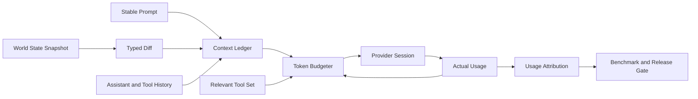

# Token 效率架构升级方案

简体中文 | [English](../en/token-efficiency-architecture-upgrade.md)

> 状态：`in_progress`。T0 已验收，基线见
> [`token-efficiency-t0-baseline.json`](../token-efficiency-t0-baseline.json)。
>
> 范围：Prompt Context、History、Compaction、Tool Catalog、Tool Result、
> Provider Session、Reasoning Budget、Completion Protocol、Usage Accounting
> 与 Token Benchmark。

## 1. 执行摘要

CodeHelper 的高 Token 消耗不是由某一段异常大的 Prompt 单独造成，而是以下机制共同
放大：

1. 每次模型采样都重新发送完整逻辑历史；
2. Tool Catalog、Repo Map、Working Set、Evidence 和 Plan 在历史之后重复渲染；
3. Provider `tools[]` Schema 与文本 Tool Catalog 同时存在，且每次请求都携带；
4. Tool Result、Assistant Output 和 Repair Feedback 持续扩大后续请求；
5. Compaction 主要由 256 KiB History 字节阈值或模型硬窗口驱动；
6. 默认允许 256 个步骤，主 Agent、Subagent 和 Worker 默认没有 Token Budget；
7. Reasoning Model 默认使用最高 Effort，并将默认输出上限提高到至少 16,384；
8. 开启 Tool 后，Read-only Turn 也要求 `turn_complete`，可能增加收尾和 Repair
   Sample。

单次请求可能仍在模型窗口内，但整个 Turn 的累计输入会随步骤数近似二次增长。若固定
上下文与 Tool 定义为 `B`，每步新增历史平均为 `g`，模型调用数为 `N`：

```text
cumulative_input(N) ~= N * B + g * N * (N - 1) / 2
```

例如 `B=15K`、`g=2K`、`N=20` 时，最后一次请求约为 53K Token，但累计输入约为
680K Token，是最后一次请求的 12.8 倍。

本升级不以缩短回答、降低正确性或绕过安全协议换取 Token。目标是：

- 让不变状态只注入一次，变化状态只追加 Diff；
- 用真实 Token Usage 管理 Context Window；
- 将 Tool Schema 与 Result 变为 Token-aware、有界、按需内容；
- 降低无价值 Sample、Repair 和过度 Reasoning；
- 对支持的 Provider 保持可验证的增量请求与缓存连续性；
- 用相同 Prompt、相同模型、相同 Fixture 对优化前后进行配对实测。

## 2. 指标口径

Token 优化必须同时报告以下指标，不能只选择最有利的一项：

| 指标 | 定义 | 用途 |
| --- | --- | --- |
| `input_tokens` | Provider 报告的累计输入 Token | 总消耗 |
| `cached_tokens` | `input_tokens` 中由 Prompt Cache 命中的部分 | 缓存效果 |
| `uncached_input_tokens` | `input_tokens - cached_tokens` | 高价格输入与 Cache Miss |
| `output_tokens` | 包含 Reasoning 的 Provider 输出 Token | 输出消耗 |
| `reasoning_tokens` | `output_tokens` 中的 Reasoning 部分 | 推理策略 |
| `active_context_tokens` | 最新一次采样的完整模型可见上下文 | 窗口压力 |
| `cumulative_tokens` | 所有 Sample 的 Input 加 Output | Turn 总消耗 |
| `request_bytes` | 实际序列化请求大小 | 传输压力 |
| `sample_count` | Provider 推理调用次数 | 循环效率 |
| `cached_share` | `cached_tokens / input_tokens` | Cache 连续性 |

`cached_tokens` 已包含于 `input_tokens`，`reasoning_tokens` 已包含于
`output_tokens`，汇总时不得重复相加。Prompt Cache 通常降低价格和延迟，但不代表
这些 Token 不再参与模型上下文。

## 3. 当前实现审计

### 3.1 每次 Sample 重建完整请求

`internal/runtime/agent/engine/model_handler.go` 当前按以下顺序组装请求：

```text
Turn stable context
  + complete durable history
  + current Tool Catalog
  + Repo Map
  + Working Set
  + Evidence
  + Plan
  + output continuation
```

Provider Adapter 随后将完整 Messages 和 Tool Definitions 序列化。OpenAI Responses
路径默认 `store=false`，没有 `previous_response_id` 或 Turn-scoped Provider
Session。

发送完整逻辑历史本身不一定是错误；问题是动态状态位于历史之后，下一步新增 Tool
Result 会插入到旧动态尾部之前：

```text
sample 1: stable + H1 + dynamic
sample 2: stable + H1 + new_history + dynamic
```

第二个请求不是第一个请求的严格扩展。即使 Provider 支持 Prefix Cache，缓存匹配也会
在旧 `dynamic` 位置提前终止。

### 3.2 动态尾部按 Sample 重复

默认分区上限为：

| 分区 | Token 上限 |
| --- | ---: |
| Tool Catalog | 4,096 |
| Repo Map | 2,048 |
| Working Set Ledger | 2,048 |
| Evidence | 1,024 |
| 合计，不含 Plan | 9,216 |

默认 Tool Catalog 基准当前记录 62 个 Tool，其中 54 个 Available，渲染文本为
5,735 Bytes，启发式估算约 1,434 Token。该数字不包含 Provider `tools[]` 中的名称、
完整 Description 和 Input Schema。

### 3.3 Tool Catalog 与 Schema 双重成本

Runtime 同时向模型提供：

1. 文本 Tool Catalog，用于描述名称、能力和可用性；
2. Provider 原生 `tools[]`，包含名称、Description 和 JSON Schema。

Provider Tool Definition 当前上限为 128 个、128 KiB Schema。`tool_search` 会发现
Deferred Tool，但所有 Eager 或 Materialized Tool 仍会加入原生 Definitions，因此
默认工具数量较多时，Tool Search 并没有充分减少每次请求的 Schema 成本。

### 3.4 History 增长与 Tool Result

每个模型输出、Tool Call 和 Tool Result 都会进入 Transaction History。普通 Tool
Result 已由统一 Result Store 限制为 32 KiB，超出部分写入 Content Store，并通过
`result_get` 获取；因此结果不是无界的。

但仍有三个问题：

- 32 KiB 是字节上限，不是模型 Token 上限；
- 整个 `tool.Result` 被 JSON 序列化，Content 之外的 Metadata 也进入模型历史；
- 截断后的结果仍会随所有后续 Sample 重复进入请求。

对代码、JSON、中文和高熵日志，固定字节预算无法稳定代表 Token 成本。

### 3.5 Compaction 目标不匹配成本

默认 `context.compact.max_history_bytes=262144`。自动压缩首先检查 History Bytes；
只有接近模型硬 Context Window 时，才使用 Token Estimator 强制压缩。

现有 Token Gate 只估算 Stable Prompt 与 History，没有完整覆盖：

- 当前动态尾部；
- Provider Tool Definitions；
- Native Search Definition；
- 序列化协议开销；
- Continuation 和部分 Provider-specific Content。

Token Estimator 使用 Unicode Rune 数除以四。该估算对英文自然语言尚可作为粗略水位，
但对中文、代码、JSON、Tool Schema、图片和加密 Reasoning 误差不可控。

### 3.6 步骤、Reasoning 与 Repair

默认配置允许：

- 主 Agent 256 Steps；
- Subagent 24 Steps、Token Budget 为 0；
- Worker Token Budget 为 0；
- Session Token Budget 为 0。

Reasoning-capable Model 默认使用 `xhigh`；DeepSeek V4 使用 `max`。当配置仍是默认来源
时，`max_output_tokens=4096` 会自动提高到至少 16,384。

开启 Tool 后，Runtime 无条件要求 Completion Declaration。即使 Turn 只执行 Read
Tool，也可能需要：

1. 一个 Sample 调用 `turn_complete`；
2. 一个 Sample 生成最终用户回答；
3. Declaration、Completion、Workspace 或 Verification Repair Sample。

安全协议对于 Mutation 是必要的，但不应由“Tool 是否开启”间接决定。

### 3.7 Accounting 的解释缺口

CodeHelper 已持久化 Input、Output、Reasoning 和 Cached Token，也能计算 Cache Share。
但当前 Pricing 仅包含普通 Input/Output 单价，没有 Cached Input 单价；成本估算会把
Cached Token 按普通 Input 价格计算。

这不会增加真实 Token，却会高估支持缓存折扣的 Provider 成本，并使优化效果难以正确
解释。

## 4. 与 Codex 的差异

### 4.1 Incremental World State

Codex 将 Environment、Permission、Tools、AGENTS、Plugin 和 Model Settings 建模为
Typed World State Section：

- 首次建立 Session 或 Compaction Window 时注入完整状态；
- 后续比较 Snapshot，只将变化渲染为 Context Fragment；
- Fragment 进入历史后成为稳定 Prefix 的一部分；
- Snapshot 与 Turn Context 持久化，Restart 后继续 Diff；
- 每个 Fragment 有明确类型、Marker 和硬上限。

CodeHelper 已有 Context Receipt、Digest、Working Set 和 Catalog Snapshot，但这些
能力分散在 Stable Prompt 与 Volatile Tail 两条路径中，没有形成统一的 Durable
World State。

### 4.2 Token-native Compaction

Codex 使用 Provider Usage 维护 Active Context Token，并区分：

- 整个 Context Window；
- 当前 Compaction Window 的 Prefix；
- Prefix 之后的 Body；
- Auto Compact Limit；
- Full Context Hard Limit；
- Fallback Buffer。

CodeHelper 当前主要维护 History Bytes，并在临近硬窗口时估算 Token。这适合防止请求
被拒绝，不适合控制累计成本。

### 4.3 Context Manager 与 Tool Output

Codex 在 Tool Output 写入 History 前统一应用 Token Truncation Policy，并按模型可见
序列化结构估算 Response Item。图片、音频和 Encrypted Reasoning 使用独立修正。

CodeHelper Result Store 在 Tool Adapter 层解决大内容存储和分页，但 Engine 缺少一条
统一的“模型可见 Token Policy”。

### 4.4 Responses Incremental Transport

Codex 的 Responses WebSocket Session 保存上一请求和 Response Items。只有满足以下
条件才发送增量：

- 非 Input 请求属性完全一致；
- 当前 Input 是上一 Input 加服务端 Response Items 的严格扩展；
- 存在有效 `previous_response_id`。

不满足条件时自动回退完整请求。逻辑 Rollout 仍保存完整上下文，传输优化不改变恢复和
审计事实。

该机制主要改善传输、延迟和 Cache 连续性。是否减少计费 Token 由 Provider 语义决定，
不能将网络 Payload 降幅直接报告为 Token 降幅。

## 5. 目标架构



### 5.1 Context Ledger

Context Ledger 是模型可见上下文的唯一组装事实，继续由
`internal/runtime/agent` Ownership。它不取代 Durable History，而是统一管理：

- Stable Prompt；
- User/Assistant/Tool History；
- World State Full Snapshot 与 Diff；
- Compaction Summary；
- Tool Definitions 的 Token Receipt；
- Provider-specific Framing Receipt。

每个模型可见项至少具有：

```go
type ContextItemReceipt struct {
    Kind            ContextItemKind
    Digest          string
    EstimatedTokens uint64
    ActualTokens    uint64
    CacheClass      CacheClass
    SourceRevision  uint64
}
```

该结构是设计示意。实施时优先收敛现有 `promptcontext.Receipt`、
`ContextBudgetSnapshot` 和 Usage Event，不并行增加第二套 Receipt。

### 5.2 Durable World State

首批 World State Section：

| Section | Full Snapshot | Diff |
| --- | --- | --- |
| Tool Catalog | 核心 Tool 与 Deferred Namespace | Added/Removed/Materialized |
| Repo Map | 有界 Repository Outline | Changed Directory/File Fact |
| Working Set | 当前相关 Path 与 Reason | Added/Removed/Re-ranked |
| Evidence | 未解决与已验证 Evidence | New/Resolved |
| Plan | 当前 Plan Revision | Replace/Complete |
| Runtime Mode | Mode、Posture、Model | Changed Fields |

规则：

1. 未变化的 Section 不产生 Message；
2. Diff 进入 History，而不是每次在 History 后重建；
3. Diff 与 Snapshot 从同一状态计算；
4. 先持久化模型可见 Diff，再推进 Durable Baseline；
5. Compaction 后注入一次 Full Snapshot 并建立新 Baseline；
6. Restart、Fork 和 Child Task Capsule 必须携带权威 Baseline Revision；
7. 单个 Fragment 不超过 4K Token，超过 1K Token 需要显式 Review。

### 5.3 Token Budgeter

Token Budgeter 使用三个水位：

| 水位 | 默认动作 |
| --- | --- |
| 55% Active Window | 停止低价值探索，减少 Tool/Result Budget |
| 65% Active Window | 自动 Compaction |
| 85% Active Window | 只允许完成、验证或明确失败 |

百分比必须基于模型 Capability 可覆盖配置。Full Context Hard Limit 始终独立存在。

预算至少包含：

```text
stable context
+ retained history
+ pending world-state delta
+ provider tool definitions
+ provider framing
+ reserved output
```

Actual Provider Usage 是下一步水位的权威输入；Estimator 用于预请求预测，并通过
`actual - estimated` 持续校准。

### 5.4 Relevant Tool Set

默认 Provider Tool Set 收敛为：

- 当前 Turn Intent 必需的核心 Tool；
- 已由任务、Working Set 或最近调用证明相关的 Tool；
- `tool_search`；
- Mutation Turn 必需的 `turn_complete`；
- Result 存在 Handle 时的 `result_get`。

文本 Catalog 只描述 Deferred Namespace、可用性变化和 Runtime 约束，不重复原生 Tool
Schema 已表达的完整 Description。

Tool Selection 只能减少可见能力，不能绕过 Catalog Authority、Role Allowlist、
Guard、Policy 或 Approval。模型请求未广告的 Tool 必须继续 Fail Closed。

### 5.5 Token-aware Tool Result

Result Store 继续持有完整内容和 Handle。写入模型历史的 Projection 改为：

```text
status
structured summary
head
tail
original token estimate
retained token estimate
content handle
next-page instruction
```

建议默认预算：

| Result 类型 | 默认 Token |
| --- | ---: |
| Search/List/Metadata | 1,024 |
| File Read | 4,096 |
| Test/Build Output | 4,096 |
| Generic Tool Result | 2,048 |
| 单项硬上限 | 10,000 |

工具可声明更小的 Policy，但不能自行突破全局硬上限。Truncation 保留头尾和结构边界，
不得截断成无效 JSON 后仍声称是完整 JSON。

### 5.6 Provider Session

Provider Session 属于 `internal/adapter/provider`：

- Engine 提交完整逻辑 Model Request；
- Adapter 判断是否满足 Incremental Capability；
- Responses WebSocket 可使用 `previous_response_id` 和 Delta Input；
- HTTP、OpenAI Chat、Anthropic 和不支持的兼容端保持完整请求；
- 属性变化、Retry、Compaction、Route Change 或恢复不确定时回退完整请求；
- Journal、Trace 和 Replay 始终记录完整逻辑请求的 Digest 与 Context Receipt。

不得为了启用 `store=true` 默默改变数据保留语义。需要服务端存储时，Capability、
配置、隐私说明和清理策略必须显式。

### 5.7 Adaptive Reasoning 与 Completion

Reasoning Effort 由 Turn Intent、复杂度事实和失败升级决定：

| 场景 | 初始 Effort |
| --- | --- |
| Read-only Lookup、格式化、简单说明 | low |
| 常规编码、局部修复 | medium |
| 多模块架构、复杂 Debug | high |
| 前一档失败且仍有预算 | xhigh/max |

不再仅因模型支持 Reasoning 就默认最高档。Output Reserve 使用模型 Capability 与当前
阶段计算，不再把默认 4K 全局提升为 16K。

Completion Declaration 改为基于结构化事实：

```text
required =
  observed mutation
  OR turn intent is workspace_change
  OR durable integration is pending
```

Read-only Tool Turn 不要求 `turn_complete`。Mutation、Verification、Journal 和
Approval 的安全语义保持不变。

## 6. 可观测性设计

### 6.1 Sample Attribution

每个 Sample 记录低基数属性：

```text
sample_reason:
  normal
  output_continuation
  completion_repair
  declaration_repair
  verification_repair
  provider_retry

context_tokens:
  stable
  history_user
  history_assistant
  history_tool_call
  history_tool_result
  world_state_full
  world_state_delta
  tool_definitions
  provider_framing
  unattributed
```

生产 Telemetry 不记录 Raw Prompt、文件内容、Tool Argument、路径、Credential 或 Tool
Result。Benchmark Fixture 的 Prompt 是仓库内公开测试数据，可以在隔离 Artifact 中
记录 Prompt Digest 和 Fixture Revision。

### 6.2 成本模型

Model Catalog 增加可选 Cached Input Price。成本计算为：

```text
uncached_input * input_price
+ cached_input * cached_input_price
+ output * output_price
```

Provider 未声明 Cached Price 时，成本标记为 Unknown 或 Lower/Upper Bound，不能自动
假设等于零或普通 Input Price。

### 6.3 Turn 报告

CLI、TUI 与 Benchmark Report 至少展示：

- Calls、Normal Calls、Repair Calls、Retry Calls；
- Input、Cached Input、Uncached Input、Output、Reasoning；
- 最新 Active Context 与峰值 Active Context；
- Context 分区占比；
- Compaction 次数和压缩前后 Token；
- Tool Schema 与 Tool Result Token；
- 真实或有边界说明的成本。

Host 只投影 Runtime/Observability Fact，不重新估算 Token。

## 7. 相同 Prompt 的前后实测协议

### 7.1 原则

验收必须同时包含：

1. **Hermetic Attribution Lane**：固定 Provider Script，精确比较每一步请求组成；
2. **Live No-cache Lane**：验证无 Prompt Cache 时的真实累计 Token；
3. **Live Cache Lane**：验证 Cached Share、Uncached Input 和真实成本；
4. **Long-output Lane**：验证 Tool Result Truncation；
5. **Compaction Lane**：验证长 Session 的窗口水位与摘要质量。

Hermetic Lane 证明“哪一部分减少了”；Live Lane 证明“Provider 实际报告减少了”。两者
不可互相替代。

### 7.2 冻结 Fixture

实施 T0 时新增：

```text
testdata/benchmarks/token-efficiency/
  fixture/
  prompt.txt
  manifest.json
  expected.json
  provider-script.jsonl
```

Fixture 是独立的小型 Go Repository，包含：

- 一个有重复读取、递归 Include 和 Cycle Handling 缺陷的配置 Loader；
- 多文件实现和固定 Unit Test；
- 足以触发 Search、Read、Edit、Test 和 Completion；
- 一个生成 100 KiB 确定性测试日志的失败场景；
- 不依赖网络、时间、用户目录或 CodeHelper 当前源码布局。

每次 Sample 从同一只读模板复制到新的临时目录。不得在用户现有 Worktree 上执行清理或
复位。

### 7.3 Canonical Prompt

以下内容以 UTF-8 和 LF 原样保存到 `prompt.txt`。Baseline 与 Candidate 必须读取同一
文件，禁止通过命令行重新拼接：

```text
Fix the config loader in this repository.

Requirements:
1. Resolve nested include directives relative to the file that declares them.
2. Preserve the first-seen order while removing duplicate entries.
3. Return a clear error for include cycles and include the cycle path.
4. Keep the public API backward compatible.
5. Add or update focused tests for the changed behavior.
6. Run the relevant tests and report the exact verification performed.

Do not modify unrelated files. Complete the implementation, verification, and
final summary in this turn.
```

Manifest 固定 Prompt SHA-256。任何字节变化都使前后结果不可比较。

### 7.4 A/B 环境

每次报告固定：

| 字段 | 要求 |
| --- | --- |
| Baseline | 优化开始前的 Git Commit |
| Candidate | 当前阶段或最终 Git Commit |
| Dirty State | 两个执行 Worktree 均为空 |
| Model | 相同 Provider、Model ID 和 Version/Snapshot |
| Configuration | 除被测 Feature 外完全相同 |
| Permission | 相同 Mode、Posture 和 Sandbox |
| Fixture | 相同 Manifest Digest |
| Prompt | 相同 Prompt Digest |
| Tool Catalog | 相同业务 Tool 集合 |
| Warmup | 每个 Arm 独立执行一次，不计入结果 |
| Samples | 每个 Arm 至少 5 次有效运行 |
| Ordering | `A B B A` 交替，降低时间漂移 |
| Concurrency | 1 |
| Failure | 保留并报告，禁止静默丢弃 |

Live Cache Lane 为 A/B 使用独立但稳定的 Cache Key，防止一侧预热另一侧。No-cache
Lane 使用同一不支持 Prompt Cache 的路由。若 Model Version 在实验中变化，整组结果
作废。

### 7.5 正确性与质量前置门禁

Token 数据只有在以下条件同时满足时才有效：

- Fixture Test 全部通过；
- 修改 Path 与 Expected Contract 一致；
- 没有修改禁止文件；
- 最终回答包含变更、测试和未解决事项；
- Mutation Turn 有有效 Completion、Verification 和 Journal Receipt；
- 无 Policy、Approval、Sandbox 或 Authority 绕过；
- Baseline 与 Candidate 的任务完成率相同。

Candidate 未完成任务却消耗更少 Token，判定为失败，不进入效率比较。

### 7.6 原始 Artifact

每次运行生成：

```text
artifacts/token-efficiency/<run-id>/
  manifest.json
  samples.ndjson
  context-breakdown.ndjson
  report.json
  report.md
```

`manifest.json` 包含 Commit、Dirty State、OS/Arch、Go Version、Provider、Model、
配置 Digest、Prompt Digest、Fixture Digest、运行顺序和时间。Artifact 不包含 API
Key、Credential 或用户数据。

### 7.7 统计方法

主要比较 Median，同时报告 Min、P75、P90、Max 和 MAD。每个指标计算：

```text
absolute_delta = candidate_median - baseline_median
relative_delta = absolute_delta / baseline_median
```

不得只展示最佳一次运行。Provider Rate Limit、Network Error 和 5xx 标记为
Infrastructure Failure；模型正常完成但步骤不同仍是有效样本。

若 5 次样本的 MAD 超过 Median 的 15%，扩展到 10 次；仍不稳定则报告
Inconclusive，不得声称通过。

## 8. 分项优化实测

每个阶段必须重复 Canonical Prompt，并将结果加入同一瀑布表：

| 阶段 | 主要变化 | 主要观察指标 |
| --- | --- | --- |
| T0 | 仅增加归因，无优化 | Estimator Error、分区占比 |
| T1 | Token-native Budget/Compaction | Active Peak、Compaction Token |
| T2 | World State Diff | Dynamic Delta、Cached Share |
| T3 | Tool Schema/Result 收敛 | Tool Definition、Tool Result Token |
| T4 | Reasoning/Completion 收敛 | Calls、Repair、Reasoning Token |
| T5 | Provider Incremental Session | Request Bytes、Latency、Cache Continuity |

阶段报告必须保留前一阶段数据，形成：

```text
baseline
  -> token-native window
  -> world-state diff
  -> tool context
  -> loop/reasoning
  -> provider session
```

若两个阶段合并后才出现收益，必须用 Feature Toggle 或临时 Benchmark Build 做
Ablation，确定收益来源。Feature Toggle 只用于实验，不要求长期保留生产双路径。

## 9. 实施计划

每个阶段使用独立分支，验收后通过 `--no-ff` 合入 `main`。每阶段生产代码净增长必须
`<= 0`；新能力落地时删除对应旧路径，不以增加平行抽象完成升级。

### T0：基线与归因

目标：先建立可信测量，不改变模型行为。

执行：

- 冻结 Fixture、Canonical Prompt、Provider Script 和 Expected Contract；
- 扩展现有 Usage Sample 与 Context Receipt，记录分区 Token；
- 记录 Tool Definition 序列化 Token 和 Sample Reason；
- 增加 Cached Price 表达与 Unknown Cost 语义；
- 增加 `token-bench`、`token-bench-live`、`token-bench-compare` 仓库命令；
- 对 Baseline Commit 完成至少 5 次 Live A/B 前置采样。

退出条件：

- Hermetic Report 可重复；
- Provider Input Token 与分区估算差异 P95 不超过 10%；
- 同一 Commit 重复 A/A 的 Median 差异不超过 5%；
- Benchmark Failure 不被统计脚本丢弃；
- 生产代码净增长 `<= 0`。

验收证据（T0，`accepted`）：

- Canonical Prompt SHA-256：
  `8b61b8edfa5f01e3cebb659eb994a3ade736b0abd71c7a4df4d80dc069e51b1e`；
- Hermetic 5/5 通过，Input P50 147,770，MAD 0，Estimator P95 Error 4.00%；
- 两组 Hermetic A/A 的 Input、Uncached Input、Output 和 Sample Count 差异均为 0；
- DeepSeek Live 10/10 通过，Input P50 394,163、P90 621,434、MAD 45,542；
- Live Uncached Input P50 64,520，Cached Share P50 80.26%；
- Live Output P50 11,964，Reasoning P50 7,838，Sample Count P50 12；
- 125 个 Live Sample 缺少明确 Cached Input Price，成本正确标记为 Unknown，
  `122,454` Microunits 仅为 P50 上界；
- Sample Reason 捕获 112 次 Normal、9 次 Tool Failure Repair、4 次 Declaration
  Repair；
- Architecture Size Budget 从 27,955 行降至 27,946 行，净变化 `-9`。

### T1：Token-native Window

目标：用 Token 水位替换 History Byte Gate。

执行：

- 将 `max_history_bytes` 收敛为 Auto Compact Token Limit；
- 引入 Total 与 Body-after-prefix Scope；
- 预算覆盖 Dynamic Delta、Tool Definitions 和 Output Reserve；
- 使用上一 Sample Actual Usage 校准下一步预测；
- 55% 提醒、65% Compact、85% Finish-only；
- 删除重复 Byte-only 判断与失效 Snapshot 字段。

退出条件：

- Compaction Lane 不出现 Context Window Rejection；
- Compaction 在目标水位 `+-5%` 内触发；
- Summary 保留 Goal、Changed Paths、Pending Work 和 Verification；
- Canonical Prompt 正确性不回退；
- 累计 Input 不高于 Baseline。

### T2：Durable World State Diff

目标：删除每 Sample Volatile Tail。

执行：

- 收敛 Prompt Section、Turn Context 和 Receipt 为统一 Context Ledger；
- 为 Tool、Repo、Working Set、Evidence、Plan 建立 Snapshot/Diff；
- Diff 追加到 History；
- Compaction、Restart 和 Child Fork 重建或继承 Baseline；
- 删除 `turnContextMessagesForCatalog` 的无条件全量渲染路径。

退出条件：

- 未变化 World State 的 Sample Delta 小于 256 Token；
- Cache Lane 第三个 Sample 后 Cached Share 中位数至少 80%；
- Restart 前后模型可见 World State 等价；
- No-cache Lane 累计 Input 相对 T1 至少下降 20%；
- 生产代码净增长 `<= 0`。

### T3：Tool Context 收敛

目标：减少 Tool Schema 与 Result 对历史的占用。

执行：

- 按 Turn Intent 和最近相关性选择 Provider Tool Set；
- 只保留核心 Tool、相关 Tool 和 `tool_search`；
- 文本 Catalog 改为 Namespace/Diff，不重复完整 Description；
- Result Store 增加模型 Token Projection；
- Test、Build、Read 和 Generic Result 使用类型化预算；
- Metadata 只将模型需要的字段写入 Tool Result。

退出条件：

- Canonical Prompt 首次 Tool Definitions 不超过 4K Token；
- 稳态 Tool Definition Delta 为 0；
- 100 KiB Log Lane 的模型可见 Result 至少下降 70%；
- `result_get` 能无损获取完整内容；
- 未广告 Tool、Role 和 Authority 测试全部 Fail Closed。

### T4：Loop 与 Reasoning 收敛

目标：消除无价值 Sample 和默认最高 Reasoning。

执行：

- Completion Requirement 由 Mutation/Intent/Integration Fact 决定；
- Read-only Tool Turn 直接完成；
- Reasoning 从 Low/Medium/High 自适应，并只在失败时升级；
- Output Reserve 按阶段设置；
- Token Budget 在 70% 和 85% 触发结构化收敛；
- Repair、Continuation 和 Retry 独立计量。

退出条件：

- Read-only Lane 的 Completion/Declaration Repair 为 0；
- Canonical Prompt Sample Count 相对 T3 至少下降 15%；
- Reasoning Token 相对 Baseline 至少下降 30%；
- Mutation Completion、Verification、Journal 和 Recovery 无回退；
- 高复杂度 Fixture 质量不低于 Baseline。

### T5：Provider Incremental Session

目标：在支持的 Responses 路由上减少重复传输并保持 Cache 连续。

执行：

- 增加 Provider Session Capability，而非让 Host 管理连接；
- 实现严格扩展检查、`previous_response_id` 和 WebSocket Delta；
- 属性变化或不确定状态自动回退完整请求；
- 分离 Logical Request Digest 与 Transport Payload Digest；
- 明确服务端 Store、Retention 与 Privacy 配置。

退出条件：

- Incremental 与 Full Fallback 的模型可见逻辑输入等价；
- Cache Lane Request Bytes 相对 T4 至少下降 60%；
- 不将 Request Byte 降幅错误计入 Token 降幅；
- Connection Reset、Retry、Compaction 和 Resume 不重复 Tool Execution；
- 不支持 Provider 行为不变。

### T6：总体验收与默认启用

执行：

- 在 Baseline Commit 与最终 Candidate Commit 上重新运行全部 Lane；
- 对每个阶段生成分项瀑布图和原始 JSON；
- 运行完整 Runtime、Provider、Guard、Persistence、Multi-Agent 和 Host 测试；
- 更新双语 Architecture、Configuration、Benchmark Book 与 Release Evidence；
- 删除实验 Toggle 和旧实现。

## 10. 最终验收阈值

### 10.1 效率

| 指标 | 最终目标 |
| --- | ---: |
| No-cache Canonical Prompt 累计 Input Median | 至少下降 50% |
| Cache Canonical Prompt Uncached Input Median | 至少下降 60% |
| Cache Lane 第三 Sample 后 Cached Share | 至少 80% |
| Canonical Prompt Sample Count | 至少下降 20% |
| Reasoning Token Median | 至少下降 30% |
| 100 KiB Tool Result 模型可见 Token | 至少下降 70% |
| Incremental Responses Request Bytes | 至少下降 60% |
| Estimator 对 Provider Input 的 P95 Error | 不超过 10% |
| Context Window Rejection | 0 |

若 Baseline 某指标为零，则使用绝对值 Gate，不计算百分比。

### 10.2 正确性与安全

以下指标必须全部保持：

- Canonical Fixture 完成率 100%；
- Test Pass Rate 100%；
- Mutation Receipt、Verification 和 Journal 完整率 100%；
- Authority、Policy、Approval、Constitution 或 Sandbox 穿透为 0；
- Restart/Resume 重复 Tool Execution 为 0；
- 未广告 Tool Execution 为 0；
- Baseline 已通过的任务质量不得下降。

### 10.3 回归边界

任何单个有效 Fixture 的累计 Token 不得回退超过 5%，除非：

1. 修复了明确的正确性或安全缺陷；
2. 报告给出因果说明；
3. 总体目标仍通过；
4. 变更经过显式 Review。

不能用平均值掩盖某类任务的显著回退。

## 11. 验证矩阵

| 层 | 必须提供的证据 |
| --- | --- |
| Context Unit | Snapshot/Diff、Digest、Bound、Ordering |
| Engine | Sample Attribution、Budget、Compaction、Repair |
| Provider | Full/Incremental 等价、Fallback、Usage Decode |
| Tool | Schema Selection、Result Token Projection、Handle |
| Persistence | Baseline、Compaction、Restart、Replay |
| Multi-Agent | Task Capsule Budget、Child Baseline、Tree Token |
| Security | Guard/Policy/Approval/Journal 无旁路 |
| Hermetic Benchmark | 相同 Prompt 的逐分区前后比较 |
| Live Benchmark | 相同 Prompt 的 Provider Usage 前后比较 |
| Architecture | Ratchet 43/43、Size Budget、Import Boundary |
| Documentation | 中英文同步、Docs、Book、Diff Check |

标准命令在实施后应收敛为：

```bash
make token-bench
make token-bench-live
make token-bench-compare
go test ./internal/runtime/agent/...
go test ./internal/adapter/provider/...
go test ./internal/adapter/tool/...
make architecture-ratchet
make architecture-size-budget
make docs-check
make book-check
git diff --check
```

Live Command 必须显式启用，缺少 Credential 时报告 `unavailable`，不能回退 Fixture
Provider 后声称真实 Token Gate 已通过。

## 12. 风险与缓解

| 风险 | 缓解 |
| --- | --- |
| World State Diff 丢失当前事实 | Snapshot/Diff 同源、Restart Golden、Full fallback |
| Tool Selection 隐藏必需能力 | Intent Core Set、Tool Search、Fail-closed Receipt |
| 提前 Compaction 降低质量 | Summary Contract、Body-after-prefix、质量 Gate |
| 低 Reasoning 无法完成复杂任务 | 基于失败和预算逐级升级 |
| Provider Usage 不可比 | 固定 Model Snapshot、ABBA 顺序、MAD Gate |
| Prompt Cache 交叉污染 | 每个 Arm 独立 Stable Cache Key |
| Incremental Session 重复执行 | Idempotency、Response ID、Replay/Retry Test |
| Token Estimator 偏差 | Actual Usage 校准、Unattributed Bucket |
| 新抽象导致代码膨胀 | 替换旧路径、每阶段生产代码净增长 `<= 0` |

## 13. 回滚策略

- T1 可回退到保守 Token Limit，但不恢复 Byte-only 双重决策；
- T2 发现 Diff 不确定时注入 Full Snapshot，不发送猜测 Diff；
- T3 Tool Selection 不确定时扩大到权威 Catalog，不绕过 Guard；
- T4 Budget 不确定时提高 Reasoning 或允许完成，不跳过 Verification；
- T5 任意 Session 状态不一致时回退完整请求；
- 所有回滚均保留 Usage Attribution，便于确认回归来源。

回滚不得扩大 Authority、关闭 Sandbox、丢弃 Journal 或伪造 Benchmark Pass。

## 14. 最终完成定义

仅当以下条件全部满足，本升级才算完成：

1. Baseline 与 Candidate 使用同一 Canonical Prompt、Fixture、Model 和配置完成配对实测；
2. Hermetic 与 Live 原始 Artifact 均可审计；
3. No-cache 与 Cache Lane 达到最终 Token 阈值；
4. 每一项主要收益都能由 Context 分区或阶段 Ablation 解释；
5. 正确性、安全、恢复和 Multi-Agent 行为没有回退；
6. Token Budget、Compaction 和 Tool Result 全部使用 Token-native Policy；
7. 不变 World State 不再按 Sample 重复注入；
8. Read-only Turn 不再承担 Mutation Completion Protocol 成本；
9. Provider Incremental Transport 不改变 Runtime 逻辑历史；
10. T0-T6 每阶段生产代码净增长 `<= 0`，全部通过 Architecture Ratchet。
